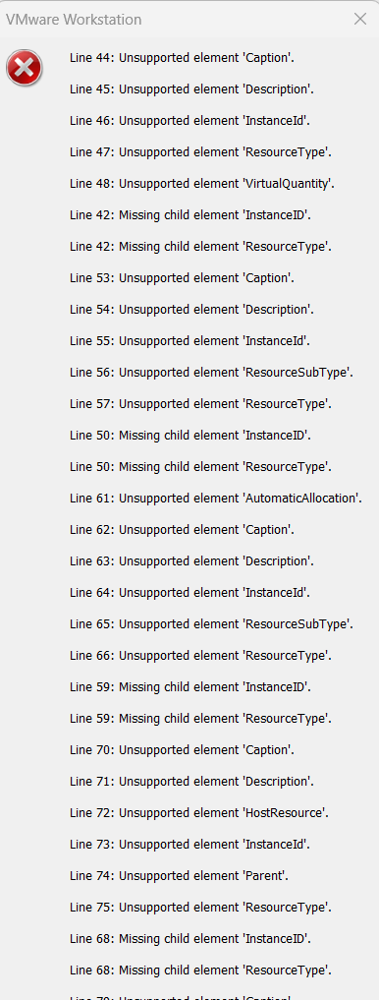

# Writeup completo y muy detallado de **Alzheimer** — HackMyVM

> **Objetivo de este documento**: dejar un writeup largo, didáctico y sin saltos bruscos, explicando no solo *qué* se hizo, sino *por qué* se hizo, *qué significa cada comando* y *cómo interpretar cada resultado*.
>
> La idea es que este documento sirva también como material de estudio para una primera toma de contacto con conceptos como **adaptador puente**, **enumeración con Nmap**, **FTP anónimo**, **port knocking**, **fuzzing web**, **lectura de pistas**, **SSH**, **SUID/SGID** y **GTFOBins**.

---

## 1. Contexto inicial de la máquina

La máquina objetivo en este caso es **Alzheimer**, de la plataforma **HackMyVM**.

El enlace de la máquina es:

`https://hackmyvm.eu/machines/machine.php?vm=Alzheimer`

Nada más empezar, al intentar importar la máquina en **VMware**, aparece un error de compatibilidad con el fichero de definición de la máquina virtual.

### Imagen 1: error al importar en VMware



### Qué significa este error

El mensaje indica que VMware no entiende correctamente ciertos elementos del descriptor OVF/OVA que trae esta máquina. En el error aparecen campos como:

- `Caption`
- `Description`
- `InstanceID`
- `ResourceType`
- `VirtualQuantity`
- `AutomaticAllocation`
- `HostResource`
- `Parent`

Eso significa, dicho de forma sencilla, que el paquete de la máquina fue generado con una estructura que **VirtualBox tolera mejor** o que, directamente, **VMware Workstation no está interpretando bien** en esa importación concreta.

No implica que la máquina esté mal para siempre, sino que **en ese entorno concreto de VMware no se está importando correctamente**.

Por eso, en lugar de perder tiempo intentando reparar manualmente el OVF, la decisión práctica aquí es:

1. **abrir la víctima en VirtualBox**, y
2. **mantener Kali en VMware**,
3. **hacer que ambas queden en la misma red de capa 2**, usando **adaptador puente**.

---

## 2. Ajuste de red para que Kali en VMware vea la máquina de VirtualBox

Como la víctima se ha levantado en **VirtualBox** y la máquina atacante (**Kali**) está en **VMware**, hay que hacer que ambas compartan la misma red real.

La solución fue usar **modo puente** en ambos hipervisores.

### ¿Qué hace el modo puente?

Cuando una máquina virtual está en **adaptador puente**, no queda aislada en una red privada del hipervisor. En lugar de eso:

- la VM se conecta a la **red física real** a la que está conectado el host,
- obtiene una IP del mismo router o del mismo rango de red,
- y aparece ante el resto de dispositivos como **un equipo más de la red local**.

Eso, en este caso, es exactamente lo que necesitamos.

---

## 3. Configuración en VirtualBox

Primero importamos la máquina **Alzheimer** en VirtualBox.

Después:

- seleccionamos la máquina,
- vamos a **Configuración**,
- entramos en **Red**,
- en **Adaptador 1** elegimos **Conectado a: Adaptador puente**,
- y en **Nombre** seleccionamos la interfaz física correcta.

### Imagen 2: selección del adaptador en VirtualBox


### ¿Por qué seleccionamos esa interfaz concreta?

En la captura aparece:

`MediaTek Wi‑Fi 6 MT7921 Wireless LAN Card`

Esa es la **tarjeta de red real** del equipo host en Windows, concretamente la tarjeta Wi‑Fi con la que el equipo está conectado a Internet y, sobre todo, a la red local de casa.

Esto es importante porque VirtualBox necesita saber **a qué interfaz física del host debe “puentear” la máquina virtual**.

Si eliges la interfaz correcta:

- la VM de VirtualBox sale por esa red,
- recibe IP del mismo segmento,
- y se comporta como otro dispositivo más conectado al Wi‑Fi.

Si eligieses otra interfaz que no está en uso, o una interfaz virtual, la máquina podría:

- no tener conectividad,
- quedar en otra red distinta,
- o no ser visible desde Kali.

Por eso **esa tarjeta** es la correcta: porque es la **NIC real que está conectando el host a la red física actual**.

---

## 4. Configuración equivalente en VMware para Kali

Como Kali está corriendo en **VMware**, hay que ponerla también en la misma red real.

Primero vamos a:

- **Editar**
- **Editor de red virtual**
- en la sección de **VMnet** configuramos la red en **puente**
- y escogemos la **misma tarjeta física** que elegimos en VirtualBox.

### Imagen 3: VMnet en puente usando la misma NIC


### ¿Por qué hay que elegir exactamente la misma interfaz?

Porque queremos que:

- la máquina de VirtualBox,
- la Kali de VMware,
- y el host físico

queden todos en el **mismo segmento de red**.

Si en VirtualBox puentearas a la Wi‑Fi y en VMware a otra interfaz distinta, podrías terminar con:

- Kali en una red,
- la víctima en otra,
- y sin posibilidad de comunicación directa.

La idea aquí es que las dos VMs “miren” hacia el mismo adaptador físico.

---

## 5. Ajuste final del adaptador de Kali en VMware

Además del VMnet, dentro de la propia configuración de la máquina Kali en VMware hacemos:

- click derecho sobre la máquina,
- **Configuración**,
- **Adaptador de red**,
- y elegimos **Conexión en puente**.

### Imagen 4: adaptador de Kali en modo puente


### Qué ocurre al cambiar esto

Cuando cambias una VM de NAT o red privada a **puente**:

- normalmente se corta la conectividad un instante,
- la VM libera su configuración anterior,
- vuelve a negociar red,
- y obtiene una IP nueva del router o del servicio DHCP de tu red real.

Por eso a veces parece que “te has quedado sin red” durante unos segundos. Es completamente normal.

---

## 6. Comprobación en Kali con `ip a`

Una vez aplicado el cambio, comprobamos la nueva IP de Kali.

### Imagen 5: resultado de `ip a`


La IP relevante es:

`inet 192.168.1.42/24`

### Qué significa `192.168.1.42/24`

Esto significa:

- **IP de Kali**: `192.168.1.42`
- **máscara /24**: red `192.168.1.0` con rango habitual `192.168.1.1` a `192.168.1.254`

Eso ya nos deja una pista muy útil: si la víctima también está en puente, lo normal es que reciba **otra IP dentro del mismo rango `192.168.1.0/24`**.

---

## 7. Preparación del directorio de trabajo

Creamos una carpeta específica para esta máquina.

```bash
cd ~/Desktop
cd HackMyVM
mkdir Alzheimer
cd Alzheimer
```

### Por qué conviene hacer esto

Aunque parezca un detalle menor, organizar cada máquina en su propia carpeta es muy útil porque ahí vas a guardar:

- escaneos de Nmap,
- archivos descargados,
- hashes,
- notas,
- capturas,
- wordlists generadas,
- y cualquier prueba temporal.

Así no mezclas resultados de varias máquinas.

---

## 8. Descubrimiento de la IP de la víctima con Nmap

Como ya conocemos la IP de Kali (`192.168.1.42`) y sabemos que estamos en la red `192.168.1.0/24`, hacemos un escaneo de descubrimiento de hosts.

```bash
sudo nmap -n -sn 192.168.1.42/24
```

## 9. Explicación detallada de las flags `-n` y `-sn`

### `sudo`

Se usa porque ciertos tipos de escaneo de red funcionan mejor con privilegios elevados. En Linux, Nmap puede necesitar acceso a sockets “raw” para enviar determinados paquetes de descubrimiento.

### `nmap`

Herramienta de enumeración de red por excelencia. Sirve para:

- descubrir hosts,
- encontrar puertos abiertos,
- identificar servicios,
- detectar versiones,
- y obtener huellas del sistema objetivo.

### `-n`

Le dice a Nmap: **no resuelvas DNS**.

Eso significa que Nmap **no intentará traducir IPs a nombres**.

Ventajas:

- va más rápido,
- evita ruido innecesario,
- y es ideal en redes locales donde lo importante es ver **qué IPs están activas**.

### `-sn`

Significa **ping scan** o escaneo de descubrimiento de hosts.

En la práctica:

- **no escanea puertos**,
- solo pregunta quién está vivo en la red.

Por eso este comando es perfecto como primer paso cuando todavía no sabes cuál es la IP de la víctima.

---

## 10. Resultado del escaneo de descubrimiento

```text
Starting Nmap 7.95 ( https://nmap.org ) at 2026-03-24 11:24 EDT
Nmap scan report for 192.168.1.1
Host is up (0.0076s latency).
MAC Address: DC:08:DA:84:39:30 (Unknown)
Nmap scan report for 192.168.1.33
Host is up (0.00056s latency).
MAC Address: 48:E7:DA:42:B4:AD (AzureWave Technology)
Nmap scan report for 192.168.1.34
Host is up (0.091s latency).
MAC Address: 6A:88:E4:FB:4A:51 (Unknown)
Nmap scan report for 192.168.1.36
Host is up (0.092s latency).
MAC Address: 36:0C:C0:9A:14:2C (Unknown)
Nmap scan report for 192.168.1.37
Host is up (0.12s latency).
MAC Address: 3C:BD:3E:C6:86:31 (Beijing Xiaomi Electronics)
Nmap scan report for 192.168.1.39
Host is up (0.31s latency).
MAC Address: EA:F2:01:29:D7:88 (Unknown)
Nmap scan report for 192.168.1.90
Host is up (0.0099s latency).
MAC Address: 44:3B:14:F0:E3:A8 (Unknown)
Nmap scan report for 192.168.1.147
Host is up (0.00032s latency).
MAC Address: 08:00:27:66:03:9B (PCS Systemtechnik/Oracle VirtualBox virtual NIC)
Nmap scan report for 192.168.1.200
Host is up (0.31s latency).
MAC Address: A4:43:8C:A3:71:3F (Arris Group)
Nmap scan report for 192.168.1.42
Host is up.
Nmap done: 256 IP addresses (10 hosts up) scanned in 5.67 seconds
```

---

## 11. Por qué aparecen tantas IPs

Esto es una consecuencia directa del modo **adaptador puente**.

Antes, cuando trabajas con redes privadas del hipervisor, las VMs suelen estar en una red casi aislada, por ejemplo:

- NAT interno de VMware,
- host-only,
- o una subred virtual donde solo ves tus VMs.

Pero aquí no.

Como ahora Kali está conectada en **puente** a la red física real:

- Nmap está escaneando tu **red doméstica real**,
- no una red privada del laboratorio.

Por eso aparecen:

- el router,
- otros móviles,
- portátiles,
- dispositivos IoT,
- y la propia víctima.

Esto es completamente normal en modo puente.

---

## 12. Cómo identificamos cuál es la máquina víctima

La pista está en la **MAC address** y, más concretamente, en su **OUI**.

Aparece esta línea:

```text
MAC Address: 08:00:27:66:03:9B (PCS Systemtechnik/Oracle VirtualBox virtual NIC)
```

Eso nos dice que esa interfaz pertenece a una **tarjeta virtual de Oracle VirtualBox**.

Como sabemos que la víctima **Alzheimer** la hemos importado en VirtualBox, la conclusión lógica es:

> La víctima es la IP `192.168.1.147`.

### Qué es un OUI

**OUI** significa **Organizationally Unique Identifier**.

Es el prefijo de los primeros **3 bytes** de una dirección MAC y sirve para identificar al fabricante de la tarjeta de red.

Ejemplos típicos:

- `08:00:27` → Oracle VirtualBox
- `00:0C:29` → VMware
- `48:E7:DA` → AzureWave
- `A4:43:8C` → Arris

Por eso, al ver `08:00:27`, podemos asociarlo a VirtualBox.

---

## 13. Escaneo completo de puertos y servicios

Una vez identificada la IP de la víctima, hacemos un escaneo más profundo:

```bash
sudo nmap -p- --open -sCV -Pn -T5 -vvv -oN fullscan 192.168.1.147
```

## 14. Explicación detallada de cada flag de este Nmap

### `-p-`

Escanea **todos los puertos TCP**, del 1 al 65535.

No solo los más comunes.

Esto es importante porque en CTF y labs muchas veces el puerto interesante:

- no está entre los 1000 más habituales,
- o está oculto tras una lógica especial.

### `--open`

Muestra solo los puertos **abiertos**.

Oculta los cerrados y filtrados, haciendo el output más limpio.

### `-sC`

Ejecuta los **scripts por defecto de Nmap** (NSE default scripts).

Sirve para sacar información adicional, como:

- banners,
- métodos HTTP,
- login anónimo en FTP,
- certificados,
- etc.

### `-sV`

Hace **detección de versiones**.

Intenta identificar qué software corre en el puerto, por ejemplo:

- vsftpd 3.0.3,
- nginx 1.14.2,
- OpenSSH 7.9p1,
- Apache 2.4.x,
- etc.

### `-Pn`

Le dice a Nmap que **no haga descubrimiento previo de host**.

Asume que el host está vivo y escanea directamente.

Es útil cuando:

- los pings pueden estar filtrados,
- o tú ya sabes que la máquina existe.

### `-T5`

Timing muy agresivo.

Hace que Nmap envíe tráfico a alta velocidad.

Ventaja:

- va rápido.

Desventajas:

- puede perder respuestas,
- algunos servicios pueden no contestar a tiempo,
- ciertos puertos pueden parecer cerrados cuando no lo están,
- y un firewall o rate limiting puede afectar más.

Esto, más adelante, será importante en esta misma máquina.

### `-vvv`

Modo **muy verbose**.

Hace que Nmap vaya mostrando más información durante el proceso.

Útil para ver qué está haciendo y seguir mejor el escaneo.

### `-oN fullscan`

Guarda la salida en formato normal en un archivo llamado `fullscan`.

Esto es fundamental para no depender solo de la salida en pantalla.

---

## 15. Resultado del escaneo inicial

```text
PORT   STATE SERVICE REASON         VERSION
21/tcp open  ftp     syn-ack ttl 64 vsftpd 3.0.3
| ftp-syst:
|   STAT:
| FTP server status:
|      Connected to ::ffff:192.168.1.42
|      Logged in as ftp
|      TYPE: ASCII
|      No session bandwidth limit
|      Session timeout in seconds is 300
|      Control connection is plain text
|      Data connections will be plain text
|      At session startup, client count was 3
|      vsFTPd 3.0.3 - secure, fast, stable
|_End of status
|_ftp-anon: Anonymous FTP login allowed (FTP code 230)
MAC Address: 08:00:27:66:03:9B (PCS Systemtechnik/Oracle VirtualBox virtual NIC)
Service Info: OS: Unix
```

---

## 16. Interpretación del resultado

Aquí, de entrada, solo vemos **un puerto abierto**:

- **21/tcp** → FTP

### Servicio detectado

El servicio es:

- **vsftpd 3.0.3**

vsftpd significa **Very Secure FTP Daemon**.

Es un servidor FTP muy conocido en entornos Linux.

### `syn-ack ttl 64`

Esto nos dice dos cosas:

1. El puerto respondió correctamente al SYN → hay servicio real escuchando.
2. TTL 64 → patrón muy típico de Linux/Unix.

### Lo más importante: `ftp-anon`

La línea clave es:

```text
ftp-anon: Anonymous FTP login allowed (FTP code 230)
```

Esto significa que el servidor **permite acceso anónimo**.

En FTP, eso suele implicar que puedes conectarte con:

- usuario: `anonymous`
- contraseña: casi cualquier cosa, a menudo un correo falso o vacío

Y el código **230** significa **login exitoso**.

Eso convierte al FTP anónimo en el primer vector claro de enumeración.

---

## 17. Acceso al FTP anónimo

Entramos con:

```bash
ftp -a 192.168.1.147
```

### Qué hace `ftp -a`

En este contexto, permite realizar el login automático/anónimo de forma cómoda según el cliente FTP instalado.

El resultado fue:

```text
Connected to 192.168.1.147.
220 (vsFTPd 3.0.3)
331 Please specify the password.
230 Login successful.
Remote system type is UNIX.
Using binary mode to transfer files.
```

Eso confirma que **hemos entrado correctamente**.

---

## 18. Primer vistazo dentro del FTP

Probamos primero un comando inexistente para recordar una cosa importante: el prompt de FTP **no es una shell Linux**.

```text
ftp> whoami
?Invalid command.
```

### Por qué pasa esto

Dentro del cliente FTP no tienes Bash ni shell remota. Tienes un **intérprete de comandos FTP**, con sus propios comandos:

- `ls`
- `get`
- `put`
- `cd`
- `pwd`
- etc.

Por eso `whoami` no existe ahí.

---

## 19. Enumeración del contenido del FTP

Primero hacemos:

```text
ftp> ls
```

Y parece no haber nada:

```text
229 Entering Extended Passive Mode (|||40943|)
150 Here comes the directory listing.
226 Directory send OK.
```

Pero si hacemos un listado con más detalle:

```text
ftp> ls -la
```

obtenemos:

```text
drwxr-xr-x    2 0        113          4096 Oct 03  2020 .
drwxr-xr-x    2 0        113          4096 Oct 03  2020 ..
-rw-r--r--    1 0        0              70 Oct 03  2020 .secretnote.txt
```

### Por qué con `ls` no se veía y con `ls -la` sí

Porque `.secretnote.txt` es un **archivo oculto** al empezar por punto (`.`).

En Unix/Linux, muchos archivos que empiezan por punto no aparecen en listados simples.

Eso es muy común en:

- configuraciones,
- notas ocultas,
- ficheros internos,
- pistas en máquinas tipo CTF.

---

## 20. Descarga del archivo `.secretnote.txt`

Lo descargamos con:

```text
ftp> get .secretnote.txt
```

### Qué hace `get`

`get` en FTP significa: **descargar del servidor remoto a tu máquina local**.

Es el equivalente a decir:

> “tráeme este archivo desde el servidor FTP a mi Kali”

La transferencia fue correcta.

---

## 21. Contenido del archivo descargado

Ya en Kali comprobamos que el fichero está presente y leemos su contenido:

```bash
cat .secretnote.txt
```

Contenido:

```text
I need to knock this ports and 
one door will be open!
1000
2000
3000
```

También se podría haber hecho desde el propio cliente FTP con:

```text
ftp> !cat .secretnote.txt
```

### Qué hace el `!` en el cliente FTP

El prefijo `!` ejecuta un **comando local**, es decir, en tu Kali, no en el servidor FTP.

Por tanto:

```text
!cat .secretnote.txt
```

significa:

> “ejecuta en mi sistema local el comando `cat .secretnote.txt`”

---

## 22. Interpretación de la pista: port knocking

El texto dice claramente que hay que **“knock”** a esos puertos:

- 1000
- 2000
- 3000

Y que entonces **“una puerta se abrirá”**.

Eso describe un mecanismo conocido como **port knocking**.

### Qué es port knocking

Es una técnica en la que un servicio importante:

- no está visible al principio,
- o el firewall lo mantiene cerrado,
- y solo se abre si realizas una **secuencia concreta de conexiones** a varios puertos en un orden determinado.

Es como una contraseña, pero en forma de **golpes de red**.

### Cómo funciona conceptualmente

1. El puerto real interesante está cerrado.
2. El servidor espera una secuencia concreta, por ejemplo `1000 -> 2000 -> 3000`.
3. Un demonio como `knockd` detecta esa secuencia.
4. Si coincide, modifica reglas del firewall.
5. Se abre temporalmente otro puerto, por ejemplo SSH o HTTP.

### Importante entender esto

No hace falta que esos puertos tengan un servicio funcionando.

Basta con “tocarlos”, es decir, enviar intentos de conexión en el orden correcto.

---

## 23. Ejecución del knocking

Usamos la herramienta `knock`:

```bash
knock -v 192.168.1.147 1000 2000 3000
```

### Explicación de la sintaxis

- `knock` → herramienta para enviar la secuencia
- `-v` → modo verbose, muestra los golpes que está enviando
- `192.168.1.147` → IP objetivo
- `1000 2000 3000` → secuencia de puertos a tocar, en orden

Salida:

```text
hitting tcp 192.168.1.147:1000
hitting tcp 192.168.1.147:2000
hitting tcp 192.168.1.147:3000
```

Eso indica que los golpes se enviaron correctamente.

---

## 24. Nuevo escaneo tras el knocking

Repetimos Nmap.

Y ahora aparece un puerto nuevo abierto:

```text
80/tcp open http syn-ack ttl 64 nginx 1.14.2
| http-methods:
|_  Supported Methods: GET HEAD
|_http-server-header: nginx/1.14.2
|_http-title: Site doesn't have a title (text/html).
```

### Qué aprendemos aquí

El knocking **sí funcionó**.

Antes el puerto 80 no aparecía, y ahora sí.

Por tanto, la secuencia:

- 1000
- 2000
- 3000

ha desbloqueado **el servicio web**.

### Interpretación del nuevo puerto 80

- **HTTP** activo
- servidor **nginx 1.14.2**
- responde con GET y HEAD
- la página no tiene título significativo

Eso suele apuntar a una página:

- mínima,
- con texto simple,
- o con pistas escondidas.

---

## 25. Revisión del puerto 22 y efecto de `-T5`

Más adelante se descubre algo importante: al repetir el escaneo sin hacerlo tan agresivo, también aparece el **puerto 22 SSH**.

Resultado:

```text
22/tcp open  ssh     syn-ack ttl 64 OpenSSH 7.9p1 Debian 10+deb10u2 (protocol 2.0)
```

### Qué significa esto

Esto no quiere decir que el knocking “inventara” SSH de la nada necesariamente. Lo importante es entender que el parámetro `-T5` puede hacer que Nmap vaya **demasiado rápido**.

Y cuando eso pasa:

- algunos servicios no responden a tiempo,
- el host puede limitar tráfico,
- se pierden respuestas,
- y un puerto real puede quedar mal reflejado en la salida.

### Lección importante

`-T5` puede ser útil para ir rápido, pero **no siempre es fiable**.

Cuando algo no encaja o sospechas que falta información, conviene repetir escaneos con timings más conservadores.

---

## 26. Revisión manual del puerto 80 en navegador

Abrimos en el navegador:

`http://192.168.1.147/`

Y la web muestra este mensaje:

```text
I dont remember where I stored my password :( I only remember that was into a .txt file... -medusa
```

### Interpretación de la pista

Hay varias cosas muy importantes aquí:

1. aparece el nombre **medusa**, que probablemente sea un usuario,
2. dice que la contraseña está en un **archivo `.txt`**,
3. por tanto el objetivo razonable ahora es encontrar archivos `.txt` accesibles por web.

Esto ya sugiere un siguiente paso muy claro: **fuzzing de contenido web**.

---

## 27. Ver el código fuente de la web

Hacemos `Ctrl + U` en el navegador para ver el source code.

Y encontramos:

```html
<!---. --- - .... .. -. --. -->
```

Eso tiene pinta de código Morse.

### Uso de CyberChef

Para analizarlo, usamos **CyberChef**.

CyberChef es una herramienta muy útil para:

- codificar y decodificar datos,
- transformar formatos,
- interpretar texto raro,
- analizar hashes o cadenas extrañas,
- y encadenar operaciones de forma visual.

Lo introducimos y aplicamos **From Morse Code**.

El resultado que aparece es:

`OTHINGM`

### Cómo interpretar esto

La cadena parece descolocada o incompleta. Lo razonable aquí es pensar que la intención era sugerir **NOTHING** o “nada importante”.

En cualquier caso, no parece ser la pista principal.

La pista realmente fuerte la dio la propia web: la contraseña está en un `.txt`.

---

## 28. Fuzzing web con `ffuf` buscando `.txt`

Lanzamos:

```bash
ffuf -u 'http://192.168.1.147/FUZZ' -c -w /usr/share/seclists/Discovery/Web-Content/DirBuster-2007_directory-list-2.3-medium.txt -t 100 -e .txt
```

## 29. Explicación detallada de cada flag de `ffuf`

### `ffuf`

Herramienta de fuzzing web muy usada para descubrir:

- directorios,
- archivos,
- endpoints,
- parámetros,
- vhosts,
- etc.

### `-u 'http://192.168.1.147/FUZZ'`

Define la URL objetivo.

La palabra `FUZZ` es un marcador especial. `ffuf` irá sustituyéndola por cada entrada del diccionario.

Ejemplos:

- `/admin`
- `/home`
- `/secret`
- `/index.txt`
- etc.

### `-c`

Activa salida coloreada, más cómoda visualmente.

### `-w <wordlist>`

Especifica el diccionario de palabras que va a probar.

En este caso se usa una wordlist amplia de descubrimiento web.

### `-t 100`

Usa 100 hilos concurrentes.

Ventaja: va rápido.

Riesgo: si el servidor o la red son frágiles, puedes perder resultados o generar ruido.

### `-e .txt`

Esta flag es muy importante aquí.

Le dice a `ffuf` que además de probar la palabra tal cual, pruebe también con la extensión `.txt`.

Por ejemplo, si la palabra del diccionario es `admin`, probará:

- `/admin`
- `/admin.txt`

Esto encaja perfectamente con la pista de la web, que mencionaba específicamente **un archivo `.txt`**.

---

## 30. Resultados del `ffuf`

```text
admin                   [Status: 301, Size: 185, Words: 6, Lines: 8, Duration: 13ms]
#.txt                   [Status: 200, Size: 132, Words: 24, Lines: 6, Duration: 108ms]
home                    [Status: 301, Size: 185, Words: 6, Lines: 8, Duration: 167ms]
secret                  [Status: 301, Size: 185, Words: 6, Lines: 8, Duration: 8ms]
```

### Qué significa `301`

Un `301` es una **redirección permanente**.

Suele indicar que esa ruta existe, normalmente como directorio, y el servidor te redirige a la versión con barra final:

- `/admin` → `/admin/`
- `/home` → `/home/`
- `/secret` → `/secret/`

### Qué significa `#.txt`

Este resultado es raro y probablemente poco útil o un artefacto del servidor/wordlist. No es la pista principal.

Los directorios realmente interesantes son:

- `/admin/`
- `/home/`
- `/secret/`

---

## 31. Revisión manual de los directorios encontrados

### `/home/`

Muestra:

```text
Maybe my pass is at home! -medusa
```

### `/admin/`

Devuelve:

```text
403 Forbidden
nginx/1.14.2
```

Eso significa que el recurso **existe**, pero no tienes permiso para verlo.

### `/secret/`

Muestra:

```text
Maybe my password is in this secret folder?
```

### Interpretación conjunta

Todavía no tenemos la contraseña, pero sí varias mini pistas:

- usuario: **medusa**
- la contraseña está en algún sitio relacionado con texto o notas
- hay rutas llamadas `/home/` y `/secret/`
- `/admin/` existe pero no es accesible

Aun así, de momento nada da una credencial directa.

---

## 32. Revisión del FTP después del port knocking

Aquí aparece el detalle decisivo.

Si volvemos a revisar el archivo `.secretnote.txt` **después** del knocking, ahora contiene algo más:

```text
I need to knock this ports and 
one door will be open!
1000
2000
3000
Ihavebeenalwayshere!!!
```

### Por qué esto es importante

Esto significa que el knocking no solo abrió servicios, sino que además **cambió o amplió la información disponible** en el FTP.

Eso es una pista muy típica de laboratorio CTF:

- haces una acción,
- y el escenario cambia,
- revelando la siguiente clave.

La nueva cadena es:

`Ihavebeenalwayshere!!!`

---

## 33. Inferencia de credenciales SSH

Ya teníamos varias pistas en la web que mencionaban a **medusa**.

Ahora tenemos una cadena con apariencia de contraseña:

`Ihavebeenalwayshere!!!`

La prueba lógica es intentar autenticarse por SSH con:

- usuario: `medusa`
- contraseña: `Ihavebeenalwayshere!!!`

Y efectivamente funciona.

---

## 34. Acceso por SSH como `medusa`

```bash
ssh medusa@192.168.1.147
```

Después de aceptar la huella del host y meter la contraseña, entramos correctamente.

### Qué significa el aviso inicial de SSH sobre la huella

La primera vez que te conectas a un host por SSH, el cliente no conoce su clave pública.

Por eso pregunta si quieres confiar en él.

Cuando dices `yes`, guarda su fingerprint en `known_hosts` para futuras conexiones.

### El aviso sobre post-quantum

Ese mensaje no era el vector de explotación. Es solo una advertencia moderna sobre el algoritmo de intercambio de claves. Para el laboratorio no tiene relevancia ofensiva aquí.

---

## 35. Confirmación de usuario actual

Una vez dentro:

```bash
whoami
```

devuelve:

```text
medusa
```

Ya tenemos una shell válida como el usuario `medusa`.

---

## 36. Comprobación de privilegios sudo

Hacemos:

```bash
sudo -l
```

### Por qué este comando es tan importante

`sudo -l` es de los primeros comandos que conviene probar cuando consigues acceso a un usuario.

Sirve para ver:

- qué comandos puede ejecutar con sudo,
- si necesita contraseña o no,
- y si hay una mala configuración explotable.

Resultado:

```text
User medusa may run the following commands on alzheimer:
    (ALL) NOPASSWD: /bin/id
```

### Interpretación

El usuario `medusa` puede ejecutar con `sudo` y **sin contraseña** (`NOPASSWD`) el binario:

`/bin/id`

A primera vista parece poco útil, porque `id` normalmente solo muestra información del usuario actual. Y además, si buscas `id` en GTFOBins, no suele ofrecer una escalada directa interesante.

Eso quiere decir que, aunque es una mala práctica de configuración, **no parece ser el camino principal**.

---

## 37. Enumeración de binarios SUID

Como no vemos escalada clara por `sudo`, pasamos a una enumeración clásica y muy importante:

```bash
find / -type f -perm -4000 -ls 2>/dev/null
```

## 38. Explicación detallada de este comando

Este comando conviene memorizarlo porque es uno de los clásicos en escalada de privilegios en Linux.

### `find /`

Busca desde la raíz del sistema, es decir, en **todo el sistema de ficheros**.

### `-type f`

Solo busca **archivos**, no directorios.

### `-perm -4000`

Busca archivos con el bit **SUID** activado.

El SUID es un permiso especial que hace que el ejecutable corra con los privilegios del **propietario del archivo**, no del usuario que lo lanza.

Si el propietario es `root`, el binario corre con privilegios efectivos de root.

### `-ls`

Muestra detalles del archivo, parecido a un `ls -l` enriquecido.

### `2>/dev/null`

Redirige los errores al agujero negro.

Esto es útil porque al buscar por todo el sistema aparecerán muchos `Permission denied`, y aquí solo queremos el resultado limpio.

---

## 39. Resultado de la búsqueda SUID

Entre otros binarios, aparece este:

```text
/usr/sbin/capsh
```

con estos permisos:

```text
-rwsr-sr-x   1 root root ... /usr/sbin/capsh
```

Este binario es muy interesante.

---

## 40. Entendiendo los permisos `-rwsr-sr-x`

Vamos a dividirlos:

- `rws` → propietario
- `r-s` → grupo
- `r-x` → otros

### 40.1. SUID en el propietario

La `s` en `rws` significa que el bit **SUID** está activado.

Eso implica que cuando un usuario ejecuta este binario, el proceso corre con el **UID del propietario del archivo**, que aquí es `root`.

### 40.2. SGID en el grupo

La `s` en `r-s` indica **SGID**.

Eso hace que el proceso herede el **GID del grupo propietario del archivo**, que también es `root`.

### 40.3. Lo realmente crítico

Aunque SGID suma privilegio, el protagonista aquí es el **SUID**.

Porque el SUID es el que permite que un usuario normal termine ejecutando un binario con privilegios efectivos de root.

---

## 41. Qué es `capsh`

`capsh` es una utilidad relacionada con **capabilities** en Linux.

Las capabilities son una forma más granular de repartir privilegios en lugar de dar poderes completos de root.

Pero si un binario como `capsh` además tiene **SUID root**, se vuelve extremadamente delicado, porque puede llegar a lanzar procesos con privilegios elevados.

---

## 42. Comprobación en GTFOBins

Buscamos `capsh` en **GTFOBins**.

### Qué es GTFOBins

GTFOBins es una base de datos muy útil que recopila formas de abusar de binarios legítimos de Linux para:

- escalar privilegios,
- leer archivos,
- escribir archivos,
- obtener shells,
- escapar de restricciones,
- y aprovechar configuraciones inseguras.

No son “exploits” en el sentido clásico de vulnerabilidad de memoria. Muchas veces son simplemente **usos legítimos pero peligrosos** de herramientas del sistema.

En GTFOBins, `capsh` tiene payloads útiles bajo contexto SUID.

---

## 43. Explotación de `capsh`

Ejecutamos:

```bash
/usr/sbin/capsh --gid=0 --uid=0 --
```

Y el resultado es una shell root:

```text
root@alzheimer:~# whoami
root
```

---

## 44. Explicación detallada del payload de `capsh`

### `/usr/sbin/capsh`

Llamamos explícitamente al binario real encontrado en el sistema.

### `--gid=0`

Le pide que cambie el **GID efectivo** al grupo 0.

En Linux, el grupo 0 corresponde a `root`.

### `--uid=0`

Le pide que cambie el **UID efectivo** al usuario 0.

En Linux, el UID 0 es **root**.

### `--`

Ese separador indica el final de opciones y da paso al contexto/shell a ejecutar con esos privilegios.

### Por qué funciona realmente

Esto es lo importante:

El comando **no funcionaría** si `capsh` fuese un binario normal.

Funciona porque `capsh` ya está corriendo con privilegios elevados al tener **SUID root**.

El flujo real es este:

1. `medusa` ejecuta `capsh`
2. el kernel ve que el archivo tiene SUID root
3. el proceso se ejecuta como root
4. `capsh` tiene permiso real para cambiar UID/GID a 0
5. lanza una shell root

Es decir, el payload no “crea” privilegios mágicamente. **Aprovecha los privilegios que el binario ya recibió del sistema por el SUID**.

---

## 45. Obtención de las flags

Una vez somos root, revisamos los archivos relevantes.

Primero vemos el home actual y encontramos:

```bash
ls
cat user.txt
```

Contenido:

```text
HMVrespectmemories
```

Después vamos a `/root`:

```bash
cd /root
ls
cat root.txt
```

Contenido:

```text
HMVlovememories
```

### Nota sobre la ubicación de `user.txt`

En esta máquina, al obtener root, se observa `user.txt` en el contexto donde se está trabajando. El valor importante ya está recuperado, y después se obtiene también `root.txt` en `/root`.

---

## 46. Imagen final: máquina completada


---

## 47. Resumen técnico de la ruta de explotación

La cadena de compromiso completa fue:

1. **Identificar la víctima** en red puente por la MAC de VirtualBox.
2. Escanear y descubrir **FTP anónimo** en el puerto 21.
3. Entrar por FTP y listar archivos ocultos con `ls -la`.
4. Descargar `.secretnote.txt`.
5. Leer la secuencia de **port knocking**: `1000 2000 3000`.
6. Ejecutar el knocking con `knock`.
7. Hacer aparecer nuevos servicios, en especial la web en el puerto 80.
8. Leer la web y deducir el usuario `medusa` y la pista del `.txt`.
9. Revisar de nuevo el FTP tras el knocking y observar que `.secretnote.txt` había sido actualizado con `Ihavebeenalwayshere!!!`.
10. Usar esa cadena como contraseña de `medusa` en SSH.
11. Acceder por SSH como `medusa`.
12. Enumerar sudo y SUID.
13. Detectar `capsh` con permisos `-rwsr-sr-x`.
14. Buscar `capsh` en GTFOBins.
15. Ejecutar `/usr/sbin/capsh --gid=0 --uid=0 --`.
16. Obtener shell root.
17. Leer `user.txt` y `root.txt`.

---

## 48. Conceptos importantes aprendidos en esta máquina

Esta máquina es especialmente buena para practicar conceptos básicos y muy reutilizables:

### 48.1. Adaptador puente

Sirve para poner una VM como un dispositivo más dentro de tu red real.

### 48.2. Identificación por MAC/OUI

Muy útil cuando tienes muchas IPs activas y necesitas distinguir qué dispositivo pertenece a qué hipervisor.

### 48.3. FTP anónimo

Siempre que lo veas, merece inspección inmediata. Aunque “parezca vacío”, hay que probar listados detallados y archivos ocultos.

### 48.4. Archivos ocultos

Un fichero que empieza por `.` puede contener justo la pista crítica.

### 48.5. Port knocking

Mecanismo para abrir servicios ocultos tras una secuencia concreta de puertos.

### 48.6. Fuzzing web

Sirve para descubrir rutas, directorios y archivos que no aparecen enlazados en la página principal.

### 48.7. Relectura de recursos

En labs tipo CTF a veces una acción previa cambia el estado de la máquina. Por eso conviene volver a revisar servicios o ficheros ya vistos.

### 48.8. SUID/SGID

Los bits especiales en binarios del sistema pueden convertir una utilidad legítima en una vía directa de escalada.

### 48.9. GTFOBins

Herramienta de consulta casi obligatoria cuando detectas binarios interesantes con:

- SUID,
- sudo,
- capabilities,
- o contexto restringido.

---

## 49. Comandos utilizados en orden

```bash
sudo nmap -n -sn 192.168.1.42/24
sudo nmap -p- --open -sCV -Pn -T5 -vvv -oN fullscan 192.168.1.147
ftp -a 192.168.1.147
ls -la
get .secretnote.txt
cat .secretnote.txt
knock -v 192.168.1.147 1000 2000 3000
ffuf -u 'http://192.168.1.147/FUZZ' -c -w /usr/share/seclists/Discovery/Web-Content/DirBuster-2007_directory-list-2.3-medium.txt -t 100 -e .txt
ssh medusa@192.168.1.147
sudo -l
find / -type f -perm -4000 -ls 2>/dev/null
/usr/sbin/capsh --gid=0 --uid=0 --
cat user.txt
cd /root
cat root.txt
```

---

## 50. Conclusión final

**Alzheimer** es una máquina muy buena para afianzar una metodología ordenada.

No exige una explotación extraña de memoria ni un bypass complejo. Lo que exige es algo muy importante y muy realista:

- observar,
- leer bien las pistas,
- no asumir que un servicio “vacío” no sirve,
- volver a revisar servicios tras cambios de estado,
- y hacer una enumeración local correcta una vez consigues acceso.

La intrusión se apoya en tres ideas fundamentales:

1. **enumeración paciente**,
2. **interpretación correcta de pistas**,
3. **escalada local por binario SUID peligroso**.

Y eso la convierte en una máquina muy útil para aprender de verdad.
