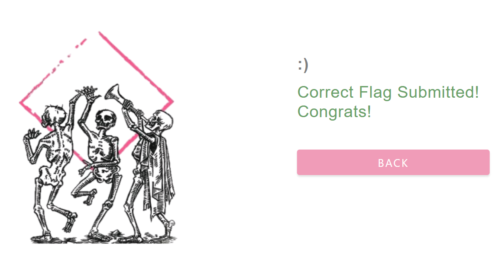

# HackMyVM – DC01  
## Writeup detallado (Parte 2): ataque completo contra Active Directory, explicado a nivel profundo

> **Objetivo de este documento**  
> Este `.md` está centrado **exclusivamente en la fase de ataque**.  
> La idea no es solo documentar *qué comandos* se ejecutan, sino entender **por qué se ejecutan**, **qué ocurre internamente**, **qué protocolo interviene**, **qué información nos devuelve cada herramienta** y **cómo encaja cada paso dentro de una cadena de ataque realista contra Active Directory**.

---

# 1. Punto de partida: ya sabemos que estamos ante un Domain Controller

En la parte anterior se identificó que la víctima era:

- **IP**: `192.168.1.44`
- **Host**: `DC01`
- **Dominio**: `SOUPEDECODE.LOCAL`

y que, por los puertos abiertos y los banners LDAP/Kerberos, se trataba claramente de un **Domain Controller** de **Active Directory**.

Eso cambia completamente la mentalidad del ataque.

No estamos delante de:

- una web cualquiera,
- un Linux con SSH,
- o un Windows standalone,

sino delante de un entorno donde intervienen:

- **DNS**
- **SMB**
- **LDAP**
- **Kerberos**
- **WinRM**
- cuentas de usuario
- cuentas de máquina
- cuentas de servicio
- shares del dominio
- tickets Kerberos
- hashes NTLM

En un entorno así, el ataque no suele ser un “exploit directo”, sino una **cadena de pequeñas debilidades** que, sumadas, terminan dándote control del DC.

---

# 2. Preparación fundamental: editar `/etc/hosts`

Lo primero que hacemos es:

```bash
sudo nano /etc/hosts
```

y añadimos:

```text
192.168.1.44    SOUPEDECODE.LOCAL DC01.SOUPEDECODE.LOCAL
```

## 2.1. Qué es `/etc/hosts`

`/etc/hosts` es un archivo local del sistema operativo Linux que permite definir **resoluciones estáticas de nombres**.

Es decir: le dices manualmente a tu sistema:

> “Cuando te pidan este nombre, no preguntes a DNS: usa directamente esta IP”.

Por ejemplo:

```text
192.168.1.44    SOUPEDECODE.LOCAL
```

significa:

> cuando un programa intente resolver `SOUPEDECODE.LOCAL`, usa la IP `192.168.1.44`.

## 2.2. Por qué esto importa tanto en Active Directory

En Active Directory, **los nombres importan muchísimo más que las IPs**.

Esto no es un detalle menor. Es uno de los puntos clave para que:

- Kerberos funcione bien,
- SMB se comporte como esperamos,
- LDAP consulte el dominio correctamente,
- las herramientas de Impacket resuelvan SPNs,
- y WinRM no falle por problemas de identidad del host.

### Idea clave

En AD no basta con saber:

```text
la máquina está en 192.168.1.44
```

También necesitas saber:

- cómo se llama el **dominio**,
- cómo se llama el **controlador de dominio**,
- y, muchas veces, el **FQDN completo**.

## 2.3. Por qué lo hemos puesto exactamente así

Partimos de información sacada del Nmap:

- **Domain**: `SOUPEDECODE.LOCAL`
- **Host**: `DC01`

Con esos dos datos podemos construir:

### Nombre del dominio

```text
SOUPEDECODE.LOCAL
```

### Nombre FQDN del controlador de dominio

Normalmente, si el host es `DC01` y el dominio es `SOUPEDECODE.LOCAL`, el FQDN (nombre de dominio completamente calificado de un equipo o recurso en la red. Representa la ruta completa y única hasta ese objeto dentro del sistema DNS.) será:

```text
DC01.SOUPEDECODE.LOCAL
```

Por eso en `/etc/hosts` ponemos:

```text
192.168.1.44    SOUPEDECODE.LOCAL DC01.SOUPEDECODE.LOCAL
```

## 2.4. Qué conseguimos con esto

Con esa línea le estamos diciendo a Kali:

- `SOUPEDECODE.LOCAL` → `192.168.1.44`
- `DC01.SOUPEDECODE.LOCAL` → `192.168.1.44`

Eso permite que muchas herramientas que trabajan con nombres en lugar de IPs:

- resuelvan correctamente el dominio,
- construyan SPNs coherentes,
- hagan autenticación Kerberos sin romperse por resolución,
- y no mezclen nombres con IPs de forma inconsistente.

## 2.5. Qué problemas evita

Si no haces esto, pueden ocurrir cosas como:

- **fallos de Kerberos** porque el SPN no coincide,
- errores al usar herramientas de **Impacket**,
- problemas con **WinRM**,
- errores porque la herramienta intenta resolver el dominio y no sabe a qué IP corresponde,
- comportamientos raros en autenticación cuando unes IP y dominio de forma inconsistente.

## 2.6. Relación con el símil del parque

Siguiendo el símil del parque de atracciones:

- la **IP** sería la ubicación física de la taquilla,
- el **dominio** sería el nombre oficial del parque,
- y el **FQDN del DC** sería el nombre exacto del edificio principal de administración.

No basta con saber “dónde está el parque”. También tienes que saber “cómo se llama oficialmente” para que los sistemas internos te reconozcan correctamente.

---

# 3. Empezamos por SMB: primer servicio a enumerar

El primer gran servicio que atacamos es:

```text
445/tcp open microsoft-ds
```

Eso significa **SMB**.

## 3.1. Qué es SMB

SMB (**Server Message Block**) es el protocolo de Windows para:

- compartir archivos,
- compartir impresoras,
- acceder a carpetas remotas,
- autenticarse contra recursos de red,
- y comunicarse con ciertos servicios del dominio.

En Active Directory, SMB es especialmente importante porque expone shares críticos como:

- `NETLOGON`
- `SYSVOL`

y puede permitir:

- acceso a recursos,
- enumeración,
- lectura de scripts,
- descarga de ficheros sensibles,
- e incluso ejecución remota en algunos escenarios.

## 3.2. Por qué empezamos por SMB

Porque SMB en entornos Windows/AD suele darte rápidamente:

- validación de credenciales,
- nombres de shares,
- permisos sobre recursos,
- acceso a `Users`,
- acceso a `SYSVOL`,
- acceso a `NETLOGON`,
- y pistas muy valiosas para pivotar.

---

# 4. Enumeración inicial con `smbmap`

Usamos:

```bash
smbmap -H SOUPEDECODE.LOCAL -u 'guest'
```

## 4.1. Qué es `smbmap`

**SMBMap** es una herramienta de enumeración de SMB. Se usa para interactuar con recursos SMB **sin necesidad de montar el share** como si fuera una unidad del sistema.

Permite:

- listar shares,
- ver permisos,
- entrar a shares,
- descargar archivos,
- subir archivos,
- en ciertos casos ejecutar acciones más avanzadas.

### Símil del parque

Si SMB es el conjunto de almacenes del parque de atracciones, entonces **SMBMap** es como una herramienta que te deja:

- ver qué almacenes existen,
- ver si puedes abrir la puerta,
- mirar si tienes permiso de lectura,
- o ver si podrías dejar o sacar cosas de ellos.

## 4.2. Explicación de las flags

### `-H`
Indica el **host** objetivo.

En vez de poner una IP, ponemos:

```text
SOUPEDECODE.LOCAL
```

y esto funciona porque antes lo resolvimos en `/etc/hosts`.

### `-u 'guest'`
Le decimos a SMBMap que use el usuario:

```text
guest
```

## 4.3. Por qué usamos `guest`

`guest` es una cuenta invitada o identidad de acceso muy básica que existe en muchos entornos Windows.

No siempre está habilitada como usuario “real” interactivo, pero a menudo sirve para:

- probar acceso básico,
- comprobar si hay sesión nula o acceso anónimo,
- ver si el servidor permite enumeración mínima,
- listar shares accesibles sin credenciales fuertes.

### Importante

Aquí el objetivo no es “entrar con privilegios”, sino responder a esta pregunta:

> ¿El DC permite ver algo usando una identidad extremadamente débil?

## 4.4. Qué significa “sesión nula”

Una **null session** o sesión nula es una conexión a ciertos servicios de Windows sin credenciales o con credenciales mínimas, normalmente usada para **enumeración**.

No siempre es una null session “pura” en sentido estricto, pero en la práctica el objetivo es el mismo: ver si el sistema expone información útil sin autenticación fuerte.

---

# 5. Resultado de `smbmap` y cómo interpretarlo

La salida fue algo así:

```text
[+] IP: 192.168.1.44:445        Name: SOUPEDECODE.LOCAL         Status: Authenticated
Disk                                                    Permissions     Comment
----                                                    -----------     -------
ADMIN$                                                  NO ACCESS       Remote Admin
backup                                                  NO ACCESS
C$                                                      NO ACCESS       Default share
IPC$                                                    READ ONLY       Remote IPC
NETLOGON                                                NO ACCESS       Logon server share
SYSVOL                                                  NO ACCESS       Logon server share
Users                                                   NO ACCESS
[*] Closed 1 connections
```

## 5.1. Qué significa “Authenticated”

Aunque uses `guest`, la herramienta te dice que la conexión ha sido autenticada a algún nivel.

Eso no significa que tengas privilegios útiles. Solo significa que el servidor aceptó la sesión dentro del modelo de SMB.

## 5.2. Qué son esos shares

### `ADMIN$`
Share administrativo de Windows. Normalmente solo accesible por administradores.

### `C$`
Share administrativo de la unidad principal. También suele requerir privilegios elevados.

### `IPC$`
Canal de comunicación SMB usado para **Inter-Process Communication**. A menudo permite cierta interacción o enumeración básica.

### `NETLOGON`
Share de logon del dominio.

### `SYSVOL`
Share crítico donde AD guarda políticas y scripts.

### `Users`
Carpeta de perfiles de usuario del sistema.

### `backup`
Share adicional que no es “de serie” y por eso ya llama la atención.

## 5.3. Qué aprendemos aquí

Con `guest`:

- no tenemos acceso útil a shares importantes,
- pero ya vemos la **superficie SMB**,
- y confirmamos que el DC expone:
  - `NETLOGON`
  - `SYSVOL`
  - `Users`
  - un share llamado `backup`

Esto es importante porque en Active Directory muchos ataques avanzan precisamente leyendo shares del dominio.

---

# 6. Qué son `NETLOGON` y `SYSVOL` y por qué importan

## 6.1. `NETLOGON`

`NETLOGON` es un share usado durante el proceso de inicio de sesión en el dominio.

### Qué suele contener

- scripts de inicio de sesión,
- scripts BAT/PS1/VBS,
- configuraciones de entorno,
- mapeos de unidades,
- automatizaciones que se ejecutan al logar usuarios.

### Flujo conceptual

Cuando un usuario inicia sesión en el dominio:

1. el equipo se autentica contra el DC,
2. el DC le indica dónde están ciertos recursos de logon,
3. el cliente puede descargar/ejecutar scripts desde `NETLOGON`.

### Por qué interesa en pentesting

Porque los administradores a veces dejan ahí:

- contraseñas hardcodeadas,
- scripts con credenciales,
- rutas internas,
- referencias a otros servidores,
- automatizaciones inseguras.

## 6.2. `SYSVOL`

`SYSVOL` es un share fundamental del dominio.

### Qué contiene

- **GPOs** (Group Policy Objects),
- scripts de logon, startup y shutdown,
- configuraciones del dominio,
- ficheros de políticas como `Registry.pol`, `GPT.ini`, etc.

### Por qué interesa en pentesting

Porque históricamente ha sido una mina de oro:

- **GPP passwords**
- scripts inseguros
- credenciales
- rutas internas
- configuraciones de seguridad del dominio

### Resumen mental

- `NETLOGON` → scripts y lógica de inicio de sesión
- `SYSVOL` → políticas del dominio y ficheros críticos de configuración

---

# 7. Como no tenemos acceso útil con `guest`, pasamos a enumerar usuarios válidos

Aquí cambiamos de estrategia.

Ya que no podemos leer shares interesantes con `guest`, el siguiente paso lógico es:

> descubrir **usuarios válidos del dominio**

Para ello usamos **NetExec**.

---

# 8. Enumeración de usuarios por RID con NetExec

Comando:

```bash
nxc smb SOUPEDECODE.LOCAL -u 'guest' -p '' --rid-brute > rid_brute.txt
```

## 8.1. Qué es `nxc`

`nxc` es **NetExec** (sucesor moderno de CrackMapExec en muchos entornos).  
Es una herramienta de post-explotación y enumeración extremadamente útil para protocolos Windows, especialmente:

- SMB
- LDAP
- WinRM
- MSSQL
- RDP
- otros

En entornos AD se usa muchísimo para:

- validar credenciales,
- enumerar usuarios,
- shares,
- grupos,
- SPNs,
- Kerberoasting,
- password spraying,
- Pass-the-Hash,
- etc.

## 8.2. Explicación detallada de las flags

### `smb`
Le decimos que use el módulo/protocolo SMB.

### `SOUPEDECODE.LOCAL`
Objetivo. Otra vez, usamos el nombre porque ya lo tenemos resuelto correctamente en `/etc/hosts`.

### `-u 'guest'`
Usuario `guest`.

### `-p ''`
Contraseña vacía.

Esto es importante porque le estamos diciendo explícitamente:

> intenta autenticar con el usuario `guest` y password vacía.

### `--rid-brute`
Esta es la flag clave.

Realiza **RID brute force**, que es una técnica de enumeración basada en los **RIDs** de los SIDs de Windows.

### `> rid_brute.txt`
Redirige la salida a un archivo para trabajarla después con calma.

---

# 9. Qué es un RID y por qué esto funciona

## 9.1. Qué es un SID

En Windows y Active Directory, cada principal de seguridad tiene un **SID**:

- usuarios
- grupos
- equipos
- cuentas del sistema

Ejemplo de SID:

```text
S-1-5-21-XXXXXXXXXX-XXXXXXXXXX-XXXXXXXXXX-2156
```

## 9.2. Qué es el RID

La última parte del SID es el **RID** (*Relative Identifier*).

Por ejemplo, aquí:

```text
2156
```

ese sería el RID.

## 9.3. Por qué se puede bruteforcear

Porque muchos RIDs se asignan de forma incremental.

Ejemplos típicos:

- `500` → Administrator
- `501` → Guest
- `1000+` → usuarios del dominio
- `2000+` → muchas cuentas adicionales, incluidos equipos en muchos entornos

Entonces la idea es:

- preguntar por RID 500,
- luego 501,
- luego 502,
- 503,
- etc.

Si el sistema responde que ese RID corresponde a un objeto real, acabas descubriendo:

- usuarios,
- grupos,
- equipos,
- cuentas de servicio.

### Idea mental sencilla

Es como si en el parque cada empleado tuviera un número incremental de identificación, y tú fueses probando:

- ¿existe el 1000?
- ¿existe el 1001?
- ¿existe el 1002?

y así descubres personal del parque aunque no conozcas sus nombres.

---

# 10. Limpieza del fichero `rid_brute.txt`

Dices que la salida contenía líneas como:

```text
SMB 192.168.1.44 445 DC01 2156: SOUPEDECODE\PC-84$ (SidTypeUser)
```

y que solo te interesa quedarte con el nombre de usuario.

Comando:

```bash
cat rid_brute.txt | grep 'SidTypeUser' | awk -F'\\' '{print $2}' | awk '{print $1}' > usuarios_filtrados.txt
```

Vamos a explicarlo con muchísimo detalle.

## 10.1. `cat rid_brute.txt`

Muestra el contenido del archivo.

## 10.2. `| grep 'SidTypeUser'`

Filtra solo las líneas que contienen:

```text
SidTypeUser
```

Eso es importante porque en RID brute force pueden aparecer:

- usuarios,
- grupos,
- alias,
- otras clases de objetos.

Aquí nos interesan solo los objetos de tipo **usuario**.

### Importante

En Active Directory, las cuentas de máquina muchas veces también aparecen como tipo usuario a nivel de seguridad, por eso verás nombres con `$`.

## 10.3. `| awk -F'\\' '{print $2}'`

Aquí `awk` usa como separador el carácter `\`.

Ejemplo original:

```text
SOUPEDECODE\PC-84$
```

al separar por `\`, queda:

- campo 1 = `SOUPEDECODE`
- campo 2 = `PC-84$`

y `'{print $2}'` imprime solo:

```text
PC-84$
```

## 10.4. `| awk '{print $1}'`

Este segundo `awk` limpia el resto de texto residual que pudiera quedar en la línea.

Por ejemplo, si tras el nombre hubiese espacios o más contenido, nos quedamos solo con la primera “palabra”.

## 10.5. `> usuarios_filtrados.txt`

Guardamos el resultado final en un archivo limpio.

---

# 11. Contar usuarios

Comando:

```bash
wc -l usuarios_filtrados.txt
```

## 11.1. Qué hace `wc -l`

`wc` significa **word count**, pero con `-l` lo que hace es contar líneas.

Como tenemos un usuario por línea, esto equivale a:

> contar cuántos usuarios hemos extraído

La salida fue:

```text
1069 usuarios_filtrados.txt
```

## 11.2. Qué significa esto

Hemos conseguido enumerar **1069 nombres válidos del dominio**.

Eso es muchísimo.

En un entorno AD, tener una lista tan grande de usuarios es oro, porque permite:

- password spray,
- búsqueda de usuarios sin preauth,
- búsquedas de reutilización de contraseña,
- enumeración LDAP posterior,
- correlación con cuentas de servicio.

---

# 12. Intento de acceso usando usuario = contraseña

Ahora pasamos a probar un error clásico:

> usuarios cuya contraseña coincide con su nombre de usuario

Comando base:

```bash
nxc smb SOUPEDECODE.LOCAL -u usuarios_filtrados.txt -p usuarios_filtrados.txt --continue-on-success
```

## 12.1. Qué hace esto conceptualmente

Le estamos diciendo a NetExec:

- usa la lista de usuarios de `usuarios_filtrados.txt`
- usa también esa misma lista como lista de contraseñas

Pero aquí hay un matiz importante.

## 12.2. Qué se busca realmente

No queremos hacer un bruteforce salvaje contra cada usuario con 1069 contraseñas, porque eso:

- tardaría mucho,
- generaría ruido,
- podría bloquear cuentas,
- y no tiene sentido si la hipótesis es “usuario = contraseña”.

Lo que queremos es probar un **password spray emparejado** o controlado, donde:

- `ybob317` se prueba con `ybob317`
- `PC-84$` con `PC-84$`
- etc.

Por eso luego añadimos una flag crucial.

## 12.3. Explicación de las flags

### `-u usuarios_filtrados.txt`
Lista de usuarios.

### `-p usuarios_filtrados.txt`
Lista de contraseñas.

### `--continue-on-success`
Le dice a NetExec que **no se detenga** cuando encuentre una credencial válida.  
Así puede seguir buscando más coincidencias.

---

# 13. Filtrar solo resultados útiles

Como la salida es demasiado grande, le añades:

```bash
| grep -v [-]
```

## 13.1. Qué hace `grep -v`

`-v` invierte la condición.

Si haces:

```bash
grep -v '[-]'
```

le estás diciendo:

> muestra todo **menos** las líneas que contengan `[-]`

Y en NetExec las líneas con `[-]` suelen ser intentos fallidos.

## 13.2. Qué conseguimos

Reducimos ruido visual y nos quedamos sobre todo con:

- banners informativos,
- líneas de éxito,
- resultados positivos.

---

# 14. La flag clave: `--no-bruteforce`

Comando final:

```bash
nxc smb SOUPEDECODE.LOCAL -u usuarios_filtrados.txt -p usuarios_filtrados.txt --no-bruteforce --continue-on-success | grep -v '[-]'
```

## 14.1. Qué significa `--no-bruteforce`

Esta flag es muy importante.

En vez de probar:

- usuario1 con password1, password2, password3...
- usuario2 con password1, password2, password3...

hace un comportamiento controlado, alineado por posiciones o evitando un bruteforce masivo cruzado.

La idea práctica aquí es:

> no quiero probar todas las contraseñas con todos los usuarios  
> quiero evitar ruido y aproximarme a la lógica “usuario = contraseña”

## 14.2. Por qué esto es mejor aquí

Porque reduce mucho:

- el tiempo,
- el volumen de intentos,
- el riesgo de lockouts,
- y el ruido innecesario.

## 14.3. Resultado

Obtuviste:

```text
[+] SOUPEDECODE.LOCAL\ybob317:ybob317
```

## 14.4. Qué significa

Has encontrado una credencial válida:

- **usuario**: `ybob317`
- **contraseña**: `ybob317`

Esto confirma:

- el usuario existe,
- la contraseña es correcta,
- y ya tienes **acceso válido al dominio**.

### Símil del parque

Hasta ahora estabas “fuera del parque”.  
Con `ybob317:ybob317`, ya has conseguido **una entrada real**.

---

# 15. Probar acceso SMB con el usuario encontrado

Comando:

```bash
smbclient //192.168.1.44/Users -U ybob317
```

## 15.1. Qué es `smbclient`

`smbclient` es como el cliente FTP pero para SMB.

Permite:

- conectarte a un share,
- navegar carpetas,
- listar contenido,
- descargar archivos,
- subir archivos si tienes permisos.

## 15.2. Explicación del comando

### `//192.168.1.44/Users`
Objetivo SMB:

- host: `192.168.1.44`
- share: `Users`

### `-U ybob317`
Usuario con el que te autenticas.

Luego te pedirá la contraseña, que en este caso es:

```text
ybob317
```

## 15.3. Qué implica que funcione

Si puedes listar este share, significa que:

- tus credenciales son válidas,
- el usuario tiene permisos de lectura sobre `Users`,
- y puedes explorar perfiles de usuario.

---

# 16. Interpretación de la salida del share `Users`

Ves algo como:

```text
admin
Administrator
All Users
Default
Public
ybob317
```

## 16.1. Qué es ese share

`Users` corresponde a la carpeta de perfiles de usuario del sistema Windows.

Aquí suelen vivir:

- escritorios,
- documentos,
- descargas,
- perfiles públicos,
- perfiles de administradores,
- perfiles de usuarios del dominio/locales.

## 16.2. Qué información te da

Ya puedes ver:

- que existe un perfil `ybob317`,
- que existe `Administrator`,
- que hay varios perfiles relevantes.

## 16.3. Qué hacemos con eso

Como ya sabemos que el usuario válido es `ybob317`, lo lógico es ir a:

```text
ybob317\Desktop
```

y buscar la primera flag.

---

# 17. Obtención de la user flag

Dentro de `ybob317\Desktop` ves:

```text
user.txt
```

y haces:

```bash
get user.txt
```

## 17.1. Qué hace `get`

Descarga el fichero remoto al directorio local desde el que ejecutaste `smbclient`.

## 17.2. Resultado

Luego en Kali haces:

```bash
cat user.txt
```

y obtienes la primera flag:

```text
6bab1f09a7403980bfeb4c2b412be47b
```

## 17.3. Qué significa a nivel del ataque

Ya no solo has validado credenciales, sino que has conseguido:

- acceso a recurso sensible,
- navegación por perfiles de usuario,
- lectura de archivos,
- primera flag.

Eso confirma que tu foothold es real.

---

# 18. Nuevo objetivo: “robar la contraseña del operador de una atracción”

Aquí es donde enlazas con el símil del parque.

Ahora que ya estamos “dentro del parque”, no basta con tener la entrada.

Lo siguiente es intentar robar la credencial de algún **operador de atracción**, es decir:

- una **cuenta de servicio** de Active Directory.

Y el nombre de este ataque es:

# **Kerberoasting**

---

# 19. Qué es un SPN

Antes de lanzar el ataque, hay que entender una pieza fundamental:

## 19.1. Definición

Un **SPN (Service Principal Name)** es un identificador único que Kerberos usa para identificar un servicio dentro del dominio.

En otras palabras:

> un SPN le dice a Kerberos **qué servicio quieres usar y qué cuenta lo ejecuta**

## 19.2. Ejemplos

SPNs típicos:

- `HTTP/webserver.soupedecode.local`
- `MSSQLSvc/db01.soupedecode.local:1433`
- `CIFS/fileserver.soupedecode.local`
- `LDAP/dc01.soupedecode.local`

## 19.3. Por qué importa

Cuando un usuario pide un ticket Kerberos para un servicio, no le dice al KDC:

> “quiero cualquier ticket”

Le dice:

> “quiero un ticket para este SPN concreto”

Y el KDC busca qué cuenta está asociada a ese SPN.

---

# 20. Problema de sincronización horaria: `clock-skew`

Nmap te daba una pista:

```text
clock-skew: 7h59m58s
```

## 20.1. Qué significa

Significa que entre tu Kali y el DC hay un desfase de casi **8 horas**.

## 20.2. Por qué eso rompe Kerberos

Kerberos usa **timestamps** (sellos de tiempo) para evitar ataques de repetición.

Cuando el cliente demuestra que conoce su clave, envía datos cifrados que incluyen una marca temporal.

El KDC verifica que esa marca temporal sea razonable respecto a su propia hora.

Si la diferencia es demasiado grande, asume que:

- el ticket es viejo,
- el cliente está mal sincronizado,
- o el mensaje no es válido.

Y por tanto **rechaza la autenticación**.

### Idea clave

Kerberos es muy sensible al tiempo.  
Si la hora no coincide, el protocolo se rompe.

---

# 21. Sincronización horaria

Primero:

```bash
timedatectl set-ntp off
```

## 21.1. Qué hace esto

Desactiva la sincronización automática por NTP del sistema.

### ¿Por qué lo hacemos?

Porque si tu sistema sigue sincronizándose automáticamente con Internet, cualquier ajuste manual que hagas puede revertirse o entrar en conflicto.

Luego:

```bash
sudo rdate -n 192.168.1.44
```

## 21.2. Qué hace `rdate`

Sincroniza la hora de tu máquina con la del host remoto.

### `-n`
Le indica que no use DNS para resolver nombres y trabaje directamente con la dirección suministrada.

## 21.3. Qué conseguimos

Alineamos el reloj de Kali con el del DC.

Esto es crucial para que:

- Kerberos funcione,
- Impacket no falle,
- los tickets tengan timestamps coherentes,
- y el ataque posterior no se rompa por un detalle horario.

---

# 22. Qué es Impacket

Usas:

```bash
impacket-GetUserSPNs ...
```

## 22.1. Qué es Impacket

**Impacket** es una colección de scripts y librerías Python para trabajar con protocolos de red, especialmente protocolos Windows:

- SMB
- MSRPC
- Kerberos
- LDAP
- MSSQL
- NTLM
- etc.

En pentesting de Active Directory es una suite esencial.

## 22.2. Por qué es tan importante

Porque te permite:

- hacer enumeración LDAP,
- solicitar tickets Kerberos,
- hacer Kerberoasting,
- Pass-the-Hash,
- DCSync,
- ejecución remota,
- y muchas otras operaciones clave.

---

# 23. Enumeración de SPNs y petición de tickets

Comando:

```bash
impacket-GetUserSPNs SOUPEDECODE.LOCAL/ybob317 -dc-ip 192.168.1.44 -usersfile usuarios_filtrados.txt -request -outputfile usuarios-spn.txt
```

## 23.1. Explicación detallada de las flags

### `SOUPEDECODE.LOCAL/ybob317`
Dominio y usuario autenticado con el que realizas la consulta.

### `-dc-ip 192.168.1.44`
IP del Domain Controller.

Esto evita problemas de resolución y hace explícito qué DC debe usarse.

### `-usersfile usuarios_filtrados.txt`
Lista de usuarios sobre la que se hará la comprobación.

### `-request`
Muy importante: no solo enumera SPNs, sino que **solicita los TGS** asociados.

### `-outputfile usuarios-spn.txt`
Guarda los tickets/hash resultantes en un archivo.

---

# 24. Qué has obtenido exactamente

Has obtenido hashes/tickets con formato del tipo:

```text
$krb5tgs$23$*file_svc$SOUPEDECODE.LOCAL$...
```

## 24.1. Qué significa ese prefijo

### `$krb5tgs$`
- `krb5` → Kerberos v5
- `tgs` → Ticket Granting Service / ticket de servicio

### `23`
Indica el **etype** o tipo de cifrado.

En este caso:

```text
etype 23 = RC4-HMAC
```

## 24.2. Por qué esto es Kerberoasting

Porque has pedido tickets de servicio Kerberos para cuentas con SPN, y esos tickets están cifrados con la **clave derivada de la contraseña del servicio**.

Eso es exactamente la base del ataque.

---

# 25. Por qué Kerberoasting funciona

Aquí está una de las ideas más importantes de todo el ataque.

## 25.1. Problema que Kerberos tiene que resolver

Cuando un usuario quiere usar un servicio:

- SMB
- HTTP
- MSSQL
- etc.

el servicio necesita poder verificar que el ticket que recibe es auténtico.

Pero el servicio **no conoce la contraseña del usuario**.  
La única autoridad que conoce las claves de todos es el **KDC**.

## 25.2. Solución del diseño

El KDC crea el ticket de servicio y lo cifra con la **clave del servicio**, no con la del usuario.

## 25.3. Consecuencia

El usuario autenticado puede pedir el ticket.  
El servicio luego podrá abrirlo con su propia clave.

## 25.4. Debilidad

Si tú, como atacante autenticado, consigues ese ticket cifrado, puedes intentar:

1. adivinar contraseñas offline,
2. derivar la clave,
3. intentar descifrar el ticket,
4. si encaja, has descubierto la contraseña del servicio.

Eso es **Kerberoasting**.

### Símil del parque

La taquilla central crea un ticket para una atracción concreta y lo cierra con la llave de esa atracción.

Si robas ese ticket, puedes intentar descubrir cuál es la llave del operador.

---

# 26. Cracking con John the Ripper

Comando:

```bash
john --format=krb5tgs --wordlist=/usr/share/wordlists/rockyou.txt usuarios-spn.txt
```

## 26.1. Qué es John

**John the Ripper** es una herramienta de cracking de hashes y credenciales.

Sirve para:

- crackear contraseñas offline,
- aplicar diccionarios,
- reglas,
- máscaras,
- y formatos de muchos sistemas, incluido Kerberos.

## 26.2. Explicación de las flags

### `--format=krb5tgs`
Le dice a John:

> estos hashes son tickets Kerberos 5 TGS

Es decir, hashes de Kerberoasting.

### `--wordlist=/usr/share/wordlists/rockyou.txt`
Usa como diccionario la wordlist `rockyou.txt`.

### `usuarios-spn.txt`
Archivo con los tickets/hashes extraídos.

---

# 27. Interpretación detallada de la salida de John

Ves algo como:

```text
Loaded 105 password hashes with 105 different salts
```

## 27.1. Qué significa

John ha cargado:

- **105 hashes Kerberos**
- cada uno con su propio salt

Eso es normal en Kerberoasting.

## 27.2. Qué es un salt

Un **salt** es un valor adicional usado en los procesos criptográficos para que:

- dos contraseñas iguales no produzcan resultados triviales iguales en todos los contextos,
- y para dificultar ciertos ataques precomputados.

No necesitas profundizar muchísimo aquí para el writeup, pero sí entender que es normal que cada ticket tenga parámetros propios.

---

Ves también:

```text
krb5tgs, Kerberos 5 TGS etype 23 [MD4 HMAC-MD5 RC4]
```

## 27.3. Qué significa esto

John te está confirmando el tipo exacto de hash/cifrado:

- **Kerberos 5 TGS**
- **etype 23**
- basado en **RC4**
- usando lógica relacionada con **HMAC-MD5**
- y derivación desde material tipo **NTLM / MD4(password)**

### Explicación intuitiva

No necesitas memorizar la matemática exacta, pero sí esta idea:

> en etype 23, la clave está ligada a la contraseña del servicio y es más atacable offline que las variantes AES modernas.

## 27.4. `Password123!! (?)`

Eso significa:

- John ha encontrado una contraseña válida:
  ```text
  Password123!!
  ```
- pero en esa salida momentánea aún no ha asociado claramente el usuario.

## 27.5. `1g 0:00:06:38 DONE`

Eso significa:

- **1g** → una contraseña encontrada
- tardó **6 minutos y 38 segundos**
- recorrió toda la wordlist

## 27.6. Qué conclusión sacamos

De 105 hashes, solo 1 cayó.

Eso es completamente normal.

En Kerberoasting no necesitas crackearlo todo.  
Con que una sola cuenta de servicio caiga y tenga valor operativo, ya has avanzado mucho.

---

# 28. Identificar a qué usuario corresponde la contraseña

Comando:

```bash
crackmapexec smb 192.168.1.44 -u usuarios_filtrados.txt -p 'Password123!!'
```

(En la práctica hoy suele equivaler a `nxc smb ...`, pero el objetivo conceptual es el mismo.)

## 28.1. Qué hacemos aquí

Tenemos una contraseña válida:

```text
Password123!!
```

pero no sabemos de qué cuenta es.

Entonces hacemos una validación sencilla:

- probamos esa contraseña contra todos los usuarios filtrados,
- y vemos cuál autentica.

## 28.2. Explicación de las flags

### `smb`
Protocolo SMB.

### `192.168.1.44`
Objetivo: el DC.

### `-u usuarios_filtrados.txt`
Lista de usuarios.

### `-p 'Password123!!'`
Contraseña fija que queremos validar.

## 28.3. Resultado

```text
[+] SOUPEDECODE.LOCAL\file_svc:Password123!!
```

Ya sabemos que la cuenta crackeada es:

- **usuario**: `file_svc`
- **contraseña**: `Password123!!`

---

# 29. Enumerar shares con `file_svc`

Comando:

```bash
nxc smb SOUPEDECODE.LOCAL -u file_svc -p 'Password123!!' --shares
```

## 29.1. Qué hace `--shares`

Le dice a NetExec que enumere los shares SMB accesibles con esas credenciales.

## 29.2. Resultado importante

La parte clave fue:

```text
backup      READ
NETLOGON    READ
SYSVOL      READ
IPC$        READ
```

## 29.3. Qué significa

Tu usuario `file_svc` tiene permisos de lectura sobre:

- `backup`
- `NETLOGON`
- `SYSVOL`

Eso es muy interesante, especialmente **backup**.

### Por qué `backup` destaca tanto

Porque no es un share “de serie” del sistema como `IPC$`, `ADMIN$`, `C$`, etc.

Un share llamado `backup` suele hacer sospechar de:

- copias de seguridad,
- dumps,
- archivos internos,
- configuración exportada,
- credenciales,
- material sensible olvidado.

Y en laboratorios suele ser un punto clave del ataque.

---

# 30. Entrar al share `backup`

Comando:

```bash
smbclient //192.168.1.44/backup -U file_svc
```

y luego:

```bash
ls
```

## 30.1. Qué encontramos

```text
backup_extract.txt
```

Lo descargamos con:

```bash
get backup_extract.txt
```

---

# 31. Qué contiene `backup_extract.txt`

Contenido:

```text
WebServer$:2119:aad3b435b51404eeaad3b435b51404ee:c47b45f5d4df5a494bd19f13e14f7902:::
DatabaseServer$:2120:aad3b435b51404eeaad3b435b51404ee:406b424c7b483a42458bf6f545c936f7:::
...
```

Esto es un **dump de hashes NTLM de cuentas de máquina**.

---

# 32. Desmontando una línea típica

Ejemplo:

```text
WebServer$:2119:aad3b435b51404eeaad3b435b51404ee:c47b45f5d4df5a494bd19f13e14f7902:::
```

Formato típico:

```text
usuario:RID:LM_hash:NTLM_hash:::
```

## 32.1. Campo 1 – Usuario

```text
WebServer$
```

El `$` indica que es una **cuenta de máquina**.

En AD, cada equipo unido al dominio tiene una cuenta:

- `DC01$`
- `FileServer$`
- `WebServer$`

Estas cuentas también tienen contraseña.

## 32.2. Campo 2 – RID

```text
2119
```

RID del objeto dentro del dominio.

## 32.3. Campo 3 – LM hash

```text
aad3b435b51404eeaad3b435b51404ee
```

Ese valor indica que el **LM hash no está en uso** o está deshabilitado.

LM es muy antiguo y muy inseguro. En sistemas modernos normalmente no se usa.

## 32.4. Campo 4 – NTLM hash

```text
c47b45f5d4df5a494bd19f13e14f7902
```

Este es el hash NTLM real.

### Idea importante

En entornos Windows, muchas herramientas permiten autenticarse **con el hash**, no necesariamente con la contraseña en texto claro.

Y eso es exactamente lo que explota **Pass-the-Hash**.

---

# 33. Crear listas separadas: nombres y hashes

## 33.1. Extraer nombres

Comando:

```bash
cat backup_extract.txt | cut -d '$' -f1 > nombres.txt
```

### Explicación detallada

#### `cut`
Herramienta para cortar campos de texto.

#### `-d '$'`
Usa como delimitador el carácter `$`.

#### `-f1`
Quédate con el campo 1, es decir, todo lo que hay antes del `$`.

Por ejemplo:

```text
WebServer$:...
```

queda en:

```text
WebServer
```

## 33.2. Extraer hashes NTLM

Comando:

```bash
cat backup_extract.txt | cut -d ':' -f4 > hashes.txt
```

### Explicación

#### `-d ':'`
Usa `:` como separador.

#### `-f4`
Quédate con el cuarto campo, que en este formato es el **NTLM hash**.

---

# 34. Qué hemos hecho exactamente con esas dos listas

Has separado el dump original en dos piezas:

- `nombres.txt` → nombres de cuentas de máquina
- `hashes.txt` → hashes NTLM correspondientes

Esto se hace porque la siguiente fase del ataque consiste en probar:

> qué combinación **usuario + hash** da acceso válido

Y la forma más cómoda de hacerlo con NetExec es alimentar listas.

---

# 35. Error y corrección: las cuentas de máquina necesitan `$`

Dices que os equivocasteis porque los usuarios sí tenían que llevar `$`.

Corrección:

```bash
sed -i 's/$/$/' nombres.txt
```

## 35.1. Qué hace `sed`

`sed` es un editor de flujo que permite hacer sustituciones automáticas.

## 35.2. Qué hace esta sustitución concreta

En la parte izquierda:

```text
$
```

es el **final de línea** (en regex).

En la parte derecha:

```text
$
```

es el carácter literal que quieres insertar.

Por tanto, esa expresión añade un símbolo `$` al final de cada línea.

### Resultado

- `WebServer` → `WebServer$`
- `FileServer` → `FileServer$`

## 35.3. Por qué es importante

Porque en AD la cuenta real de máquina es:

```text
FileServer$
```

no:

```text
FileServer
```

Si no conservas el `$`, no estás probando la identidad real de la cuenta.

---

# 36. Pass-the-Hash con NetExec

Comando:

```bash
nxc smb SOUPEDECODE.LOCAL -u nombres.txt -H hashes.txt --continue-on-success | grep '[+]'
```

## 36.1. Explicación de las flags

### `smb`
Módulo SMB.

### `SOUPEDECODE.LOCAL`
Objetivo.

### `-u nombres.txt`
Lista de usuarios.

### `-H hashes.txt`
Lista de hashes NTLM.

**Ojo**: aquí `-H` no es host, sino **hash**.

Le estás diciendo a NetExec:

> no uses contraseñas; usa estos hashes NTLM

### `--continue-on-success`
No te detengas en el primer éxito.

### `| grep '[+]'`
Filtra solo líneas de éxito.

---

# 37. Qué ataque es este

Esto es:

# **Pass-the-Hash**

## 37.1. Qué significa

Significa que te autenticas usando directamente el **hash NTLM**, sin conocer la contraseña en claro.

En Windows/NTLM, eso es posible porque muchas veces el hash funciona como material suficiente para la autenticación.

## 37.2. La cadena de ataque hasta aquí

Tu flujo completo ya va así:

```text
Enumeración SMB
↓
RID brute
↓
Lista de usuarios
↓
Password spray
↓
Acceso inicial con ybob317
↓
Kerberoasting
↓
Crack de file_svc
↓
Lectura de backup
↓
Robo de hashes NTLM
↓
Pass-the-Hash
```

Es una cadena de ataque muy realista en AD.

---

# 38. Resultado crítico: `FileServer$ ... (Pwn3d!)`

Salida:

```text
[+] SOUPEDECODE.LOCAL\FileServer$:e41da7e79a4c76dbd9cf79d1cb325559 (Pwn3d!)
```

## 38.1. Qué significa

- autenticación correcta,
- hash válido,
- la cuenta `FileServer$` funciona,
- y además tiene privilegios importantes sobre el host.

## 38.2. Qué significa `Pwn3d!`

En NetExec / CrackMapExec, `(Pwn3d!)` indica que la cuenta tiene permisos que permiten **control administrativo o ejecución remota** en el objetivo.

No significa solo “login válido”.

Significa algo mucho más fuerte:

> **tienes privilegios útiles de compromiso sobre el host**

Y el host es:

- `DC01`
- es decir, el **Domain Controller**

## 38.3. Por qué esto es tan potente

Porque no has encontrado solo una credencial más.  
Has encontrado **una cuenta de máquina cuyo hash te da control privilegiado sobre el DC**.

Eso ya es un nivel de compromiso crítico.

---

# 39. Por qué una cuenta de máquina puede tener privilegios

Esto suele confundir al principio.

## 39.1. Cuentas de máquina no significa “sin privilegios”

En AD, una cuenta de máquina no es simplemente “el nombre del ordenador”.  
Es una identidad de seguridad completa, con:

- SID,
- contraseña,
- membresías,
- ACLs,
- permisos delegados,
- y capacidad de autenticarse.

## 39.2. Qué puede pasar en laboratorios y entornos mal configurados

Puede ocurrir que una cuenta como `FileServer$`:

- pertenezca a grupos con privilegios,
- tenga delegaciones peligrosas,
- tenga permisos administrativos sobre otros equipos,
- o incluso sobre el propio DC.

En un laboratorio esto suele estar intencionado.  
En entornos reales, sería una mala configuración muy grave.

---

# 40. Entrar por WinRM usando el hash

Comando:

```bash
evil-winrm -i 192.168.1.44 -u FileServer$ -H e41da7e79a4c76dbd9cf79d1cb325559
```

## 40.1. Qué es Evil-WinRM

`evil-winrm` es una herramienta muy usada en pentesting Windows para abrir una shell remota sobre **WinRM**.

WinRM es el servicio de administración remota de Windows, parecido conceptualmente a una shell remota administrativa.

## 40.2. Explicación de las flags

### `-i 192.168.1.44`
IP del objetivo.

### `-u FileServer$`
Usuario.

### `-H e41da...`
Hash NTLM.

De nuevo, esto es **Pass-the-Hash**: no estás usando contraseña en claro.

## 40.3. Qué implica que funcione

Que con ese hash no solo autenticas por SMB, sino que además puedes:

- obtener shell remota,
- ejecutar PowerShell,
- navegar el sistema,
- y actuar con el contexto de esa cuenta privilegiada.

---

# 41. Shell obtenida

Salida:

```text
*Evil-WinRM* PS C:\Users\FileServer$\Documents>
```

## 41.1. Qué significa

Ya estás **dentro del DC** con una shell funcional.

Eso implica:

- ejecución remota conseguida,
- pivot completo al objetivo,
- y capacidad de explorar el sistema operativo desde dentro.

---

# 42. Búsqueda de la root flag

Encuentras en:

```text
C:\Users\Administrator\Desktop
```

el archivo:

```text
root.txt
```

y al hacer:

```powershell
cat root.txt
```

obtienes:

```text
a9564ebc3289b7a14551baf8ad5ec60a
```

---

# 43. Resumen final del ataque completo

Vamos a reconstruir todo el flujo con lógica:

## 43.1. Preparación

- Se configura `/etc/hosts` para que dominio y DC resuelvan bien.
- Esto evita problemas de Kerberos, SMB y herramientas de AD.

## 43.2. Enumeración inicial por SMB

- Con `guest` se enumeran shares.
- Se confirma superficie SMB del dominio.

## 43.3. RID brute force

- Se enumeran más de 1000 usuarios válidos del dominio.
- Se obtiene una base de nombres muy útil.

## 43.4. Password spray

- Se prueba usuario = contraseña.
- Se obtiene acceso válido como `ybob317`.

## 43.5. Acceso inicial

- Se entra al share `Users`.
- Se obtiene la user flag.

## 43.6. Kerberoasting

- Se sincroniza la hora.
- Se enumeran SPNs con Impacket.
- Se solicitan tickets TGS.
- Se crackean offline con John.

## 43.7. Escalada intermedia

- Se descubre que `file_svc` usa `Password123!!`.
- Se accede con esa cuenta a shares más sensibles.

## 43.8. Robo de hashes

- En el share `backup` se encuentra un dump de hashes NTLM de cuentas de máquina.

## 43.9. Pass-the-Hash

- Se prueban los hashes contra SMB.
- El hash de `FileServer$` da `(Pwn3d!)`.

## 43.10. Compromiso final

- Se usa Evil-WinRM con Pass-the-Hash.
- Se obtiene shell en el DC.
- Se lee `root.txt`.

---

# 44. Qué debilidades han hecho posible el compromiso

Este ataque no se basa en “una sola vulnerabilidad mágica”, sino en una cadena de errores:

- enumeración accesible con `guest`
- demasiada exposición por SMB
- usuarios enumerables por RID
- contraseña débil (`ybob317:ybob317`)
- cuentas de servicio crackeables por Kerberoasting
- share `backup` legible por una cuenta de servicio
- dump de hashes NTLM dentro del backup
- reutilización/abuso de cuentas de máquina
- permisos excesivos de `FileServer$`
- WinRM accesible con esa identidad

---

# 45. Idea final: por qué este writeup es tan valioso conceptualmente

Esta máquina enseña muy bien que atacar Active Directory no suele consistir en:

- lanzar un exploit directo
- y ya está

Sino en:

- enumerar bien,
- entender protocolos,
- aprovechar errores humanos,
- encadenar malas prácticas,
- y moverte de una credencial a otra hasta llegar al control total.

Y eso es precisamente lo que has hecho aquí.

---

# 46. Máquina completada



Flag final:

```text
a9564ebc3289b7a14551baf8ad5ec60a
```

