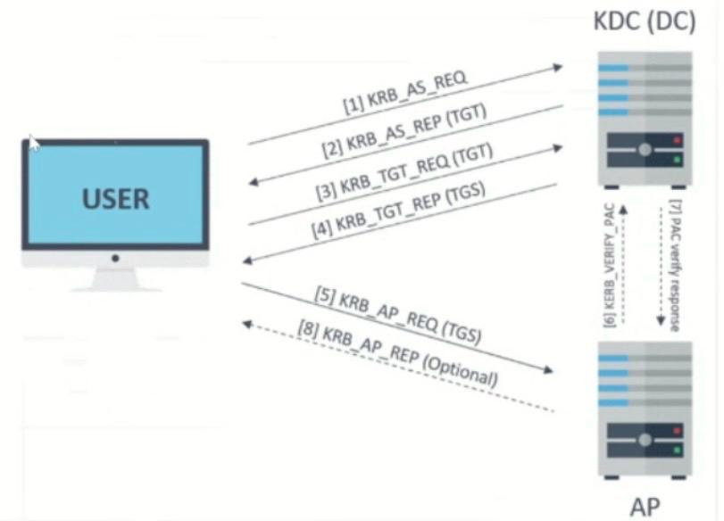
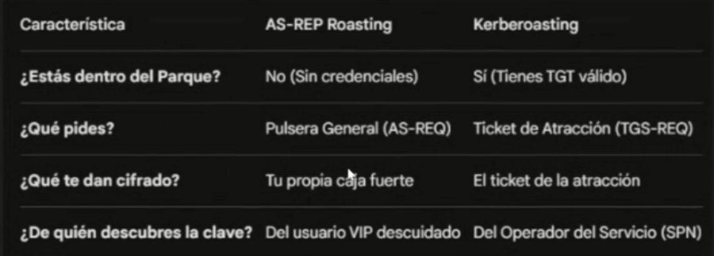

# Kerberos explicado con el símil de un parque de atracciones

## Introducción

Kerberos es un protocolo de autenticación usado principalmente en **Active Directory** cuyo objetivo es **autenticar usuarios sin enviar contraseñas por la red**.

Para entenderlo mejor lo compararemos con **un parque de atracciones**.

---

# Arquitectura de Kerberos

## Componentes principales

### Usuario (Client)
Es quien quiere acceder a un servicio.

Ejemplo:

usuario@dominio.local

En el símil sería **el visitante del parque**.

---

### KDC (Key Distribution Center)

El **KDC** es el sistema central de autenticación.

Normalmente se ejecuta en el **Domain Controller**.

El KDC contiene:

- **Authentication Service (AS)**
- **Ticket Granting Service (TGS)**
- **Base de datos de identidades (Active Directory)**

Dentro del KDC se almacenan:

- hashes de contraseñas de usuarios
- cuentas de servicio
- SPN (Service Principal Names)
- grupos y privilegios
- políticas de seguridad

Ejemplos de políticas:

- política de contraseñas
- expiración de tickets
- control de privilegios
- reglas de autenticación

Por eso el KDC funciona como:

> taquilla central + base de datos + sistema de reglas del parque

---

### Base de datos de identidades

El KDC consulta **Active Directory** para verificar:

- identidad del usuario
- hash de contraseña
- pertenencia a grupos
- privilegios
- servicios disponibles (SPN)

---

# Equivalencia con el parque

| Kerberos | Parque |
|---|---|
Usuario | Visitante |
KDC | Taquilla central |
TGT | Pulsera del parque |
TGS | Ticket de atracción |
AP | Atracción |
SPN | Operador de la atracción |

---

# Flujo normal de Kerberos

### 1️⃣ AS_REQ

El usuario solicita autenticación.

Usuario → KDC

En el parque:

"Hola, quiero entrar".

---

### 2️⃣ AS_REP

El KDC verifica la identidad y entrega un **TGT**.

El TGT es equivalente a:

> la pulsera del parque.

---

### 3️⃣ TGS_REQ

El usuario quiere acceder a un servicio específico.

Usuario → KDC

Ejemplo:

"Quiero subir a la montaña rusa".

---

### 4️⃣ TGS_REP

El KDC devuelve un **ticket de servicio**.

Este ticket está cifrado con la **clave del servicio**.

---

### 5️⃣ AP_REQ

El usuario presenta el ticket al servicio.

Usuario → Servicio (AP)

---

### 6️⃣ AP_REP

El servicio valida el ticket y permite el acceso.

---

# Preauthentication

La **preauthentication** obliga al usuario a demostrar que conoce su contraseña antes de recibir el TGT.

El cliente envía un:

timestamp cifrado con su clave.

El KDC lo descifra usando el hash almacenado en Active Directory.

Si coincide → autenticación válida.

---

# Qué es el Timestamp en Kerberos

Un **timestamp** es una marca de tiempo.

Ejemplo:

2026-03-16 18:42:15

Se utiliza para evitar **replay attacks** (reutilizar mensajes antiguos).

---

## Cómo funciona el timestamp

Durante la preauthentication el cliente envía:

EncryptedTimestamp

Esto significa:

timestamp cifrado con la clave derivada de la contraseña.

Conceptualmente:

Encrypt(timestamp, clave_usuario)

---

## Qué hace el KDC

El KDC intenta descifrar ese valor usando el hash de contraseña almacenado.

Decrypt(EncryptedTimestamp, clave_usuario)

Si el resultado es un timestamp válido:

usuario autenticado.

---

## Qué ve un atacante

Un atacante que capture el tráfico solo verá datos cifrados.

Ejemplo:

AS_REQ  
EncryptedTimestamp = 7A1B23F8...

La contraseña **no aparece en la red**.

---

## ¿Se puede obtener la contraseña del timestamp?

No directamente.

El atacante solo puede intentar un **ataque de fuerza bruta offline**.

Proceso:

1. probar contraseña candidata
2. generar clave
3. intentar descifrar timestamp
4. si produce timestamp válido → contraseña correcta

---

# Ataques contra Kerberos

---

## AS-REP Roasting

Este ataque ocurre cuando un usuario tiene desactivada la preauthentication.

Configuración vulnerable:

Do not require Kerberos preauthentication

Entonces el KDC devuelve directamente:

AS_REP

Ese ticket está cifrado con la contraseña del usuario.

El atacante puede:

1. solicitar el ticket
2. capturarlo
3. crackearlo offline

---

## Kerberoasting

Este ataque se dirige a **cuentas de servicio**.

Cada servicio tiene un **SPN**.

Ejemplo:

HTTP/webserver.domain.local

Un usuario autenticado puede solicitar un ticket para ese servicio.

El ticket estará cifrado con la contraseña del servicio.

El atacante puede:

1. solicitar el ticket
2. guardarlo
3. crackearlo offline

---

# Resumen

Kerberos funciona como un parque:

1. te autenticas en la taquilla
2. recibes una pulsera (TGT)
3. pides tickets de atracción (TGS)
4. presentas el ticket en la atracción (AP)

Ataques principales:

| Ataque | Objetivo |
|---|---|
AS-REP Roasting | contraseña de usuario |
Kerberoasting | contraseña de servicio |
Golden Ticket | clave KRBTGT |
Silver Ticket | clave de servicio |

