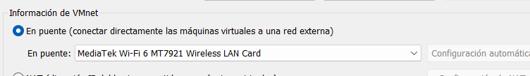

# HackMyVM – DC01
## Writeup detallado (Parte 1): desde la importación de la máquina hasta el final de la enumeración de puertos


---

## 1. Introducción

En este writeup vamos a documentar **solo la primera parte** de la máquina **DC01** de **HackMyVM**, y lo vamos a hacer con muchísimo detalle porque aquí aparecen conceptos base que conviene entender bien desde el principio:

- cómo conectar máquinas virtuales que están en **hipervisores distintos**
- qué diferencia hay entre **NAT**, **Host-Only** y **Adaptador Puente**
- por qué una máquina de **VirtualBox** y otra de **VMware** no siempre se ven entre sí
- cómo descubrir la IP de una víctima dentro de una red local
- cómo identificar la máquina correcta fijándonos en el **fabricante de la MAC**
- cómo interpretar un escaneo Nmap cuando lo que tenemos delante es un **Domain Controller** de Active Directory

En esta parte **no vamos a avanzar más allá de la enumeración inicial de red y puertos**. Todo lo que venga después se dejará para otro `.md` independiente.

---

## 2. Qué máquina estamos trabajando

La máquina en este caso es **DC01** de la página HackMyVM:

`https://hackmyvm.eu/machines/machine.php?vm=DC01`

Ya desde el propio nombre podemos sospechar algo:

- **DC** suele usarse como abreviatura de **Domain Controller**
- **01** sugiere que puede ser el primer controlador de dominio del entorno

Aun así, eso de inicio es solo una pista nominal. Lo importante será confirmarlo después con la enumeración.

---

## 3. Problema inicial: error al importar la máquina en VMware

Al intentar importar la máquina en **VMware** aparece el siguiente error:


El mensaje muestra errores como:

- `Unsupported element 'Caption'`
- `Unsupported element 'Description'`
- `Unsupported element 'InstanceID'`
- `Unsupported element 'ResourceType'`
- `Unsupported element 'VirtualQuantity'`
- `Missing child element 'InstanceID'`
- `Missing child element 'ResourceType'`

### ¿Qué significa esto?

Significa, en esencia, que el descriptor de la máquina virtual que estás intentando importar **no es interpretado correctamente por VMware**.

Cuando importas una máquina desde un archivo tipo OVF/OVA, ese paquete contiene una descripción estructurada del hardware virtual:

- CPU
- memoria
- adaptadores de red
- discos
- controladoras
- otros recursos virtuales

VMware está leyendo ese descriptor y encuentra elementos que **no soporta** o que **espera con otra estructura**.

### Conclusión práctica

Como no conseguimos abrir esta máquina correctamente en VMware, optamos por abrirla en **VirtualBox**.

Eso deja nuestro laboratorio así:

- **Kali** en **VMware**
- **DC01** en **VirtualBox**

Y ahí aparece el siguiente reto: **hacer que ambas máquinas se vean entre sí por red**.

---

## 4. Por qué no basta con encenderlas sin más

Aunque ambas sean máquinas virtuales, no necesariamente comparten red.

Cada hipervisor puede crear sus propias redes internas:

- VMware puede crear sus redes **VMnet**
- VirtualBox puede crear sus propios adaptadores virtuales

Si cada máquina queda conectada a una red virtual distinta, entonces:

- Kali no verá a la víctima
- la víctima no verá a Kali
- no podrás escanearla ni atacarla

Por eso aquí hemos tenido que hacer una pequeña “ingeniería de laboratorio” para que ambas queden en **el mismo segmento de red**.

---

## 5. Solución elegida: Adaptador Puente / Bridged Networking

La solución ha sido usar **modo puente** en ambos hipervisores.

### ¿Qué hace el modo puente?

El modo puente hace que la máquina virtual **se conecte directamente a la red física** a la que está conectado tu host.

Eso significa que la VM deja de estar en una red puramente interna del hipervisor y pasa a comportarse como **otro equipo más de tu red doméstica**.

Por ejemplo, si tu host Windows está conectado a una WiFi de casa con rango:

`192.168.1.0/24`

entonces la VM en modo puente puede recibir una IP de ese mismo rango, por ejemplo:

- Windows host → `192.168.1.33`
- Kali → `192.168.1.42`
- víctima → `192.168.1.44`

### Idea mental sencilla

En vez de pensar en la VM como “encerrada dentro del hipervisor”, en modo puente debes pensarla como:

> otro dispositivo más conectado al router de casa

---

## 6. Configuración en VirtualBox

Primero vamos a **VirtualBox**, importamos la máquina, la seleccionamos y configuramos la red así:

- **Configuración**
- **Red**
- **Adaptador 1**
- **Conectado a: Adaptador Puente**
- y en **Nombre** seleccionamos la interfaz que aparece en la imagen


La interfaz elegida es:

**MediaTek Wi‑Fi 6 MT7921 Wireless LAN Card**

### ¿Por qué exactamente esa?

Porque esa es la **tarjeta de red física real** con la que el equipo host está conectado a la red local.

Es decir:

- tu Windows host sale a Internet por esa tarjeta
- tu router de casa ve esa tarjeta
- tu red doméstica está asociada a esa interfaz

Si en VirtualBox eliges esa interfaz en modo puente, la VM podrá salir **directamente a la misma red WiFi real**.

### Qué pasaría si eliges otra interfaz incorrecta

Si eligieras una interfaz equivocada, por ejemplo:

- una interfaz virtual
- una interfaz desconectada
- una interfaz de VPN
- una interfaz de otro software

la máquina podría:

- no obtener IP
- quedar en otra red distinta
- no poder comunicarse con Kali
- o directamente no tener conectividad útil

### Resumen conceptual

Elegimos esa interfaz porque queremos que la máquina **DC01** quede conectada a la **misma red física real** que usa el host.

---

## 7. Configuración de VMware: Editor de red virtual

Ahora configuramos la parte de **VMware** para que la Kali también use **esa misma interfaz física**.

Nos vamos a:

- **Seleccionamos la Kali**
- **Editar**
- **Editor de red virtual**
- **En información de VMnet**
- **En puente**
- y seleccionamos la misma tarjeta que en VirtualBox



### ¿Qué estamos haciendo realmente aquí?

VMware usa una infraestructura de redes virtuales llamada **VMnet**.

El **Editor de red virtual** te permite definir cómo se conectan esas redes virtuales con el exterior.

Cuando marcas una red en **puente**, le estás diciendo a VMware:

> cuando una VM use esta red, no la dejes encerrada dentro del hipervisor; conéctala a esta tarjeta física concreta

En este caso queremos que VMware también use:

**MediaTek Wi‑Fi 6 MT7921 Wireless LAN Card**

porque esa es la misma NIC física que usamos en VirtualBox.

### ¿Por qué es importante que sea la misma?

Porque si:

- VirtualBox sale por una interfaz física
- y VMware sale por otra distinta

entonces las dos VMs podrían quedar en redes diferentes.

Nos interesa que ambas máquinas:

- salgan por la misma tarjeta física
- entren en el mismo segmento
- reciban IPs comparables dentro de la misma red local

---

## 8. Configuración del adaptador de Kali en VMware

Además de tocar el Editor de red virtual, también hay que configurar el **adaptador de red de la propia Kali**.

Hacemos:

- click derecho en la máquina Kali
- **Configuración**
- **Adaptador de red**
- **Conexión de red**
- **Conexión en puente**


### ¿Por qué también hay que hacer esto?

Porque una cosa es decirle a VMware **cómo** debe puentear una VM, y otra distinta es decirle a la **VM concreta** que efectivamente use ese modo puente.

Dicho de forma sencilla:

- el **Editor de red virtual** define la infraestructura
- la **configuración del adaptador de la VM** decide cómo participa esa VM en esa infraestructura

Si la Kali siguiera en NAT o Host-Only, no importaría lo bien que esté configurado el bridge general: esa VM seguiría en otro tipo de red.

---

## 9. Efecto inmediato del cambio: la Kali cambia de IP

Al poner la Kali en puente, se nos desconecta de red durante un momento. Eso es normal.

La máquina deja la red virtual anterior y pasa a solicitar conectividad en la red física real.

Cuando hacemos:

```bash
ip a
```

vemos esta nueva IP:


La parte importante es esta:

```bash
inet 192.168.1.42/24
```

### ¿Qué significa exactamente?

- `192.168.1.42` → IP asignada a la Kali
- `/24` → máscara de red equivalente a `255.255.255.0`

Eso significa que Kali ya está dentro de la red:

`192.168.1.0/24`

### ¿Quién le ha asignado esa IP?

En este contexto, normalmente el que asigna la IP es el **router doméstico** por DHCP.

Es decir, Kali ya no está viviendo en una red privada de VMware, sino que se comporta como otro dispositivo más de tu casa.

---

## 10. Preparación del directorio de trabajo

Antes de empezar a enumerar, creamos una carpeta dedicada a esta máquina:

```bash
cd ~/Desktop
cd HackMyVM
mkdir DC01
cd DC01
```

Quedamos en:

```bash
~/Desktop/HackMyVM/DC01
```

### ¿Por qué merece la pena hacer esto siempre?

Porque durante una máquina vas a generar:

- escaneos Nmap
- posibles diccionarios
- capturas
- ficheros descargados
- notas
- scripts auxiliares

Si no separas el trabajo por máquina, al cabo de unas cuantas se vuelve todo un caos.

---

## 11. Descubrimiento de hosts en la red

Ahora hacemos el mismo proceso de enumeración inicial para encontrar la IP de la máquina víctima.

Lanzamos:

```bash
sudo nmap -n -sn 192.168.1.42/24
```

### Explicación detallada de las flags

#### `sudo`
Nmap, para ciertos tipos de descubrimiento y escaneo, necesita privilegios elevados para trabajar con ciertos tipos de paquetes y modos de detección.

#### `nmap`
Es la herramienta que estamos usando para descubrimiento y enumeración de red.

#### `-n`
Le dice a Nmap:

> no resuelvas DNS

Es decir, no intentes traducir las IPs a nombres de host.

Esto acelera el escaneo y evita ruido innecesario.

#### `-sn`
Significa **ping scan** o **host discovery only**.

Con `-sn`, Nmap **no escanea puertos**.

Solo responde a la pregunta:

> ¿qué hosts están vivos en este rango de red?

#### `192.168.1.42/24`
Le estamos diciendo que explore toda la red local del rango `192.168.1.0/24`.

Aunque pongamos la IP de Kali con `/24`, lo importante es la red resultante.

---

## 12. Resultado del descubrimiento de hosts

El escaneo devuelve esto:

```text
192.168.1.1
192.168.1.33
192.168.1.34
192.168.1.44
192.168.1.90
192.168.1.200
192.168.1.42
```

y, además, Nmap muestra el fabricante de la MAC cuando puede identificarlo.

Una de las líneas clave es:

```text
192.168.1.44
MAC Address: 08:00:27:70:A6:F4 (PCS Systemtechnik/Oracle VirtualBox virtual NIC)
```

---

## 13. Por qué ahora aparecen muchas IPs y antes no

Esto es un concepto muy importante y conviene dejarlo muy claro.

### Antes
Cuando trabajabas con redes internas de VMware, tus VMs estaban dentro de una **red virtual privada**. Eso significa que solo veías:

- tus VMs
- la infraestructura virtual del hipervisor
- a veces gateways virtuales de VMware

### Ahora
Como hemos puesto las máquinas en **adaptador puente**, la VM ya no está en una burbuja privada del hipervisor.

Está dentro de la **red física real** a la que tu host Windows está conectado.

En tu caso, eso es la WiFi de casa.

Por tanto, al escanear `192.168.1.0/24` ves:

- tu router
- otros dispositivos del hogar
- tu propia Kali
- la máquina víctima en VirtualBox
- cualquier otro equipo vivo de esa red

### Idea clave

**El bridge hace que la VM se inserte en la LAN real.**

Eso es útil porque permite que VMware y VirtualBox se comuniquen entre sí, pero también implica que verás muchos más dispositivos y tendrás que saber distinguir cuál es tu objetivo.

---

## 14. La pista decisiva: la MAC de VirtualBox

La pista clave es esta línea:

```text
192.168.1.44
MAC Address: 08:00:27:70:A6:F4 (PCS Systemtechnik/Oracle VirtualBox virtual NIC)
```

### ¿Por qué esa es la víctima?

Porque sabemos dos cosas:

1. la máquina **DC01** la hemos abierto en **VirtualBox**
2. el prefijo MAC `08:00:27` corresponde a VirtualBox

### Qué es un OUI

**OUI** significa **Organizationally Unique Identifier**.

Es el identificador asignado al fabricante de una tarjeta de red y corresponde a los **primeros 3 bytes de la dirección MAC**.

Ejemplos:

| Prefijo MAC | Fabricante |
|---|---|
| `08:00:27` | VirtualBox |
| `00:0C:29` | VMware |
| `3C:BD:3E` | Xiaomi |
| `48:E7:DA` | AzureWave |

Por eso, cuando Nmap detecta el prefijo `08:00:27`, te lo traduce como:

**PCS Systemtechnik/Oracle VirtualBox virtual NIC**

### Conclusión

La máquina víctima es:

```text
192.168.1.44
```

---

## 15. Interpretación de los hosts encontrados

Una posible interpretación del escaneo sería:

| IP | Dispositivo probable |
|---|---|
| `192.168.1.1` | router |
| `192.168.1.33` | equipo real / tarjeta WiFi |
| `192.168.1.34` | dispositivo doméstico |
| `192.168.1.44` | máquina virtual de VirtualBox |
| `192.168.1.90` | otro dispositivo |
| `192.168.1.200` | router / dispositivo del ISP |
| `192.168.1.42` | tu Kali |

La que nos interesa es:

```text
192.168.1.44
MAC Address: 08:00:27:70:A6:F4 (PCS Systemtechnik/Oracle VirtualBox virtual NIC)
```

---

## 16. Escaneo completo de puertos y servicios

Una vez identificada la víctima, pasamos al siguiente paso:

```bash
sudo nmap -p- --open -sCV -Pn -T5 -vvv -oN fullscan 192.168.1.44
```

### Explicación muy detallada de cada flag

#### `sudo`
Permisos elevados para que Nmap pueda trabajar con todos sus modos de escaneo y detección con mayor fiabilidad.

#### `-p-`
Escanea **todos los puertos TCP** del `1` al `65535`.

No solo los 1000 puertos más comunes, sino absolutamente todos.

#### `--open`
Hace que en la salida final solo aparezcan los **puertos abiertos**.

Así eliminamos ruido visual de puertos cerrados o filtrados.

#### `-sC`
Ejecuta los **scripts NSE por defecto** de Nmap.

Estos scripts pueden extraer información muy útil, como:

- títulos HTTP
- banners
- certificados SSL
- nombres de dominio
- información adicional de algunos protocolos

#### `-sV`
Intenta identificar la **versión exacta del servicio** que corre en cada puerto.

No se queda solo con “hay algo escuchando”, sino que intenta responder:

- qué servicio es
- qué software exacto lo expone
- a veces qué versión concreta usa

#### `-Pn`
Le dice a Nmap:

> considera al host activo aunque no responda al ping

Muy útil porque muchos hosts bloquean ICMP o ciertos tipos de descubrimiento previo.

#### `-T5`
Timing agresivo.

Hace el escaneo más rápido, pero también más ruidoso.

En laboratorio está bien. En un entorno real puede no ser lo ideal si quieres minimizar detección.

#### `-vvv`
Máxima verbosidad práctica.

Muestra mucho detalle de lo que Nmap va encontrando durante el escaneo.

#### `-oN fullscan`
Guarda la salida en formato normal en el archivo `fullscan`.

Esto es muy útil porque luego puedes revisar resultados con calma sin repetir el escaneo.

---

## 17. Resultado del escaneo de puertos

Obtenemos lo siguiente:

```text
53/tcp    open  domain        Simple DNS Plus
88/tcp    open  kerberos-sec  Microsoft Windows Kerberos
135/tcp   open  msrpc         Microsoft Windows RPC
139/tcp   open  netbios-ssn   Microsoft Windows netbios-ssn
389/tcp   open  ldap          Microsoft Windows Active Directory LDAP (Domain: SOUPEDECODE.LOCAL0., Site: Default-First-Site-Name)
445/tcp   open  microsoft-ds?
464/tcp   open  kpasswd5?
593/tcp   open  ncacn_http    Microsoft Windows RPC over HTTP 1.0
636/tcp   open  tcpwrapped
3268/tcp  open  ldap          Microsoft Windows Active Directory LDAP (Domain: SOUPEDECODE.LOCAL0., Site: Default-First-Site-Name)
3269/tcp  open  tcpwrapped
5985/tcp  open  http          Microsoft HTTPAPI httpd 2.0
9389/tcp  open  mc-nmf        .NET Message Framing
49664/tcp open  msrpc         Microsoft Windows RPC
49668/tcp open  msrpc         Microsoft Windows RPC
49675/tcp open  ncacn_http    Microsoft Windows RPC over HTTP 1.0
49689/tcp open  msrpc         Microsoft Windows RPC
49709/tcp open  msrpc         Microsoft Windows RPC
```

---

## 18. Conclusión general inmediata: esto es un Domain Controller

Esto no se deduce por un solo puerto aislado, sino por la **combinación concreta de servicios**.

Las pistas más fuertes son:

- `53/tcp` → DNS
- `88/tcp` → Kerberos
- `389/tcp` → LDAP
- `3268/tcp` → Global Catalog LDAP
- `464/tcp` → servicio relacionado con cambio de contraseña Kerberos
- `9389/tcp` → Active Directory Web Services
- el banner LDAP dice explícitamente:
  - `Domain: SOUPEDECODE.LOCAL...`
  - `Site: Default-First-Site-Name`

Y además el host se llama:

**DC01**

### Qué es un Domain Controller

Un **Domain Controller** es el servidor que en un entorno Windows con **Active Directory** centraliza funciones como:

- autenticación de usuarios
- autenticación de equipos
- gestión de grupos
- políticas del dominio
- resolución interna de nombres
- servicios Kerberos
- directorio LDAP

Si ves juntos los puertos:

- `53`
- `88`
- `389`
- `445`
- `464`
- `3268`
- `9389`

debes pensar inmediatamente:

> **esto es Active Directory y casi seguro un Domain Controller**

---

## 19. Qué es el banner LDAP y por qué aquí es tan importante

Nmap nos devuelve en LDAP algo así:

```text
Microsoft Windows Active Directory LDAP
(Domain: SOUPEDECODE.LOCAL0., Site: Default-First-Site-Name)
```

### ¿Qué es un banner?

Un banner es información que el servicio devuelve sobre sí mismo, por ejemplo:

- producto
- versión
- capacidades
- dominio
- site
- sistema relacionado

### ¿Por qué este banner es casi una confesión?

Porque no dice simplemente “LDAP”, sino:

- **Microsoft Windows Active Directory LDAP**
- **Domain: SOUPEDECODE.LOCAL**
- **Site: Default-First-Site-Name**

Eso ya no es una suposición. Es una evidencia directa de que estamos frente a un entorno de **Active Directory**.

### Qué es un Site en AD

Un **site** en Active Directory es una agrupación lógica de controladores de dominio y subredes. Sirve para organizar replicación y localizar servicios de forma eficiente.

`Default-First-Site-Name` es el nombre por defecto muy habitual cuando no se ha personalizado esa parte.

---

## 20. Explicación puerto por puerto

Ahora vamos a explicar cada servicio en detalle.

---

### 20.1 Puerto 53/tcp — DNS

```text
53/tcp open domain Simple DNS Plus
```

Este es el servicio **DNS**.

### ¿Qué hace DNS?

DNS traduce nombres a direcciones IP.

Ejemplo:

- `dc01.soupedecode.local` → `192.168.1.44`

### Por qué es importante en Active Directory

En Active Directory, DNS no es un extra. Es una **pieza fundamental**.

AD depende muchísimo de DNS para localizar servicios críticos.

Por ejemplo, un cliente del dominio necesita encontrar:

- controladores de dominio
- servidores Kerberos
- servicios LDAP
- Global Catalog

Eso se hace a través de registros DNS especiales, especialmente **registros SRV**.

Ejemplos típicos:

- `_ldap._tcp.dc._msdcs.soupedecode.local`
- `_kerberos._tcp.soupedecode.local`

### Símil sencillo

DNS es como el **mapa del parque** que te dice dónde está cada atracción y cada mostrador.

### En pentesting, ¿por qué nos interesa?

Porque desde DNS puedes llegar a descubrir:

- nombre del dominio
- nombres de host internos
- controladores de dominio
- servicios internos de AD
- subdominios y registros útiles

---

### 20.2 Puerto 88/tcp — Kerberos

```text
88/tcp open kerberos-sec Microsoft Windows Kerberos
```

Este es el servicio **Kerberos**, el protocolo principal de autenticación en Active Directory.

### ¿Qué hace Kerberos?

Permite que:

- usuarios se autentiquen
- equipos se autentiquen
- se emitan tickets de acceso

### Qué piezas importantes viven aquí

Dentro del servicio Kerberos del DC viven dos componentes esenciales:

- **AS (Authentication Service)**
- **TGS (Ticket Granting Service)**

### Idea mental sencilla

Kerberos funciona con tickets.

1. el usuario demuestra quién es
2. obtiene un ticket base (TGT)
3. con ese ticket pide otros tickets para servicios concretos (TGS)

### Por qué este puerto delata un DC

En Active Directory, el **KDC** (Key Distribution Center) vive en el **Domain Controller**.

Si tienes:

- un host Windows
- con LDAP de AD
- y Kerberos Microsoft

la sospecha de Domain Controller es fortísima.

### Símil

Es como la **taquilla principal del parque**:

- primero te identificas
- te dan la pulsera general
- luego con esa pulsera consigues tickets para entrar a atracciones concretas

### En pentesting

Kerberos es muy relevante porque de aquí salen técnicas como:

- AS-REP Roasting
- Kerberoasting
- Password Spraying contra Kerberos

---

### 20.3 Puerto 135/tcp — MSRPC / RPC Endpoint Mapper

```text
135/tcp open msrpc Microsoft Windows RPC
```

Este es el servicio **RPC Endpoint Mapper**.

### ¿Qué significa RPC?

**RPC = Remote Procedure Call**

Es un mecanismo para que un programa pueda invocar funciones en otro sistema remoto.

### Qué hace el puerto 135

Funciona como una **centralita inicial**.

Cuando un cliente quiere hablar con un servicio RPC de Windows:

1. pregunta al puerto `135`
2. el sistema le dice en qué puerto dinámico alto está el servicio real
3. el cliente se conecta a ese puerto alto

Por eso después aparecen varios puertos `49xxx` abiertos.

### Por qué aparece en un DC

Los controladores de dominio usan muchísimo RPC para servicios internos y administrativos.

Entre ellos están servicios como:

- **DRSUAPI**
- **Netlogon**
- **SAMR**
- **LSARPC**
- otros servicios internos del sistema

#### DRSUAPI
Servicio relacionado con la **replicación del directorio** entre controladores de dominio.

#### Netlogon
Servicio clave para autenticación y relaciones de confianza dentro del dominio.

#### SAMR
Interfaz para interactuar con la base de cuentas y seguridad del sistema.

#### LSARPC
Relacionado con la Local Security Authority, políticas de seguridad, SIDs y otra información sensible del sistema.

### Símil

Es como el **mostrador de información del parque**:

- tú preguntas por un servicio
- te dicen a qué ventanilla concreta tienes que ir

### En pentesting

RPC es importantísimo en entornos Windows porque permite mucha enumeración y está profundamente ligado a Active Directory.

---

### 20.4 Puerto 139/tcp — NetBIOS Session Service

```text
139/tcp open netbios-ssn Microsoft Windows netbios-ssn
```

Este puerto corresponde a **NetBIOS sobre TCP**.

### ¿Qué es NetBIOS?

Es una tecnología antigua de redes Windows utilizada para:

- descubrimiento de máquinas
- resolución antigua de nombres
- sesiones de red
- compatibilidad con compartición de recursos

### ¿Por qué sigue apareciendo?

Porque muchos sistemas Windows aún lo exponen por compatibilidad heredada.

### Relación con Active Directory

No es lo que define a un DC por sí solo, pero sí encaja muy bien con un servidor Windows corporativo.

### Símil

Es como un sistema antiguo de carteles, megafonía y avisos del parque que sigue funcionando aunque ya exista uno más moderno.

### En pentesting

Puede ayudar a:

- enumerar nombres NetBIOS
- descubrir información de red antigua
- entender compatibilidad SMB heredada

---

### 20.5 Puerto 389/tcp — LDAP

```text
389/tcp open ldap Microsoft Windows Active Directory LDAP
(Domain: SOUPEDECODE.LOCAL0., Site: Default-First-Site-Name)
```

Este es uno de los puertos más importantes de todos aquí.

### ¿Qué es LDAP?

**LDAP = Lightweight Directory Access Protocol**

Es el protocolo usado para consultar el directorio.

### ¿Qué guarda ese directorio?

Active Directory es, en esencia, una base de datos jerárquica de objetos, por ejemplo:

- usuarios
- grupos
- equipos
- OU
- cuentas de servicio
- políticas
- controladores de dominio
- atributos de todo lo anterior

### ¿Qué permite LDAP?

Consultar información como:

- nombres de usuarios
- grupos a los que pertenecen
- SPNs
- equipos del dominio
- estructura del dominio
- atributos internos de objetos

### Por qué este puerto es una prueba casi definitiva

Porque Nmap no está detectando un LDAP cualquiera, sino explícitamente:

**Microsoft Windows Active Directory LDAP**

Y además te revela:

- el dominio
- el site

Eso es una confirmación casi directa de entorno AD.

### Símil

LDAP es como el **libro de registro del parque** donde aparece:

- qué visitantes existen
- qué empleados existen
- qué rol tiene cada uno
- quién puede entrar a qué zona

### En pentesting

Desde LDAP se puede obtener muchísima información útil para el ataque o la enumeración de AD.

---

### 20.6 Puerto 445/tcp — SMB

```text
445/tcp open microsoft-ds?
```

Este es el puerto de **SMB**.

### ¿Qué es SMB?

**SMB = Server Message Block**

Sirve para:

- compartir archivos
- compartir impresoras
- autenticación y comunicación en redes Windows
- acceso a recursos compartidos

### Por qué es importantísimo en un DC

En un Domain Controller, SMB suele exponer recursos muy relevantes, por ejemplo:

- `SYSVOL`
- `NETLOGON`

### ¿Por qué son tan importantes?

Porque en esos recursos se alojan cosas como:

- scripts de logon
- políticas de grupo
- archivos de configuración
- material operativo del dominio

### Símil

Es como la **zona de almacenes y documentación operativa del parque**.

### En pentesting

SMB en un DC casi siempre es un punto clave de enumeración.

---

### 20.7 Puerto 464/tcp — kpasswd / servicio de cambio de contraseña Kerberos

```text
464/tcp open kpasswd5?
```

Este puerto está relacionado con el **cambio de contraseñas mediante Kerberos**.

### ¿Qué hace?

Permite operaciones de cambio de contraseña dentro del entorno Kerberos.

### Por qué aparece en un DC

Porque el controlador de dominio centraliza autenticación y gestión de credenciales del dominio.

### Símil

Es como la ventanilla del parque donde cambias o actualizas tu pulsera de acceso.

### En pentesting

No siempre se explota directamente, pero suma otra evidencia clara de infraestructura Kerberos/AD.

---

### 20.8 Puerto 593/tcp — RPC over HTTP

```text
593/tcp open ncacn_http Microsoft Windows RPC over HTTP 1.0
```

### ¿Qué es esto?

Es RPC encapsulado sobre HTTP.

### ¿Qué permite?

Transportar llamadas RPC a través de HTTP.

### Por qué encaja con un servidor Windows corporativo

Los entornos Microsoft usan muchos servicios administrativos e internos que se apoyan en RPC, y a veces estos mecanismos aparecen también sobre HTTP.

### Símil

Es como si en vez de usar los pasillos normales del parque, algunos empleados usaran un conducto interno alternativo para mandar mensajes.

---

### 20.9 Puerto 636/tcp — LDAPS

```text
636/tcp open tcpwrapped
```

Aunque Nmap aquí no lo identifique en detalle, este puerto suele corresponder a **LDAPS**, es decir, LDAP sobre TLS/SSL.

### ¿Qué significa `tcpwrapped`?

Significa, simplificando, que el puerto:

- acepta la conexión
- pero no deja extraer fácilmente banner o detalle
- o cierra rápido
- o queda protegido de forma que Nmap no lo identifica con precisión

### Por qué encaja con un DC

En un controlador de dominio es muy normal ver:

- `389` → LDAP
- `636` → LDAP cifrado (LDAPS)

### Símil

Es el mismo libro de registro del parque, pero en una sala segura y cerrada.

---

### 20.10 Puerto 3268/tcp — Global Catalog LDAP

```text
3268/tcp open ldap Microsoft Windows Active Directory LDAP
```

Este puerto es **muy característico de Active Directory**.

### ¿Qué es el Global Catalog?

Es una versión especial del directorio que permite búsquedas rápidas a nivel más amplio dentro del bosque de Active Directory.

### ¿Qué permite?

Buscar objetos globales del bosque, no solo del dominio local, como:

- usuarios
- grupos
- contactos
- ciertos atributos parciales

### Por qué esto delata mucho un DC

El puerto `3268` no es “un LDAP cualquiera”. Es una función muy concreta de Active Directory.

Verlo abierto es una pista muy fuerte de **Domain Controller**.

### Símil

Es como el **catálogo general del parque entero**, no solo el registro de una zona concreta.

---

### 20.11 Puerto 3269/tcp — Global Catalog seguro

```text
3269/tcp open tcpwrapped
```

Este puerto es la versión cifrada del Global Catalog.

La relación es equivalente a:

- `389` → LDAP
- `636` → LDAPS
- `3268` → Global Catalog
- `3269` → Global Catalog cifrado

### Por qué refuerza tanto la hipótesis de DC

Porque vuelve a ser una señal muy asociada a Active Directory y no a un Windows cualquiera.

### Símil

Es el catálogo global del parque, pero dentro de una oficina segura.

---

### 20.12 Puerto 5985/tcp — WinRM

```text
5985/tcp open http Microsoft HTTPAPI httpd 2.0
```

WinRM es **Windows Remote Management**.

### ¿Qué es?

Es el sistema de administración remota de Windows.

Es lo más parecido a SSH dentro del mundo Windows, aunque técnicamente no sea lo mismo.

### ¿Qué permite?

- ejecutar comandos remotos
- abrir sesiones PowerShell remotas
- administrar el equipo a distancia

### Por qué aparece en un DC

Es común en servidores Windows modernos, incluidos controladores de dominio.

### En pentesting

Si consigues credenciales válidas, WinRM puede darte shell remota fácilmente con herramientas como:

- `evil-winrm`

### Símil

Es como el panel de control remoto del parque desde donde un administrador opera cosas sin estar físicamente allí.

---

### 20.13 Puerto 9389/tcp — Active Directory Web Services

```text
9389/tcp open mc-nmf .NET Message Framing
```

Este puerto está relacionado con **Active Directory Web Services (ADWS)**.

### ¿Qué hace?

Permite administración moderna de Active Directory mediante APIs y herramientas de gestión.

### Por qué es tan revelador

No es un puerto típico de “cualquier Windows”. Está muy asociado a AD DS y gestión de Active Directory.

### Símil

Es como una API administrativa moderna del parque para que otros sistemas hablen con la dirección central.

---

### 20.14 Puertos 49664, 49668, 49689 y 49709 — RPC dinámicos

Todos estos aparecen como:

```text
msrpc Microsoft Windows RPC
```

### ¿Qué son?

Son puertos dinámicos asignados a servicios RPC.

### ¿Cómo funcionan?

1. un cliente pregunta al `135`
2. el Endpoint Mapper le dice en qué puerto alto está el servicio real
3. el cliente va a ese puerto dinámico

### Por qué aparecen en un DC

Porque un Domain Controller usa muchísimos servicios internos basados en RPC.

Es completamente normal ver varios puertos altos abiertos para esto.

### Símil

Son las ventanillas internas específicas a las que te manda el mostrador principal del parque.

---

### 20.15 Puerto 49675/tcp — RPC over HTTP dinámico

```text
49675/tcp open ncacn_http Microsoft Windows RPC over HTTP 1.0
```

Es otra instancia de RPC sobre HTTP en un puerto dinámico alto.

### Por qué también refuerza el escenario Microsoft/AD

Porque indica que hay bastante infraestructura RPC activa, algo muy normal en un Windows con servicios administrativos complejos, y aún más en un Domain Controller.

---

## 21. Pistas finales que cierran la identificación

Además del listado de puertos, hay varias señales finales que terminan de cerrar la idea.

### 1. La MAC

```text
08:00:27:70:A6:F4
```

Nos confirma que estamos en una VM de VirtualBox, justo lo esperado.

### 2. El host se llama DC01

Eso ya sugiere fuertemente **Domain Controller 01**.

### 3. El banner LDAP revela el dominio

```text
Domain: SOUPEDECODE.LOCAL
```

### 4. También revela el site

```text
Site: Default-First-Site-Name
```

### 5. La combinación de puertos es inequívoca

- `53` → DNS
- `88` → Kerberos
- `389` → LDAP
- `445` → SMB
- `464` → cambio de contraseña Kerberos
- `3268/3269` → Global Catalog
- `9389` → AD Web Services

Eso no es “parecido a un DC”. Eso es, prácticamente, una confesión del propio host.

---

## 22. Resumen mental rápido para el futuro

Si en una máquina Windows ves juntos estos servicios:

- `53`
- `88`
- `389`
- `445`
- `464`
- `3268`
- `9389`

piensa inmediatamente en:

- **Domain Controller**
- **Active Directory**
- **Kerberos**

Y si además LDAP te devuelve un dominio, ya tienes una confirmación clarísima.

---

## 23. Conclusión de esta primera parte

En esta fase hemos hecho todo lo necesario para preparar el laboratorio y obtener una primera fotografía muy sólida del objetivo:

1. hemos visto que la máquina no se dejaba importar en VMware
2. hemos decidido abrirla en VirtualBox
3. hemos entendido por qué VMware y VirtualBox no se veían de forma automática
4. hemos configurado ambas máquinas en **adaptador puente** usando la misma NIC física
5. hemos comprobado que Kali recibió una IP dentro de la red real de casa
6. hemos descubierto la IP de la víctima mediante `nmap -sn`
7. hemos identificado la máquina correcta fijándonos en el **OUI de la MAC**
8. hemos realizado un escaneo completo de puertos y servicios
9. hemos interpretado el resultado y concluido que estamos frente a un **Domain Controller Windows con Active Directory** en el dominio:

```text
SOUPEDECODE.LOCAL
```

Hasta aquí dejamos esta **Parte 1**, porque el objetivo de este documento era llegar **solo hasta el final de la enumeración de puertos**, pero dejándolo todo explicado con mucho detalle y con buena base conceptual.

En la siguiente parte ya tocará empezar a trabajar sobre ese contexto de:

- DNS
- Kerberos
- LDAP
- SMB
- WinRM
- y servicios propios de Active Directory
