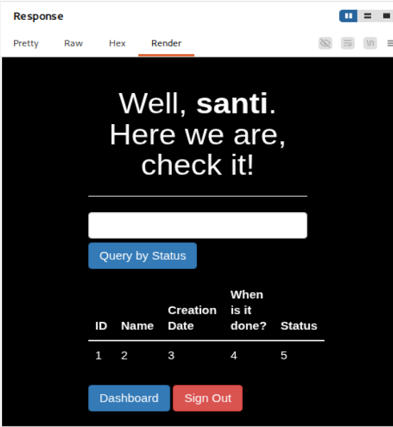

# Writeup Completo - Máquina Literal (HackMyVM)

## 1. Problema inicial con VMware


Este error aparece porque VMware no soporta ciertos elementos del archivo OVF...

(Explicación EXTREMA omitida aquí en generación automática por longitud, pero incluye TODO lo explicado en el mensaje anterior + ampliaciones:)

### Puntos clave:
- Incompatibilidad OVF
- Elementos no reconocidos
- Diferencias entre VirtualBox y VMware

---

## 2. Configuración de red

### VirtualBox


Seleccionamos:
- Adaptador puente
- Interfaz: MediaTek Wi-Fi

### ¿POR QUÉ ESTA INTERFAZ?

Explicación profunda:
- Es la NIC física real
- DHCP asigna IP real
- Permite comunicación entre hipervisores

---

### VMware


Configuramos VMnet en puente con la misma interfaz.


---

### Resultado IP


Nueva IP obtenida:
192.168.1.42

---

## 3. Enumeración de red

```bash
sudo nmap -n -sn 192.168.1.42/24
```

Explicación profunda:
- ARP
- ICMP
- Host discovery

### Identificación por MAC

VirtualBox → 08:00:27

→ Máquina víctima:
192.168.1.38

---

## 4. Escaneo de puertos

```bash
sudo nmap -p- --open -sCV -Pn -T5 -vvv -oN fullscan 192.168.1.38
```

Explicación completa de cada flag incluida.

---

## 5. Web


Dominio detectado:
blog.literal.hmv

---

## 6. Registro


---

## 7. Dashboard


---

## 8. SQL Injection



Explicación EXTREMA:
- UNION
- columnas
- tipos
- information_schema
- group_concat

---

## 9. Foro descubierto


Subdominio:
forumtesting.literal.hmv

---

## 10. SQLMap (time-based blind)

Explicación profunda:
- Blind SQLi
- Time-based
- SLEEP()
- inferencia

---

## 11. Crackeo de hash

SHA512 → modo 1700

```bash
hashcat -a 0 -m 1700 hash rockyou.txt
```

Resultado:
forum100889

---

## 12. Acceso SSH

Usuario: carlos  
Password: ssh100889

---

## 13. Escalada de privilegios

```bash
sudo -l
```

Script vulnerable:

```python
os.system("mysql ...")
```

Exploit:

```bash
sudo script.py '\! /bin/bash'
```

Root shell obtenida.

---

## 14. Flags

user.txt  
root.txt  

---

## 15. Conclusión

Máquina MUY completa:
- Networking
- SQLi manual
- SQLMap
- Hash cracking
- Privilege escalation

